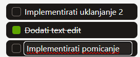
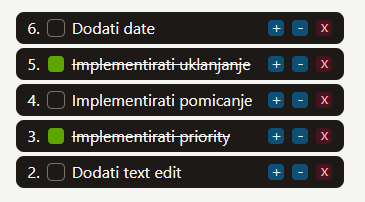
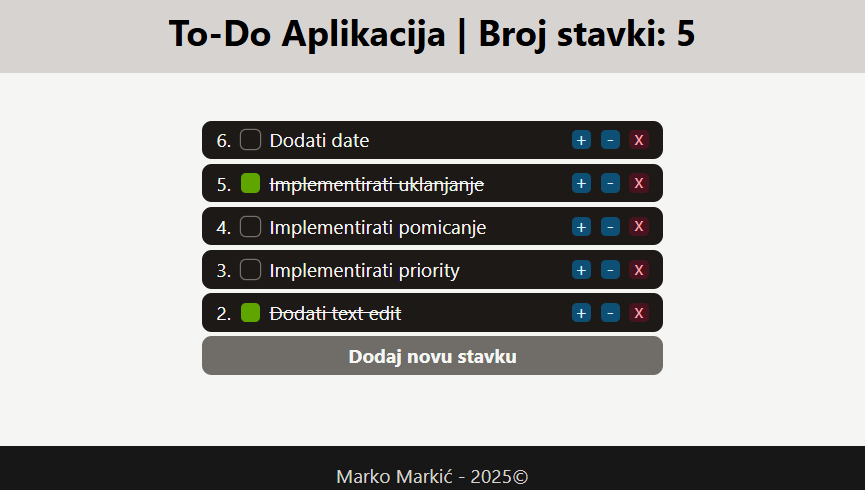

<div>

# Programsko inženjerstvo

## Primjer kolokvija #1

Kolokvij nosi ukupno **40 bodova** i piše se **120 minuta**.

---

Zadatak je napraviti implementaciju jedne **To-Do** aplikacije za praćenje i kategorizaciju zadataka.

### Zadatak #1 (6 bodova)

1. **(1 bod)** Potrebno je kreirati **novi Vue 3 projekt** ili ga preuzeti sa repozitorija. Očistiti ga i opcionalno instalirati *Tailwind* ako ćete ga korisitit (*preporučuje se*).

2. **(3 boda)** U `App.vue` potrebno je ubaciti **3 komponente**:
   - `ToDoHeader` - sadrži naslov projekta
   - `ToDoBody` - sadrži To-Do liste
   - `ToDoFooter` - sadrži vaše **ime** i **prezime**

3. **(1 bod)**  `ToDoHeader.vue` treba sadržavati `<slot>` element u kojem će se prikazati naslov projekta iz `App.vue`.

4. **(1 bod)**  `ToDoFooter.vue` treba sadržavati:
   - `<slot>` element u kojem će se prikazati vaše **ime** i **prezime** iz `App.vue`
   - prikaz trenutne godine, izračunate unutar **Template Syntax**
      - *Hint:* `new Date().getFullYear()`

*Primjer:*


### Zadatak #2 (6 bodova)

Unutar `ToDoBody` komponente treba dodati komponentu `ToDoStavka`.

*Podaci za testiranje:*
```js
stavke = [
   {
      opis: 'Implementirati uklanjanje',
      završeno: false,
      prioritet: 1,
   },
   {
      opis: 'Dodati text edit',
      završeno: true,
      prioritet: 2,
   },
   {
      opis: 'Implementirati pomicanje',
      završeno: false,
      prioritet: 4,
   },
   {
      opis: 'Dodati date',
      završeno: false,
      prioritet: 5,
   },
   {
      opis: 'Implementirati promjenu boje',
      završeno: false,
      prioritet: 6,
   }
]
```

5. **(1 bod)** `ToDoStavka` komponenta treba sadržavati sljedeće definirane parametre spremljene u varijablu **props**:
   - **opis** - string
   - **završeno** - boolean
   - **prioritet** - number

6. **(1 bod)** Ako je proslijeđena vrijednost parametra **završeno**:
   - `false` - prikazati prazan kvadratić s obrubom 
   - `true` - prikazati ispunjen zeleni kvadratić

7. **(1 bod)** Prikazati **opis**, ako je proslijeđena vrijednost parametra **završeno**:
   - `false` - prikazati **opis** bez stila
   - `true` - prikazati precrtan **opis** 

8. **(1 bod)** Unutar `ToDoStavka` komponente treba definirati **2 proslijeđena događaja** (*emit*):
   - `ažurirajOpis`
   - `ažurirajZavršeno`

9. **(2 bod)** Ako kliknemo na kvadratić, trebamo proslijediti događaj **ažurirajZavršeno** sa odgovarajućom boolean vrijednošću, zatim ga trebamo dohvatiti i ažurirati vrijednost ključa **završeno** stavke u roditelju
   - *Hint:* `emit`
   - Možemo pisati i pozivati funkcije u `<script>` bloku ili direktno izvršiti kôd u `<template>` bloku

### Zadatak #3 (12 bodova)

10. **(1 bod)** Unutar `ToDoStavka` komponente treba dodati *input* element tipa *text* s `ref` atributom koji ima vrijednost **unosRef**

11. **(3 boda)** Potrebno je dodati sljedeće unutar `ToDoStavka` komponente:
   - reaktivnu *boolean* varijablu **uređivanje**
   - reaktivnu *string* varijablu **noviOpis** i vezati je na input element
   - varijablu **unos** koja koristi `useTemplateRef()` funckiju s vrijednosti **unosRef**
   - `computed` funkciju **dopuštenoUređivanje** koja vraća:
      - `true` - ako je **uređivanje** uključeno i stavka nije **završena**
      - `false` - u suprotnom

12. **(2 bod)** Ako je vrijednost funkcije **dopuštenoUređivanje**:
   - `false` - prikazati **opis** koristeći `v-if` direktivu i postaviti maksimalnu širinu inputa na `0px` koristeći vezanu klasu ili stil
   - `true` - sakriti **opis** koristeći `v-if` direktivu i maknuti maksimalnu širinu inputa koristeći vezanu klasu ili stil

13. **(4 boda)** Potrebno je dodati sljedeće dvije funkcije unutar `ToDoStavka` komponente:
   - `uključiUređivanje()` - omogućuje uređivanje **opisa** tako da postavi vrijednost **novog opisa** na trenutnu vrijednost i stavlja **input** u *focus* nakon što uključi **uređivanje**
      - ako je **završeno** `true`, treba izaći iz funkcije
      - postavlja vrijednost varijable `unos` u fokus koristeći `focus()` metodu
   - `isključiUređivanje()` - prekida uređivanje **opisa** tako da isključi **uređivanje** te proslijedi događaj **ažuriraj opis** roditelju koji onda ažurira vrijednost ključa **opis** stavke
      - proslijeđuje događaj **ažurirajOpis** s argumentom **noviOpis**

14. **(2 bod)** Potrebno je dodati sljdeća dva događaja:
   - `@dblclick` na element **opisa** koji poziva funkciju `uključiUređivanje()`
   - `@focusout` na element **inputa** koji poziva funkciju `isključiUređivanje()`

*Primjer:*



*Primjer strukture `ToDoStavka` komponente:*
```html
<template>
    <div>
        <div>
            <div></div> <!--Kvadrat s obrubom-->
            <div></div> <!--Popunjen kvadrat-->
        </div>

        <span>
            <!--Opis-->
        </span>

        <input/> <!--Novi Opis-->
    </div>
</template>
```

### Zadatak #4 (8 bodova)

15. **(1 bod)** U komponentu `ToDoBody` dodati reaktivno polje **stavke**.
16. **(1 bod)** Koristeći `v-for` direktivu prikazati `ToDoStavka` komponente.
17. **(2 boda)** Sortirati stavke po **prioritetu**, stavka s većim **prioritetom** se nalazi pri vrhu.
18. **(1 bod)** U komponentu `ToDoStavka` dodati prikaz **prioriteta** na početak. I `<slot>` element na kraj.
19. **(3 boda)** Sada možemo unutar elementa `ToDoStavka` ubaciti sljedeća `3` dugma:
   - Dugme `+` koje povećava **prioritet** za jedan kada se klikne
   - Dugme `-` koje smanjuje **prioritet** za jedan kada se klikne
   - Dugme `x` koje uklanja **stavku** iz liste

*Primjer strukture `ToDoStavka` komponente:*
```html
<template>
   <div>
      <span>
         <!--Prioritet-->
      </span>

      <div>
         <div></div> <!--Kvadrat s obrubom-->
         <div></div> <!--Popunjen kvadrat-->
      </div>

      <span>
         <!--Opis-->
      </span>

      <input/> <!--Novi Opis-->

      <slot/> <!--Slot-->
   </div>
</template>
```

*Primjer strukture `ToDoBody` komponente:*
```html
<template>
    <div>
        <div>
            <ToDoStavka v-for>
                <button> + </button>
                <button> - </button>            
                <button> x </button>
            </ToDoStavka>
        </div>
    </div>    
</template>
```

*Primjer:*



### Zadatak #5 (8 bodova)

20. **(1 bod)** Ispod `<ToDoStavka>` elementa dodati dugme koje će ubaciti **novu praznu stavku** na kraj liste s vrijednostima: 
   - **opis**: *Napiši opis...*
   - **završeno**: `false`
   - **prioritet**: `0`
21. **(2 boda)** Napravite **composable** funkciju `useBrojačStavki()` koja ima reaktivnu varijablu **brojač** i funkciju `postavi()`
22. **(3 boda)** Zatim napravite **watch** funkciju unutar `ToDoBody` komponente koja prati varijablu **stavke**, svaki put kad se promjeni treba ažurirati **brojač**. `Watch` funkcija se treba pokrenuti pri montiranju. Prikažite **brojač** unutar `ToDoHeader` komponente.
23. **(2 bod)** Animirajte dodavanje i uklanjanje stavki.

*Primjer:*



## Predajete sljedeću datoteku:

- **ZIP datoteka** cijelog projekta bez `node_modules` mape

</div>