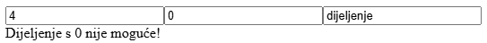
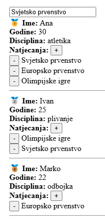

<div>

# Programsko inženjerstvo

## Drugi primjer kolokvija #1

Kolokvij nosi ukupno **40 bodova** i piše se **120 minuta**.

> Potrebno je preuzet projekt drugog primjera kolokvija s Merlina.

---

### Zadatak #1 - SimpleCalculator (14 bodova)

1. **(1 boda)** Potrebno je napraviti tri **reaktivne** varijable `broj1`, `broj2`, `operacija` i funkciju `provjeraOperacije()`.

2. **(2 boda)** Funkcija `provjeraOperacije()` treba vratiti **true** ako varijabla `operacija` ima neku od sljedećih vrijednost: *"zbrajanje"*, *"oduzimanje"*, *"mnozenje"* ili *"dijeljenje"*, u suprotnom vraća **false**. 

3. **(2 bod)** Stvorite `<input>` element za svaku varijablu i vežite ih koristeći `v-model`.

4. **(3 boda)** Ako je rezultat funkcije `provjeraOperacije()` **false** onda pomoću **v-if/v-else** direktiva prikažite tekst *Nepoznata operacija!* u suprotnom napravite izračun varijabli `broj1` i `broj2` ovisno o vrsti operacije koristeći `template syntax` = `{{ }}`


5. **(2 bod)** Ako je u pitanju operacija **dijeljenja**, provjerite je li `broj2` različit od `0`, ako nije, prikažite tekst *"Dijeljenje s 0 nije moguće!"*



6. **(4 boda)** Nadogradite kôd tako da funkciju `provjeraOperacije()` pretvorite u **computed** funkciju. Napišite u komentaru ispod funkcije koja je razlika između computed funckije u usporedbi s običnom funkcijom u kontekstu ovog zadatka **SimpleCalculator**.

<div class="page"></div>

### Zadatak #2 - Sportasi (14 bodova)

Definirani su sljedeći podaci:

```js
const sportasi = ref([
   {
      ime: 'Ivan', 
      disciplina: 'plivanje', 
      godine: 25, 
      natjecanja: ['Olimpijske igre', 'Svjetsko prvenstvo']
   },
   {
      ime: 'Ana', 
      disciplina: 'atletika', 
      godine: 30, 
      natjecanja: ['Svjetsko prvenstvo', 'Europsko prvenstvo', 'Olimpijske igre']
   },
   {
      ime: 'Marko', 
      disciplina: 'odbojka', 
      godine: 22, 
      natjecanja: ['Europsko prvenstvo']
   }
])
```

1. **(3 boda)** Prikažite sve podatke sportaša i njihova natjecanja koristeći **v-for** direktivu. Potrebno je izlistati natjecanja.

2. **(1 boda)** Dodajte **reaktivnu** varijablu `novo_natjecanje` i `<input>` element za koji će biti vezana.

3. **(3 boda)** Implementirajte funkciju `dodaj_natjecanje(sportasIndex)` koja **dodaje** `novo_natjecanje` u polje `natjecanja` odabranog sportaša. Dodajte `<button>` element s tekstom *"+"* koje će pozivati tu funkciju za svakog **sportaša**.

4. **(3 boda)** Implementirajte funkciju `ukloni_natjecanje(sportasIndex, natjecanjeIndex)` koja **uklanja** natjecanje iz polja `natjecanja` odabranog sportaša. Dodajte `<button>` element s tekstom *"-"* koje će pozivati tu funkciju za svako **natjecanje**.

5. **(2 boda)** Sortirajte polje tako da sportaš s najviše natjecanja bude pri vrhu (`.sort((a, b) => a - b)`). Za prvog sportaša ispred imena dodajte zlatnu medalju 🥇, za drugog dodajte srebrnu medalju 🥈, za trećeg dodajte brončanu medalju 🥉.

6. **(2 bod)** Dodajte animacije za uklanjanje i dodavanje natjecanja.

<div class="page"></div>

```css
.list-enter-active,
.list-leave-active {
    transition: all 0.5s ease;
}
.list-enter-from,
.list-leave-to {
    opacity: 0;
    transform: translateX(30px);
}
```



<div class="page"></div>

### Zadatak #3 - Galerija slika (12 bodova)

Definirani su sljedeći podaci:

```js
const galerija = [    
    {
        slikar: "Pablo Picasso",
        godina: 1903,
        naslov: "The Old Guitarist",
        slika: "/src/assets/slike/The Old Guitarist.png"
    },
    {
        slikar: "Vincent van Gogh",
        godina: 1886,
        naslov: "Le Moulin de Blute-Fin",
        slika: "/src/assets/slike/Le Moulin de Blute-Fin.png"
    },
    {
        slikar: "Hokusai",
        godina: 1890,
        naslov: "Courtesan Asleep",
        slika: "/src/assets/slike/Courtesan Asleep.png"
    },
];
```

1. **(1 boda)** Kreirajte komponentu `Slika.vue` sa parametrima (*props*): **slikar**, **godina**, **naslov**, **slika**

2. **(1 bod)** Unutar roditelja učitajte i prikažite komponente `Slika.vue` koristeći **v-for** direktivu.

2. **(1 bod)** Komponenta treba sadržavati prikaz **slike** visine `100` i prikaz podataka  **naslov**, **slikar**, **starost**.

3. **(2 bod)** Implementirajte funkciju `starost()` koja vraća starost slike u godinama.

4. **(2 boda)** Ako je starost veća od `136` godina <u>podcrtajte</u> **naslov** koristeći vezanu klasu (`:class`).

```css
.underline {
    text-decoration: underline;
}
```

5. **(1 boda)** Pritiskom na sliku treba se proslijediti događaj **povecaj** roditelju (`$emit()`).

6. **(1 boda)** Unutar roditelja dodajte **reaktivnu** varijablu `povecana_slika` i `` element gdje će biti vezana za **src** atribut.

7. **(3 boda)** Kada roditelj dohvati događaj **povecaj** (`@`) iz elementa `<Slika>` treba ažurirati varijablu `povecana_slika` s odgovarajućom slikom.


## Predajete sljedeću datoteku:

- **ZIP datoteka** cijelog projekta bez `node_modules` mape

</div>