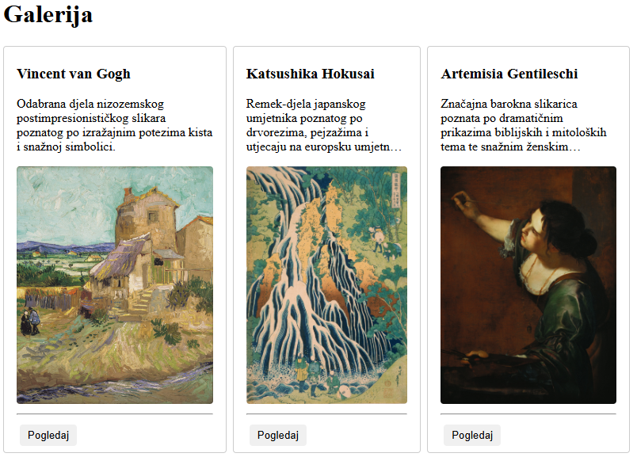
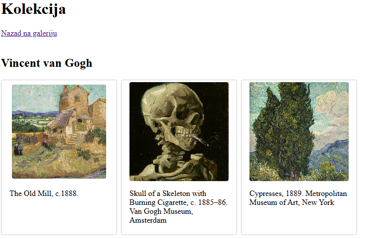
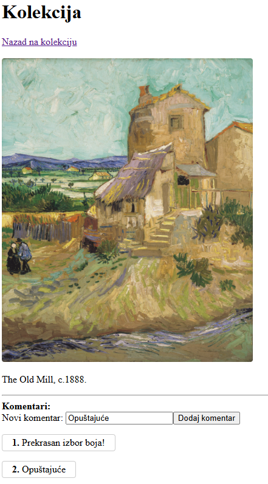
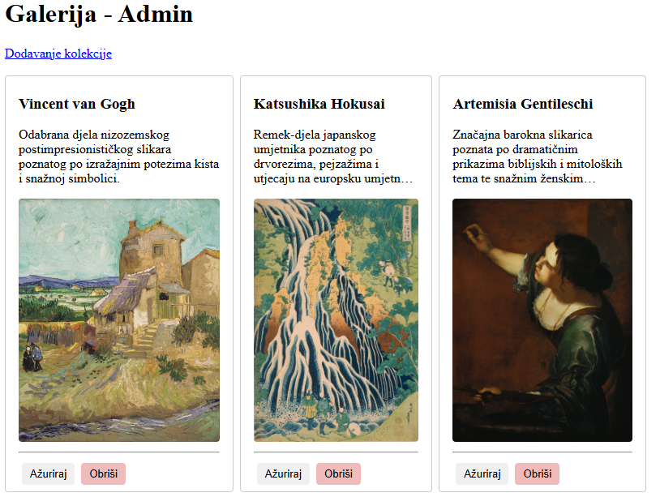
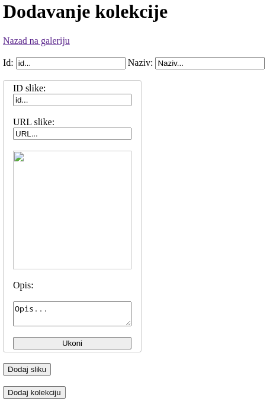
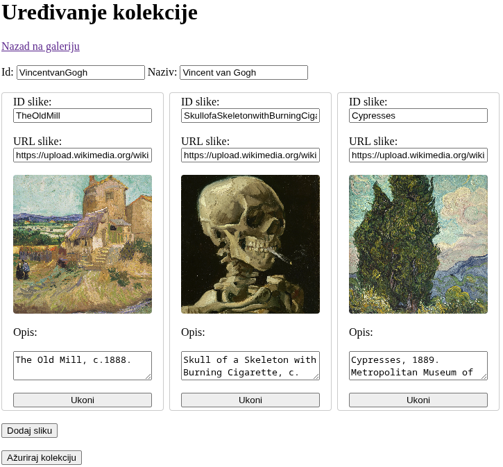
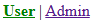

# Programsko inženjerstvo

## Primjer kolokvija #2

Kolokvij nosi ukupno **60 bodova** i piše se **120 minuta**.

> Potrebno je preuzeti projekt primjera drugog kolokvija s Merlina.

---

### Zadatak #1 – Galerija korisnik (26 boda)

1. Napravite **router** i definirajte sljedeće rute:
    - `/` redirect na `/gallery`
    - `/gallery` – prikaz dostupnih kolekcija
    - `/gallery/:collectionId` – prikaz slika unutar kolekcije
    - `/gallery/view/:imageId` – prikaz slike u punoj veličini

2. Napravite **Pinia** spremnik `galleryStore` i definirajte:
    - `collections` – sve kolekcije i slike (*učitati iz `collectionsData.js`*)
    - `comments` – komentari po slikama (objekt `{ [imageId]: [komentari] }`)
    - `addComment(imageId, comment)` – dodaje komentar slici

3. Izradite sljedeće **komponente** (*views*):

- **`CollectionListView`** – prikaz svih kolekcija
    - Prikazuje naziv, opis i prvu sliku iz kolekcije
    - Gumb **"Pogledaj"** vodi na `/gallery/:collectionId`

    

- **`CollectionView`** – prikaz svih slika iz kolekcije
    - Link za povratak na galeriju
    - Prikaz naziva kolekcije
    - Kolekciju dohvatiti iz url-a (*id kolekcije*)
    - Prikazuje slike kao thumbnail i njihove opise
    - Klik na sliku vodi na `/gallery/view/:imageId`

    

- **`ImageView`** – prikaz slike u punoj veličini
    - Prikazuje opis i cijelu sliku
    - Slika dohvaćena iz url-a (*id slike i kolekcije*)
    - Forma za dodavanje komentara (tekst + gumb **"Dodaj komentar"**)
    - Prikaz svih komentara za tu sliku
    - Link za povratak na kolekciju

    

---

### Zadatak #2 – Galerija administrator (34 bodova)

1. Dodajte sljedeće rute u **router**:

    - `/admin` – pregled svih kolekcija
    - `/admin/add` – dodavanje nove kolekcije
    - `/admin/:collectionId/edit` – uređivanje kolekcije i slika

2. Proširite **Pinia** spremnik `galleryStore` s funkcijama:

    - `addCollection(collection)` – dodaje kolekciju
    - `updateCollection(id, updatedCollection)` – ažurira kolekciju
    - `deleteCollection(id)` – briše kolekciju

3. Izradite sljedeće **admin komponente**:

- **`AdminView`** – prikaz svih kolekcija
    - Gumb **"Uredi"** i **"Obriši"** za svaku kolekciju
    - Link na `/admin/add` za dodavanje nove kolekcije

    

- **`AddCollectionView`** – dodavanje nove kolekcije
    - **Polja**: *id, naziv kolekcije, opis, slike (ID + URL + opis)*
    - Gumb **"Spremi kolekciju"**
    - Link za povratak na `/admin`

    

- **`EditCollectionView`** – uređivanje kolekcije
    - Mogućnost izmjene podataka kolekcije i slika
    - Brisanje i dodavanje novih slika
    - Gumb **"Ažuriraj kolekciju"**

    

4. Dodajte **zaglavlje** koje sadrži:
    - Linkove: `User`, `Admin`
        - **aktivni link** treba biti zelene boje
    
    

---

## Predajete sljedeću datoteku:

* **ZIP datoteka** cijelog projekta bez `node_modules` mape

