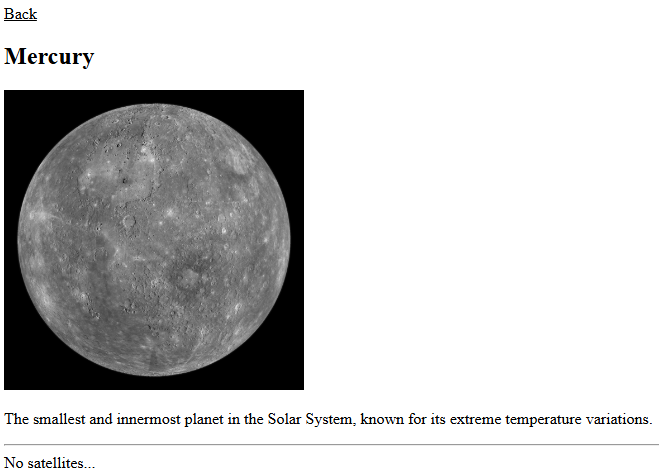
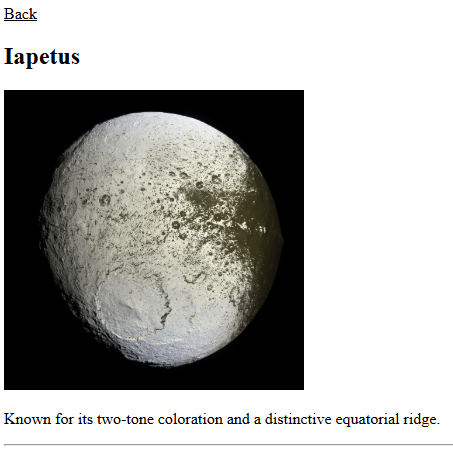
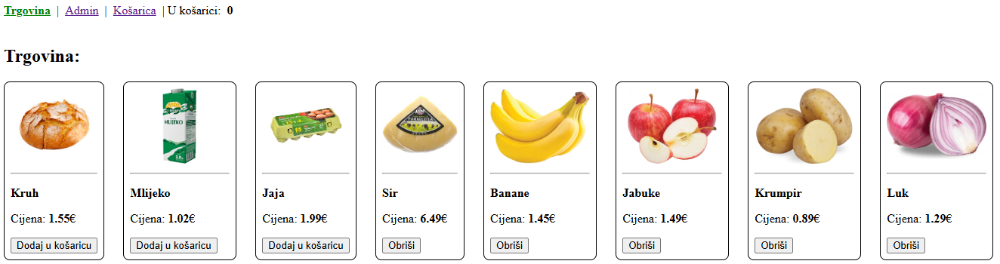
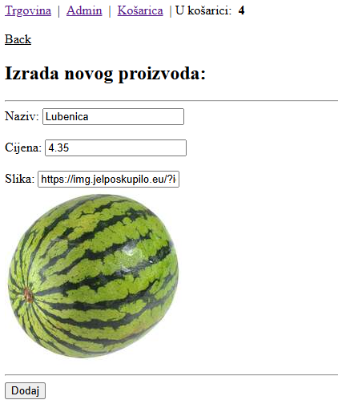
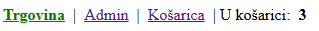

# Programsko inženjerstvo

## Primjer kolokvija #2

Kolokvij nosi ukupno **60 bodova** i piše se **120 minuta**.

> Potrebno je preuzet projekt primjera drugog kolokvija s Merlina.

---

### Zadatak #1 - SolarSystem (30 bodova)

1. **(8 boda)** Napravite **router** i definirajte sljedeće **rute**:
    - `/` redirect na `/solarsystem`
    - `/solarsystem` - lista planeta, 
    - `/solarsystem/:planet` – opis planeta i lista satelita
    - `/solarsystem/:planet/:satellite` – opis satelita

2. Izradite sljedeće **komponente** (*views*):
- **(4 boda)** **`SolarSystemView` - početna stranica**
    - Prikaz svih planeta (*slike i nazivi*)
    - Kad se klikne na **naziv** planeta, treba **navigirati** na rutu `/solarsystem/:planet`

- **(6 boda)** **`PlanetView` - prikaz planeta i njegovih satelita**
    - Link za ići **nazad** na prethodnu stranicu
    - Prikaz **naziva** i **opisa** planeta 
    - Ako planet **ima** satelite:
        - prikaz svih satelita (*slike i nazivi*)
        - kad se klikne na **naziv** satelita, treba **navigirati** na rutu `/solarsystem/:planet/:satellite`
    - Ako planet **nema** satelite:
        - prikazat text: `No satellites...`

  
  

- **(4 boda)** **`MoonView` - prikaz satelita**
    - Link za ići **nazad** na prethodnu stranicu
    - Prikaz **naziva** i **opisa** satelita 

3. **(8 boda)** Napravite **pinia** spremnik (*store*) i definirajte sljedeće:
    - `getPlanets()` funkciju koja vraća **sve planete** iz datoteke `solarSystemData.js`
    - `getPlanet(planetName)` funkciju koja vraća **planet** po danom *nazivu*
    - `getSatellite(planetName, satelliteName)` funkciju koja vraća **satelit** po danom *nazivu planeta* i *satelita*

---

### Zadatak #2 - MaliDucan (30 bodova)

1. **(6 bodova)** Napravite **router** i definirajte sljedeće **rute**:
    - `/shop` – pregled proizvoda
    - `/cart` – prikaz košarice
    - `/admin` – lista svih proizvoda
    - `/admin/add` – forma za dodavanje novog proizvoda

2. Izradite sljedeće **komponente** (*views* i *components*):

- **(4 boda)** **`ShopView` - pregled proizvoda:**
    - Prikaz svih proizvoda (*naziv, cijena, slika*)
    - Gumb **"Dodaj u košaricu"** za svaki proizvod

- **(3 boda)** **`CartView` - prikaz košarice:**
    - Prikaz dodanih proizvoda
    - Ukupna cijena na dnu stranice
    - Gumb **"Ukloni"** za svaki proizvod

- **(3 boda)** **`AdminView` - prikaz svih proizvoda:**
    - Prikaz svih proizvoda
    - Gumb **Obriši** za svaki proizvod
    - Link za otići na `/admin/add`

- **(4 boda)** **`AddProductView` - forma za dodavanje proizvoda:**
    - Link za ići **nazad** na prethodnu stranicu
    - Polja za unos (*naziva, cijene i slike (URL)*)
    - Gumb **"Dodaj proizvod"**
    - Testni podaci:
        - Naziv: `Lubenica`
        - Cijena: `4.35`
        - Slika: `https://img.jelposkupilo.eu/?id=lubenica-mini`

3. **(7 bodova)** Napravite **pinia** spremnik (*store*) i definirajte sljedeće:
    - `products` - reaktivna **lista proizvoda** 
        - proizvode učitajte iz datoteke `proizvodiData.js`
    - `cart` - reaktivna **lista proizvoda** koje je korisnik dodao u **košaricu**
    - `addToCart(product)` - **dodaje** proizvod u `cart`
    - `removeFromCart(index)` - **uklanja** proizvod iz `cart`
    - `addProduct(product)` - **dodaje** proizvod u `products`
    - `removeProduct(index)` - **uklanja** proizvod iz `products`

4. **(3 boda)** Dodajte **zaglavlje** koje sadrži:
    - Linkove: `Trgovina`, `Admin`, `Košarica` 
        - **aktivni link** treba biti zelene boje
    - **Broj** proizvoda u košarici

## Predajete sljedeću datoteku:

- **ZIP datoteka** cijelog projekta bez `node_modules` mape

