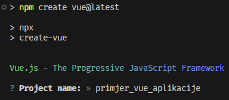
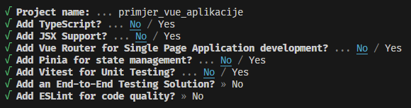

# Programsko inžinjerstvo

**Nositelj**: doc. dr. sc. Nikola Tanković  
**Asistent**: mag. inf. Alesandro Žužić

**Ustanova**: Sveučilište Jurja Dobrile u Puli, Fakultet informatike u Puli

<p style="float: clear; display: flex; gap: 8px; align-items: center;" class="font-brioni text-sm whitespace-nowrap">
    </img>
    Fakultet informatike u Puli
</p>

# [1] Vue.js osnove

<div style="display: flex; justify-content: space-between; text-align: justify; gap: 32px;">
    <p>
        Vue je JavaScript okvir (framework) za izradu korisničkih sučelja. Građen je na standardima HTML-a, CSS-a i JavaScript-a i pruža <b>deklarativno</b> programiranje bazirano na <b>komponentama</b> što omogućuje efikasnu izradu korisničkih sučelja bilo koje kompleksnosti.
    </p>
    </img>
</div>

**Posljednje ažurirano: 25.2.2025.**

## Sadržaj
<!-- TOC -->

- [Programsko inžinjerstvo](#programsko-in-injerstvo)
- [[1] Vue.js osnove](#-1--vuejs-osnove)
  * [Sadržaj](#sadr-aj)
  * [1.1 Uvod](#11-uvod)
    + [Single Page Application (SPA)](#single-page-application--spa-)
      - [Minimalni primjer Vue aplikacije](#minimalni-primjer-vue-aplikacije)
      - [Isti primjer bez Vue](#isti-primjer-bez-vue)
  * [1.2 Komponentni pristup u Vue.js](#12-komponentni-pristup-u-vuejs)
    + [Primjer liste voća koristeći samo *html*](#primjer-liste-vo-a-koriste-i-samo--html-)
    + [Primjer liste voća koristeći *html* i *js*](#primjer-liste-vo-a-koriste-i--html--i--js-)
    + [Primjer liste voća koristeći *Vue*](#primjer-liste-vo-a-koriste-i--vue-)
    + [Primjer liste voća koristeći *Vue* i *komponentu*](#primjer-liste-vo-a-koriste-i--vue--i--komponentu-)
    + [Primjer liste voća i liste povrća koristeći *Vue* i *komponente*](#primjer-liste-vo-a-i-liste-povr-a-koriste-i--vue--i--komponente-)
- [2. Postavljanje aplikacije/projekta](#2-postavljanje-aplikacije-projekta)
  * [2.1 Koraci za postavljanje projekta:](#21-koraci-za-postavljanje-projekta-)
  * [2.2 Struktura projekta](#22-struktura-projekta)
    + [App.vue](#appvue)
    + [main.js](#mainjs)
    + [main.css](#maincss)
- [3. Tailwind](#3-tailwind)
  * [3.1 Prednosti Tailwind-a](#31-prednosti-tailwind-a)
    + [Izravno pisanje u class atributu](#izravno-pisanje-u-class-atributu)
    + [Lakše održavanje kôda](#lak-e-odr-avanje-kôda)
    + [Jednostavna responzivnost](#jednostavna-responzivnost)
    + [Konfiguracija](#konfiguracija)
  * [3.2 Instalacija Tailwind-a](#32-instalacija-tailwind-a)
  * [3.3 Tailwind Osnove](#33-tailwind-osnove)
- [Samostalni zadatak za vježbu 1](#samostalni-zadatak-za-vje-bu-1)

<!-- /TOC -->

## 1.1 Uvod

Vue.js je JavaScript okvir koji se koristi za izradu dinamičkih i interaktivnih web aplikacija temeljenih na promjenjivim podacima (data-driven). Omogućuje učinkovito ažuriranje korisničkog sučelja bez potrebe za ponovnim učitavanjem cijele stranice.  

### Single Page Application (SPA)
Vue se često koristi za izradu **Single Page Applications (SPA)** – aplikacija koje učitavaju jednu HTML stranicu i dinamički mijenjaju njezin sadržaj ovisno o interakciji korisnika, bez potrebe za ponovnim učitavanjem stranice s poslužitelja.  

U SPA arhitekturi:  
- Sav **routing** (navigacija između različitih dijelova aplikacije) odvija se u pregledniku, umjesto na poslužitelju.  
- Vue Router omogućuje navigaciju između "stranica" bez osvježavanja cijelog sadržaja.  
- API pozivi prema backendu koriste se za dohvaćanje podataka, često u JSON formatu, putem **Axios** ili Fetch API-ja.  
- Vuex ili Pinia mogu se koristiti za upravljanje stanjem aplikacije kako bi podaci ostali dosljedni kroz cijelu aplikaciju.  

Ovakav pristup poboljšava korisničko iskustvo jer aplikacija radi brzo i fluidno, bez zastoja uzrokovanih ponovnim učitavanjem stranice.  

---

#### Minimalni primjer Vue aplikacije

```html
<!DOCTYPE html>
<html lang="hr">
<head>
    <meta charset="UTF-8">
    <meta name="viewport" content="width=device-width, initial-scale=1.0">
    <title>Minimalna Vue aplikacija</title>
    <script src="https://unpkg.com/Vue@3/dist/Vue.global.js"></script>
</head>
<body>
    <div id="app">
        <button @click="count++"> <!-- Event handling -->
            Count is: {{ count }} <!-- Template syntax -->
        </button>
    </div>

    <script>
        const { createApp, ref } = Vue;

        createApp({
            setup() {
                return {
                    count: ref(0) // Reactive variable
                };
            }
        }).mount("#app");
    </script>
</body>
</html>
```


Gornji primjer pokazuje dvije ključne značajke:

- **Deklarativno renderiranje** – Vue koristi *template sintaksu* unutar HTML-a kako bi prikazao dinamičke podatke. Promjene u varijabli `count` automatski se prikazuju u DOM-u.  

- **Reaktivnost** – Vue koristi reaktivne varijable (ovdje `ref(0)`) kako bi pratio promjene i ažurirao korisničko sučelje bez potrebe za ručnim manipuliranjem DOM-a.  

---

#### Isti primjer bez Vue 

Ako bismo istu funkcionalnost implementirali bez Vue.js, morali bismo ručno ažurirati DOM:  

```html
<!DOCTYPE html>
<html lang="hr">
<head>
    <meta charset="UTF-8">
    <meta name="viewport" content="width=device-width, initial-scale=1.0">
    <title>Minimalna aplikacija bez Vue.js</title>
</head>
<body>
    <div id="app">
        <button id="counterButton">
            Count is: 0
        </button>
    </div>

    <script>
        const counterButton = document.getElementById("counterButton");
        let count = 0;

        counterButton.addEventListener("click", () => {
            count++;
            counterButton.textContent = `Count is: ${count}`;
        });
    </script>
</body>
</html>
```

## 1.2 Komponentni pristup u Vue.js  
Vue koristi **komponente** – modularne i višekratno iskoristive dijelove sučelja koji imaju vlastitu logiku, stil i podatke. Komponente olakšavaju održavanje kôda i omogućuju lakšu skalabilnost aplikacija.

Vue koristi **komponente** – modularne, višekratno iskoristive dijelove korisničkog sučelja koji sadrže vlastitu logiku, stilove i podatke. Komponente olakšavaju održavanje kôda i omogućuju lakšu skalabilnost aplikacija. 

U sljedećim primjerima prikazat ćemo postupni prijelaz od običnog HTML-a do Vue komponenti, detaljno objašnjavajući svaki korak tog procesa. Kao konkretan primjer, izradit ćemo aplikaciju koja prikazuje listu voća.

### Primjer liste voća koristeći samo *html*  


Možemo primijetiti da se u ovom pristupu ponavlja isti kôd za svaku stavku, pri čemu je jedina razlika naziv stavke i ikona. Ova duplicirana logika može otežati održavanje aplikacije, jer svaki put kad dođe do promjene, potrebno je ažurirati svaku instancu tog obrasca.

Međutim, korištenjem osnovnih JavaScript tehnika, možemo riješiti ove izazove tako da dinamički punimo listu voća manipulirajući DOM elementima, čime se smanjuje potreba za ponavljanjem istog kôda na više mjesta.

### Primjer liste voća koristeći *html* i *js*  


Kroz ovaj pristup uspjeli smo riješiti problem ponavljanja kôda, čime smo postigli veću efikasnost i održivost. Međutim, HTML kôd za dinamičko generiranje stavki sada više nije odvojen u zasebnom HTML dokumentu, već je smješten unutar skripte, što može povećati složenost održavanja i čitljivosti kôda, jer se logika za prikazivanje sadržaja miješa s logikom za upravljanje podacima.

Korištenjem Vue.js-a, možemo pojednostaviti strukturu aplikacije i odvojiti HTML od skripte.

### Primjer liste voća koristeći *Vue*  


Možemo primijetiti da smo, umjesto da HTML kôd smjestimo unutar skripte, sada integrirali JavaScript unutar HTML-a. Korištenjem Vue ugrađenih direktiva, uspjeli smo pojednostaviti i učiniti kôd čitljivijim, a u isto vrijeme sačuvali istu funkcionalnost kao i prije.

Sljedeći korak koji možemo poduzeti je pretvoriti pojedinačnu stavku voća u zasebnu komponentu.

### Primjer liste voća koristeći *Vue* i *komponentu*  


Na ovaj način izdvajamo kôd stavke u zasebnu Vue datoteku koju poslije možemo koristiti u drugim dijelovima aplikacije. Takve zasebne Vue datoteke nazivaju se Single-File Components.

> Komponente se obično pišu u formatu koji nalikuje HTML-u, poznatom kao **Single-File Component** *(SFC)*, odnosno `*.vue` datoteke. Kao što ime sugerira, SFC encapsulira logiku komponente (JavaScript), predložak (HTML) i stilove (CSS) u jednoj datoteci.

### Primjer liste voća i liste povrća koristeći *Vue* i *komponente* 


# 2. Postavljanje aplikacije/projekta

U sljedećim koracima instalirat ćemo sve potrebne alate za razvoj Vue.js projekta.

## 2.1 Koraci za postavljanje projekta:  

1. **Instalacija uređivača kôda (Code Editor) Visual Studio Code**
    - Potrebno je preuzet i instalirat Visual Studio Code s [code.visualstudio.com](https://code.visualstudio.com)

        </img>
    - Alternativno preuzet i instalirat VSCodium s [vscodium.com](https://vscodium.com)
    
        <div style="display: flex; align-items: center; gap: 16px;">
            </img>
            <p>
                - Visual Studio Code bez telemetrije <br>
                - manje ekstenzija
            </p>
        </div>


2. **Instalacija Node.js**  
    - Potrebno je preuzet i instalirat Node.js verziju `>=18.3` s [nodejs.org](https://nodejs.org)
    - Instalacija se provjerava pomoću naredbe:  
        ```sh
        npm -v
        ```

3. **Kreiranje Vue projekta**  
    - Vue projekt kreira se pomoću naredbe:  
        ```sh
        npm create vue@latest
        ```

4. **Odabir naziva projekta**  
    - Prilikom kreiranja projekta, potrebno je unijeti željeni naziv
    - Taj naziv će odrediti ime mape u kojoj će se generirati svi potrebni resursi

        

5. **Podešavanje postavki projekta**  
    - U ovom koraku nije potrebno birati dodatne opcije, pa za sve stavke odabiremo `No`
    - Kasnije, kada budemo koristili Router i Piniu, za te opcije ćemo odabrati `Da`

        

6. **Pokretanje projekta**

    - Ući u direktorij projekta

        ```sh
        cd primjer_vue_aplikacije
        ```

    - Za instalaciju svih potrebnih paketa potrebno je pokrenuti sljedeću naredbu:

        ```sh
        npm install
        ```

    - Za pokretanje projekta u razvojnom načinu (*Hot-Reload*) s automatskim osvježavanjem koristi se naredba:

        ```sh
        npm run dev
        ```
    *Početni izgled aplikacije:*

     
        
7. **VS Code Ekstenzije**

Za lakši rad s projektom potrebno je instalirati nekoliko ekstenzija. U VS Code-u potrebno je otvoriti *lijevi bočni izbornik*, kliknuti na *Extensions* (ili pritisnuti `Ctrl + Shift + X`), zatim upisati naziv željene ekstenzije u pretraživač, pronaći je i kliknuti *Install*.


Preporučene ekstenzije:
    
- **Vue - Official** - podrška za Vue sintaksu

    

- **vscode-icons** - ikone dadoteka i mapa

    

- **Tailwind CSS IntelliSense**

    


## 2.2 Struktura projekta

*Struktura novokreiranog projekta izgleda kao što je prikazano na slici ispod:*


Trenutno projekt sadrži unaprijed definirane datoteke i komponente koje služe kao primjer jednostavne aplikacije s linkovima na dokumentaciju i druge korisne materijale. Budući da nam za početak treba čisti kostur aplikacije, izvršit ćemo sljedeće korake unuta `src` mape:

1. **Uklanjanje suvišnih datoteka i mapa**  
   - Izbrisati sve datoteke i podmape unutar mape `components/`
   - Izbrisati `base.css` i `logo.svg` iz mape `assets/`

2. **Čišćenje stilova**  
   - Isprazniti sadržaj `main.css` kako bi bio potpuno prazan.
 
3. **Priprema glavne komponente**  
   - Očistiti `App.vue` tako da sadrži samo osnovnu strukturu s `script setup`, `template` i `style` blokovima

***Izgled `src` mape nakon izvršenih koraka:*** 


### App.vue
`App.vue` je **glavna vue komponenta** koja se koristi za montira. Unutar nje ubacujemo sve druge komponente i rute na druge stranice aplikacije koje budemo kasnije radili pomoću `router` paketa.

*Izgled `App.vue` nakon čišćenja:*

```html
<script setup>
    // JS - logika komponente
</script>

<template>
    <!-- HTML - struktura i sadržaj komponente -->
</template> 

<style scoped>
    /* CSS - stil komponente */
</style>
```

Nakon što smo uklonili suvišne datoteke i očistili projekt, `src` mapa sada sadrži samo osnovne datoteke potrebne za daljnji rad. U ovom trenutku, stranica bi trebala biti potpuno prazna, tako da možemo u `App.vue` unutar `template` bloka napisati *"Hello, world!"*. 
```html
<template>
    Hello, World!
</template> 
```


### main.js
`Main.js` je glavna **JavaScript** dadoteka unutar koje se inicijalizira i montira vue aplikacija.

*Struktura `main.js` dadoteke:*
```js
import './assets/main.css'      // učitavanje glavnog stila aplikacije
                                // koji se primjenjuje nad cijelom aplikacijom

import { createApp } from 'vue' // učitavanje funkcije za kreiranje nove vue instance
import App from './App.vue'     // učitavanje komponente App.vue

createApp(App).mount('#app')    // kreiranje vue instance koristeći App.vue komponentu
                                // montiranje komponente na div s id-em #app
```

*Ako pogledamo `index.html` dadoteku:*

```html
<!DOCTYPE html>
<html lang="">
    <head>
        <meta charset="UTF-8">
        <link rel="icon" href="/favicon.ico">
        <meta name="viewport" content="width=device-width, initial-scale=1.0">
        <title>Vite App</title>
    </head>
    
    <body>
        <div id="app">
            <!--ovdje se montira App.vue-->
        </div>
        <script type="module" src="/src/main.js"></script>
    </body>
</html>
```
Vidimo da dokument sadrži `div` s **id**-jem `#app`, na koji *Vue* montira komponentu `App.vue`. Također, sadrži `module script` koji učitava `main.js`, čime se pokreće sama aplikacija.  

Iako Vue omogućuje kreiranje i montiranje više instanci istovremeno, u praksi se obično koristi samo jedna. Također, ime glavne komponente i `id` elementa na koji se montira mogu biti proizvoljni, ali se pridržavamo standardne konvencije.

*Primjer s dvije instance:*

```html
<!DOCTYPE html>
<html lang="">
    <head>
        <meta charset="UTF-8">
        <link rel="icon" href="/favicon.ico">
        <meta name="viewport" content="width=device-width, initial-scale=1.0">
        <title>Vite App</title>
    </head>
    
    <body>
        <div id="app">
            <!--ovdje se montira App.vue-->
        </div>
        <div id="druga_app">
            <!--ovdje se montira MojApp.vue-->
        </div>
        <script type="module" src="/src/main.js"></script>
    </body>
</html>
```
```js
import './assets/main.css'

import { createApp } from 'vue'
import App from './App.vue'
import MojApp from './MojApp.vue'

createApp(App).mount('#app')
createApp(MojApp).mount('#druga_app')
```
### main.css
Datoteka `main.css` služi za primjenu globalnih stilova na cijelu aplikaciju ili za učitavanje vanjskih CSS okvira poput **Tailwind**-a.  

*Kako bismo osigurali dosljedan prikaz aplikacije i olakšali rad sa stilovima, dodajemo sljedeća CSS pravila:  *

```css
html, body, #app {
    height: 100%;
    margin: 0;
}
```

# 3. Tailwind

<div style="display: flex; justify-content: space-between; text-align: justify; gap: 32px;">
    <p>
        <b>Tailwind CSS</b> je utility-first CSS okvir koji omogućuje brzo i efikasno stiliziranje web aplikacija. Umjesto unaprijed definiranih komponenti (kao u Bootstrapu), Tailwind koristi klase koje direktno primjenjuju pojedinačne stilove, što omogućuje veću fleksibilnost i prilagodljivost dizajna. Za razliku od tradicionalnih CSS frameworka (poput Bootstrapa), ne prisiljava korištenje unaprijed definiranih komponenti.
    </p>
    </img>
</div>

Ako želimo poboljšati *"Hello, world!"* primjer i učiniti ga vizualno zanimljivijim, možemo koristiti standardni `style` blok i **CSS** za stilizaciju.

*Primjer koristeći standardni `style` blok i **CSS**:*
```html
<template>
    <div class="mojDiv">
        <span class="mojSpan">
            Hello, World!
        </span>
    </div>
</template>

<style scoped>
    .mojDiv {
        background: linear-gradient(135deg, oklch(0.257 0.09 281.288) 0%, oklch(0.13 0.028 261.692) 100%);
        height: 100%;
        display: flex;
        justify-content: center;
        align-items: center;
    }
    .mojSpan {
        transition: all 0.3s ease-in-out;
        color: oklch(0.967 0.003 264.542);
        font-family: monospace;
        font-size: 4rem;
        font-weight: bold;
    }
    .mojSpan:hover {
        color: oklch(0.789 0.154 211.53);
        scale: 125%;
        letter-spacing: 0.25rem;
    }
</style>
```


*Primjer koristeći **Tailwind**:*
```html
<template>
    <div class="bg-gradient-to-br from-indigo-950 to-gray-950 h-full flex justify-center items-center">
        <span class="transition-all duration-300 ease-in-out text-gray-100 font-mono text-6xl font-bold
            hover:text-cyan-400 hover:scale-125 hover:tracking-[0.25rem]">
            Hello, World!
        </span>
    </div>
</template>

<style scoped>
</style>
```

Možemo uočiti da smo u drugom primjer potpuno ispraznili style i pisali gotove dinamičke *Tailwind* **klase** direktno u `template`.

## 3.1 Prednosti Tailwind-a  

### Izravno pisanje u class atributu 
Tailwind omogućuje izravno stiliziranje u `class` atributu bez potrebe za pisanjem zasebnog CSS-a. Umjesto definiranja zasebnih CSS pravila za svaki element, Tailwind koristi unaprijed definirane klase.

*Ako pišemo CSS klasu za povećat veličinu fonta:*

```html 
<p class="customFontSize">
    Some text
</p>
```

```css 
.customFontSize {
    font-size: 1.25rem /* (20px) */;
}
```

*Možemo umjesto toga direktno u `class` pisat Tailwind klasu `text-xl`:*

```html 
<p class="text-xl">
    Some text
</p>
```

### Lakše održavanje kôda

Smanjuje potrebu za pisanjem dodatnih CSS datoteka i olakšava održavanje kôda. Nema potrebe za traženjem gdje su definirani stilovi za određeni element jer se svi stilovi nalaze unutar `class` atributa tog elementa. Budući da svaka Tailwind klasa primjenjuje samo jedno svojstvo, stilizacija je jasna, modularna i lako prilagodljiva.

### Jednostavna responzivnost

Tailwind nudi jednostavan sustav za prilagodbu različitim veličinama ekrana pomoću prefiksa (`sm:`, `md:`, `lg:`, `xl:`). Nema potrebe za pisanjem posebnih `@media` upita – sve se rješava unutar `class` atributa

*Koristeći tradicionalan media query:*

```html
<template>
    <div class="mojDiv">
        <h1>Prilagodljiv tekst</h1>
    </div>
</template>

<style scoped>
    .mojDiv {
        height: 100vh;
        width: 100%;
        display: flex;
        justify-content: center;
        align-items: center;
        background-color: #1f2937; /* bg-gray-800 */
    }
    
    h1 {
        color: white;
        font-weight: bold;
        font-size: 1.5rem; /* text-2xl */
    }

    @media (min-width: 640px) { /* sm */
        h1 {
            font-size: 1.875rem; /* text-3xl */
        }
    }

    @media (min-width: 768px) { /* md */
        h1 {
            font-size: 2.25rem; /* text-4xl */
        }
    }

    @media (min-width: 1024px) { /* lg */
        h1 {
            font-size: 3rem; /* text-5xl */
        }
    }

    @media (min-width: 1280px) { /* xl */
        h1 {
            font-size: 3.75rem; /* text-6xl */
        }
    }
</style>
```

*Koristeći Tailwind responzivni dizajn:*

```html
<template>
    <div class="h-screen flex justify-center items-center bg-gray-800">
        <h1 class="text-white font-bold text-2xl sm:text-3xl md:text-4xl lg:text-5xl xl:text-6xl">
            Prilagodljiv tekst
        </h1>
    </div>
</template>
```

### Konfiguracija

Tailwind pruža konfiguraciju, gdje možemo definirati boje, fontove i rasporede koji će se koristiti kroz cijelu aplikaciju. Time osigurava dosljedan vizualni stil u cijelom projektu.

*Primjer prilagođene teme:*

```css
@import "tailwindcss";

@theme {
    --color-FIPU-blue: rgb(14, 165, 233);
}
```

```html
<template>
    <h1 class="text-FIPU-blue">
        FIPU blue
    </h1>
</template>
```

## 3.2 Instalacija Tailwind-a

Tailwind ćemo integrirati i instalirati unutar našeg Vue projekta koristeći **Vite**, koji je već uključen prilikom kreiranja Vue aplikacije. Instalaciju Tailwinda možete i pratiti na njihovoj stranici: [https://tailwindcss.com/docs/installation/using-vite](https://tailwindcss.com/docs/installation/using-vite)

Koraci za instalaciju:

1. Instalacija **Tailwind CSS**
    
    - u `terminal` treba napisati sljedeću komandu

    ```
    npm install tailwindcss @tailwindcss/vite
    ```
    - instalacija se vrši pomoću naredbe `npm`, budući da zapravo instaliramo **npm paket**. U kasnijim predavanjima koristit ćemo isti postupak za instalaciju drugih paketa koje ćemo upotrebljavati u projektu.

2. Konfiguracija Vite plugina

    - unutar Vite konfiguracijske dadoteke `vite.config.js` dodajemo sljedeći kôd
    
    ```js
    import { fileURLToPath, URL } from 'node:url'

    import { defineConfig } from 'vite'
    import vue from '@vitejs/plugin-vue'
    import vueDevTools from 'vite-plugin-vue-devtools'
    import tailwindcss from '@tailwindcss/vite' // <- učitavanje tailwindcss paketa

    export default defineConfig({
        plugins: [
            vue(),
            vueDevTools() // <- dodan plugin
        ],
        resolve: {
            alias: {
                '@': fileURLToPath(new URL('./src', import.meta.url))
            },
        },
    })
    ```

3. Učitavanje Tailwind CSS-a

    - unutar `main.css` dadoteke dodajemo sljedeću liniju kôda čime uključujemo Tailwind CSS
    
    ```css
    @import "tailwindcss";
    ```

    - sada možemo koristiti Tailwind klase

4. Fix za Tailwind CSS IntelliSense

    - ako smo instalirali ekstenziju `Tailwind CSS IntelliSense` postoji velika šansa da neće raditi nakon prva 3 koraka
    - da bi ekstenzija proradila potrebno je dodati praznu dadoteku `tailwind.config.js` u projekt
    - nakon dodavanje ove dadoteke ekstenzija bi trebala raditi kako spada

    

## 3.3 Tailwind Osnove

U ovom djelu ćemo proći osnove Tailwind klasa kao što su *boje, text, veličine, spacing, flex, stanja, responzivnost i teme*. Sva dokumentacija Tailwinda dostupna je na stranici: [https://tailwindcss.com/docs/styling-with-utility-classes](https://tailwindcss.com/docs/styling-with-utility-classes)

### Boje

Tailwind dolazi s mnogo predefiniranih boja koje se mogu direktno koristiti za oblikovanje teksta, pozadina, gradijenata i obruba. Za korištenje boje, koristi se `ime atributa`, `naziv boje` i `broj svjetline` (*manji broj označava svjetliju boju, veći broj tamniju*).

*Primjer korištenja boja:*
```html
<div class="
    text-lime-300
    bg-zinc-800
    border-sky-700
    border-2
">
    Some text
</div>
``` 


*Lista svih boja:*

<div style="display: flex; flex-direction: column; gap: 2px; font-size: 12px;">

<div style="display: flex; gap: 4px;">
<div style="width: 64px; text-align: right; padding-right: 2px;"></div>
<div style="width: 26px; text-align: center;">50</div>
<div style="width: 26px; text-align: center;">100</div>
<div style="width: 26px; text-align: center;">200</div>
<div style="width: 26px; text-align: center;">300</div>
<div style="width: 26px; text-align: center;">400</div>
<div style="width: 26px; text-align: center;">500</div>
<div style="width: 26px; text-align: center;">600</div>
<div style="width: 26px; text-align: center;">700</div>
<div style="width: 26px; text-align: center;">800</div>
<div style="width: 26px; text-align: center;">900</div>
<div style="width: 26px; text-align: center;">950</div>
</div>

<div style="display: flex; gap: 4px;">
<div style="width: 64px; text-align: right; padding-right: 2px;">Red:</div>
<div style="background: oklch(0.971 0.013 17.38);  width: 24px; height: 24px; border-radius: 4px; border: 1px solid gray;"></div>
<div style="background: oklch(0.936 0.032 17.717); width: 24px; height: 24px; border-radius: 4px; border: 1px solid gray;"></div>
<div style="background: oklch(0.885 0.062 18.334); width: 24px; height: 24px; border-radius: 4px; border: 1px solid gray;"></div>
<div style="background: oklch(0.808 0.114 19.571); width: 24px; height: 24px; border-radius: 4px; border: 1px solid gray;"></div>
<div style="background: oklch(0.704 0.191 22.216); width: 24px; height: 24px; border-radius: 4px; border: 1px solid gray;"></div>
<div style="background: oklch(0.637 0.237 25.331); width: 24px; height: 24px; border-radius: 4px; border: 1px solid gray;"></div>
<div style="background: oklch(0.577 0.245 27.325); width: 24px; height: 24px; border-radius: 4px; border: 1px solid gray;"></div>
<div style="background: oklch(0.505 0.213 27.518); width: 24px; height: 24px; border-radius: 4px; border: 1px solid gray;"></div>
<div style="background: oklch(0.444 0.177 26.899); width: 24px; height: 24px; border-radius: 4px; border: 1px solid gray;"></div>
<div style="background: oklch(0.396 0.141 25.723); width: 24px; height: 24px; border-radius: 4px; border: 1px solid gray;"></div>
<div style="background: oklch(0.258 0.092 26.042); width: 24px; height: 24px; border-radius: 4px; border: 1px solid gray;"></div>
</div>

<div style="display: flex; gap: 4px;">
<div style="width: 64px; text-align: right; padding-right: 2px;">Orange:</div>
<div style="background: oklch(0.98 0.016 73.684);  width: 24px; height: 24px; border-radius: 4px; border: 1px solid gray;"></div>
<div style="background: oklch(0.954 0.038 75.164); width: 24px; height: 24px; border-radius: 4px; border: 1px solid gray;"></div>
<div style="background: oklch(0.901 0.076 70.697); width: 24px; height: 24px; border-radius: 4px; border: 1px solid gray;"></div>
<div style="background: oklch(0.837 0.128 66.29); width: 24px; height: 24px; border-radius: 4px; border: 1px solid gray;"></div>
<div style="background: oklch(0.75 0.183 55.934); width: 24px; height: 24px; border-radius: 4px; border: 1px solid gray;"></div>
<div style="background: oklch(0.705 0.213 47.604); width: 24px; height: 24px; border-radius: 4px; border: 1px solid gray;"></div>
<div style="background: oklch(0.646 0.222 41.116); width: 24px; height: 24px; border-radius: 4px; border: 1px solid gray;"></div>
<div style="background: oklch(0.553 0.195 38.402); width: 24px; height: 24px; border-radius: 4px; border: 1px solid gray;"></div>
<div style="background: oklch(0.47 0.157 37.304); width: 24px; height: 24px; border-radius: 4px; border: 1px solid gray;"></div>
<div style="background: oklch(0.408 0.123 38.172); width: 24px; height: 24px; border-radius: 4px; border: 1px solid gray;"></div>
<div style="background: oklch(0.266 0.079 36.259); width: 24px; height: 24px; border-radius: 4px; border: 1px solid gray;"></div>
</div>

<div style="display: flex; gap: 4px;">
<div style="width: 64px; text-align: right; padding-right: 2px;">Amber:</div>
<div style="background: oklch(0.987 0.022 95.277);  width: 24px; height: 24px; border-radius: 4px; border: 1px solid gray;"></div>
<div style="background: oklch(0.962 0.059 95.617); width: 24px; height: 24px; border-radius: 4px; border: 1px solid gray;"></div>
<div style="background: oklch(0.924 0.12 95.746); width: 24px; height: 24px; border-radius: 4px; border: 1px solid gray;"></div>
<div style="background: oklch(0.879 0.169 91.605); width: 24px; height: 24px; border-radius: 4px; border: 1px solid gray;"></div>
<div style="background: oklch(0.828 0.189 84.429); width: 24px; height: 24px; border-radius: 4px; border: 1px solid gray;"></div>
<div style="background: oklch(0.769 0.188 70.08); width: 24px; height: 24px; border-radius: 4px; border: 1px solid gray;"></div>
<div style="background: oklch(0.666 0.179 58.318); width: 24px; height: 24px; border-radius: 4px; border: 1px solid gray;"></div>
<div style="background: oklch(0.555 0.163 48.998); width: 24px; height: 24px; border-radius: 4px; border: 1px solid gray;"></div>
<div style="background: oklch(0.473 0.137 46.201); width: 24px; height: 24px; border-radius: 4px; border: 1px solid gray;"></div>
<div style="background: oklch(0.414 0.112 45.904); width: 24px; height: 24px; border-radius: 4px; border: 1px solid gray;"></div>
<div style="background: oklch(0.279 0.077 45.635); width: 24px; height: 24px; border-radius: 4px; border: 1px solid gray;"></div>
</div>

<div style="display: flex; gap: 4px;">
<div style="width: 64px; text-align: right; padding-right: 2px;">Yellow:</div>
<div style="background: oklch(0.987 0.026 102.212);  width: 24px; height: 24px; border-radius: 4px; border: 1px solid gray;"></div>
<div style="background: oklch(0.973 0.071 103.193); width: 24px; height: 24px; border-radius: 4px; border: 1px solid gray;"></div>
<div style="background: oklch(0.945 0.129 101.54); width: 24px; height: 24px; border-radius: 4px; border: 1px solid gray;"></div>
<div style="background: oklch(0.905 0.182 98.111); width: 24px; height: 24px; border-radius: 4px; border: 1px solid gray;"></div>
<div style="background: oklch(0.852 0.199 91.936); width: 24px; height: 24px; border-radius: 4px; border: 1px solid gray;"></div>
<div style="background: oklch(0.795 0.184 86.047); width: 24px; height: 24px; border-radius: 4px; border: 1px solid gray;"></div>
<div style="background: oklch(0.681 0.162 75.834); width: 24px; height: 24px; border-radius: 4px; border: 1px solid gray;"></div>
<div style="background: oklch(0.554 0.135 66.442); width: 24px; height: 24px; border-radius: 4px; border: 1px solid gray;"></div>
<div style="background: oklch(0.476 0.114 61.907); width: 24px; height: 24px; border-radius: 4px; border: 1px solid gray;"></div>
<div style="background: oklch(0.421 0.095 57.708); width: 24px; height: 24px; border-radius: 4px; border: 1px solid gray;"></div>
<div style="background: oklch(0.286 0.066 53.813); width: 24px; height: 24px; border-radius: 4px; border: 1px solid gray;"></div>
</div>

<div style="display: flex; gap: 4px;">
<div style="width: 64px; text-align: right; padding-right: 2px;">Lime:</div>
<div style="background: oklch(0.986 0.031 120.757);  width: 24px; height: 24px; border-radius: 4px; border: 1px solid gray;"></div>
<div style="background: oklch(0.967 0.067 122.328); width: 24px; height: 24px; border-radius: 4px; border: 1px solid gray;"></div>
<div style="background: oklch(0.938 0.127 124.321); width: 24px; height: 24px; border-radius: 4px; border: 1px solid gray;"></div>
<div style="background: oklch(0.897 0.196 126.665); width: 24px; height: 24px; border-radius: 4px; border: 1px solid gray;"></div>
<div style="background: oklch(0.841 0.238 128.85); width: 24px; height: 24px; border-radius: 4px; border: 1px solid gray;"></div>
<div style="background: oklch(0.768 0.233 130.85); width: 24px; height: 24px; border-radius: 4px; border: 1px solid gray;"></div>
<div style="background: oklch(0.648 0.2 131.684); width: 24px; height: 24px; border-radius: 4px; border: 1px solid gray;"></div>
<div style="background: oklch(0.532 0.157 131.589); width: 24px; height: 24px; border-radius: 4px; border: 1px solid gray;"></div>
<div style="background: oklch(0.453 0.124 130.933); width: 24px; height: 24px; border-radius: 4px; border: 1px solid gray;"></div>
<div style="background: oklch(0.405 0.101 131.063); width: 24px; height: 24px; border-radius: 4px; border: 1px solid gray;"></div>
<div style="background: oklch(0.274 0.072 132.109); width: 24px; height: 24px; border-radius: 4px; border: 1px solid gray;"></div>
</div>

<div style="display: flex; gap: 4px;">
<div style="width: 64px; text-align: right; padding-right: 2px;">Green:</div>
<div style="background: oklch(0.982 0.018 155.826);  width: 24px; height: 24px; border-radius: 4px; border: 1px solid gray;"></div>
<div style="background: oklch(0.962 0.044 156.743); width: 24px; height: 24px; border-radius: 4px; border: 1px solid gray;"></div>
<div style="background: oklch(0.925 0.084 155.995); width: 24px; height: 24px; border-radius: 4px; border: 1px solid gray;"></div>
<div style="background: oklch(0.871 0.15 154.449); width: 24px; height: 24px; border-radius: 4px; border: 1px solid gray;"></div>
<div style="background: oklch(0.792 0.209 151.711); width: 24px; height: 24px; border-radius: 4px; border: 1px solid gray;"></div>
<div style="background: oklch(0.723 0.219 149.579); width: 24px; height: 24px; border-radius: 4px; border: 1px solid gray;"></div>
<div style="background: oklch(0.627 0.194 149.214); width: 24px; height: 24px; border-radius: 4px; border: 1px solid gray;"></div>
<div style="background: oklch(0.527 0.154 150.069); width: 24px; height: 24px; border-radius: 4px; border: 1px solid gray;"></div>
<div style="background: oklch(0.448 0.119 151.328); width: 24px; height: 24px; border-radius: 4px; border: 1px solid gray;"></div>
<div style="background: oklch(0.393 0.095 152.535); width: 24px; height: 24px; border-radius: 4px; border: 1px solid gray;"></div>
<div style="background: oklch(0.266 0.065 152.934); width: 24px; height: 24px; border-radius: 4px; border: 1px solid gray;"></div>
</div>

<div style="display: flex; gap: 4px;">
<div style="width: 64px; text-align: right; padding-right: 2px;">Emerald:</div>
<div style="background: oklch(0.979 0.021 166.113);  width: 24px; height: 24px; border-radius: 4px; border: 1px solid gray;"></div>
<div style="background: oklch(0.95 0.052 163.051); width: 24px; height: 24px; border-radius: 4px; border: 1px solid gray;"></div>
<div style="background: oklch(0.905 0.093 164.15); width: 24px; height: 24px; border-radius: 4px; border: 1px solid gray;"></div>
<div style="background: oklch(0.845 0.143 164.978); width: 24px; height: 24px; border-radius: 4px; border: 1px solid gray;"></div>
<div style="background: oklch(0.765 0.177 163.223); width: 24px; height: 24px; border-radius: 4px; border: 1px solid gray;"></div>
<div style="background: oklch(0.696 0.17 162.48); width: 24px; height: 24px; border-radius: 4px; border: 1px solid gray;"></div>
<div style="background: oklch(0.596 0.145 163.225); width: 24px; height: 24px; border-radius: 4px; border: 1px solid gray;"></div>
<div style="background: oklch(0.508 0.118 165.612); width: 24px; height: 24px; border-radius: 4px; border: 1px solid gray;"></div>
<div style="background: oklch(0.432 0.095 166.913); width: 24px; height: 24px; border-radius: 4px; border: 1px solid gray;"></div>
<div style="background: oklch(0.378 0.077 168.94); width: 24px; height: 24px; border-radius: 4px; border: 1px solid gray;"></div>
<div style="background: oklch(0.262 0.051 172.552); width: 24px; height: 24px; border-radius: 4px; border: 1px solid gray;"></div>
</div>

<div style="display: flex; gap: 4px;">
<div style="width: 64px; text-align: right; padding-right: 2px;">Teal:</div>
<div style="background: oklch(0.984 0.014 180.72);  width: 24px; height: 24px; border-radius: 4px; border: 1px solid gray;"></div>
<div style="background: oklch(0.953 0.051 180.801); width: 24px; height: 24px; border-radius: 4px; border: 1px solid gray;"></div>
<div style="background: oklch(0.91 0.096 180.426); width: 24px; height: 24px; border-radius: 4px; border: 1px solid gray;"></div>
<div style="background: oklch(0.855 0.138 181.071); width: 24px; height: 24px; border-radius: 4px; border: 1px solid gray;"></div>
<div style="background: oklch(0.777 0.152 181.912); width: 24px; height: 24px; border-radius: 4px; border: 1px solid gray;"></div>
<div style="background: oklch(0.704 0.14 182.503); width: 24px; height: 24px; border-radius: 4px; border: 1px solid gray;"></div>
<div style="background: oklch(0.6 0.118 184.704); width: 24px; height: 24px; border-radius: 4px; border: 1px solid gray;"></div>
<div style="background: oklch(0.511 0.096 186.391); width: 24px; height: 24px; border-radius: 4px; border: 1px solid gray;"></div>
<div style="background: oklch(0.437 0.078 188.216); width: 24px; height: 24px; border-radius: 4px; border: 1px solid gray;"></div>
<div style="background: oklch(0.386 0.063 188.416); width: 24px; height: 24px; border-radius: 4px; border: 1px solid gray;"></div>
<div style="background: oklch(0.277 0.046 192.524); width: 24px; height: 24px; border-radius: 4px; border: 1px solid gray;"></div>
</div>

<div style="display: flex; gap: 4px;">
<div style="width: 64px; text-align: right; padding-right: 2px;">Cyan:</div>
<div style="background: oklch(0.984 0.019 200.873);  width: 24px; height: 24px; border-radius: 4px; border: 1px solid gray;"></div>
<div style="background: oklch(0.956 0.045 203.388); width: 24px; height: 24px; border-radius: 4px; border: 1px solid gray;"></div>
<div style="background: oklch(0.917 0.08 205.041); width: 24px; height: 24px; border-radius: 4px; border: 1px solid gray;"></div>
<div style="background: oklch(0.865 0.127 207.078); width: 24px; height: 24px; border-radius: 4px; border: 1px solid gray;"></div>
<div style="background: oklch(0.789 0.154 211.53); width: 24px; height: 24px; border-radius: 4px; border: 1px solid gray;"></div>
<div style="background: oklch(0.715 0.143 215.221); width: 24px; height: 24px; border-radius: 4px; border: 1px solid gray;"></div>
<div style="background: oklch(0.609 0.126 221.723); width: 24px; height: 24px; border-radius: 4px; border: 1px solid gray;"></div>
<div style="background: oklch(0.52 0.105 223.128); width: 24px; height: 24px; border-radius: 4px; border: 1px solid gray;"></div>
<div style="background: oklch(0.45 0.085 224.283); width: 24px; height: 24px; border-radius: 4px; border: 1px solid gray;"></div>
<div style="background: oklch(0.398 0.07 227.392); width: 24px; height: 24px; border-radius: 4px; border: 1px solid gray;"></div>
<div style="background: oklch(0.302 0.056 229.695); width: 24px; height: 24px; border-radius: 4px; border: 1px solid gray;"></div>
</div>

<div style="display: flex; gap: 4px;">
<div style="width: 64px; text-align: right; padding-right: 2px;">Sky:</div>
<div style="background: oklch(0.977 0.013 236.62);  width: 24px; height: 24px; border-radius: 4px; border: 1px solid gray;"></div>
<div style="background: oklch(0.951 0.026 236.824); width: 24px; height: 24px; border-radius: 4px; border: 1px solid gray;"></div>
<div style="background: oklch(0.901 0.058 230.902); width: 24px; height: 24px; border-radius: 4px; border: 1px solid gray;"></div>
<div style="background: oklch(0.828 0.111 230.318); width: 24px; height: 24px; border-radius: 4px; border: 1px solid gray;"></div>
<div style="background: oklch(0.746 0.16 232.661); width: 24px; height: 24px; border-radius: 4px; border: 1px solid gray;"></div>
<div style="background: oklch(0.685 0.169 237.323); width: 24px; height: 24px; border-radius: 4px; border: 1px solid gray;"></div>
<div style="background: oklch(0.588 0.158 241.966); width: 24px; height: 24px; border-radius: 4px; border: 1px solid gray;"></div>
<div style="background: oklch(0.5 0.134 242.749); width: 24px; height: 24px; border-radius: 4px; border: 1px solid gray;"></div>
<div style="background: oklch(0.443 0.11 240.79); width: 24px; height: 24px; border-radius: 4px; border: 1px solid gray;"></div>
<div style="background: oklch(0.391 0.09 240.876); width: 24px; height: 24px; border-radius: 4px; border: 1px solid gray;"></div>
<div style="background: oklch(0.293 0.066 243.157); width: 24px; height: 24px; border-radius: 4px; border: 1px solid gray;"></div>
</div>

<div style="display: flex; gap: 4px;">
<div style="width: 64px; text-align: right; padding-right: 2px;">Blue:</div>
<div style="background: oklch(0.97 0.014 254.604);  width: 24px; height: 24px; border-radius: 4px; border: 1px solid gray;"></div>
<div style="background: oklch(0.932 0.032 255.585); width: 24px; height: 24px; border-radius: 4px; border: 1px solid gray;"></div>
<div style="background: oklch(0.882 0.059 254.128); width: 24px; height: 24px; border-radius: 4px; border: 1px solid gray;"></div>
<div style="background: oklch(0.809 0.105 251.813); width: 24px; height: 24px; border-radius: 4px; border: 1px solid gray;"></div>
<div style="background: oklch(0.707 0.165 254.624); width: 24px; height: 24px; border-radius: 4px; border: 1px solid gray;"></div>
<div style="background: oklch(0.623 0.214 259.815); width: 24px; height: 24px; border-radius: 4px; border: 1px solid gray;"></div>
<div style="background: oklch(0.546 0.245 262.881); width: 24px; height: 24px; border-radius: 4px; border: 1px solid gray;"></div>
<div style="background: oklch(0.488 0.243 264.376); width: 24px; height: 24px; border-radius: 4px; border: 1px solid gray;"></div>
<div style="background: oklch(0.424 0.199 265.638); width: 24px; height: 24px; border-radius: 4px; border: 1px solid gray;"></div>
<div style="background: oklch(0.379 0.146 265.522); width: 24px; height: 24px; border-radius: 4px; border: 1px solid gray;"></div>
<div style="background: oklch(0.282 0.091 267.935); width: 24px; height: 24px; border-radius: 4px; border: 1px solid gray;"></div>
</div>

<div style="display: flex; gap: 4px;">
<div style="width: 64px; text-align: right; padding-right: 2px;">Indigo:</div>
<div style="background: oklch(0.962 0.018 272.314);  width: 24px; height: 24px; border-radius: 4px; border: 1px solid gray;"></div>
<div style="background: oklch(0.93 0.034 272.788); width: 24px; height: 24px; border-radius: 4px; border: 1px solid gray;"></div>
<div style="background: oklch(0.87 0.065 274.039); width: 24px; height: 24px; border-radius: 4px; border: 1px solid gray;"></div>
<div style="background: oklch(0.785 0.115 274.713); width: 24px; height: 24px; border-radius: 4px; border: 1px solid gray;"></div>
<div style="background: oklch(0.673 0.182 276.935); width: 24px; height: 24px; border-radius: 4px; border: 1px solid gray;"></div>
<div style="background: oklch(0.585 0.233 277.117); width: 24px; height: 24px; border-radius: 4px; border: 1px solid gray;"></div>
<div style="background: oklch(0.511 0.262 276.966); width: 24px; height: 24px; border-radius: 4px; border: 1px solid gray;"></div>
<div style="background: oklch(0.457 0.24 277.023); width: 24px; height: 24px; border-radius: 4px; border: 1px solid gray;"></div>
<div style="background: oklch(0.398 0.195 277.366); width: 24px; height: 24px; border-radius: 4px; border: 1px solid gray;"></div>
<div style="background: oklch(0.359 0.144 278.697); width: 24px; height: 24px; border-radius: 4px; border: 1px solid gray;"></div>
<div style="background: oklch(0.257 0.09 281.288); width: 24px; height: 24px; border-radius: 4px; border: 1px solid gray;"></div>
</div>

<div style="display: flex; gap: 4px;">
<div style="width: 64px; text-align: right; padding-right: 2px;">Violet:</div>
<div style="background: oklch(0.969 0.016 293.756);  width: 24px; height: 24px; border-radius: 4px; border: 1px solid gray;"></div>
<div style="background: oklch(0.943 0.029 294.588); width: 24px; height: 24px; border-radius: 4px; border: 1px solid gray;"></div>
<div style="background: oklch(0.894 0.057 293.283); width: 24px; height: 24px; border-radius: 4px; border: 1px solid gray;"></div>
<div style="background: oklch(0.811 0.111 293.571); width: 24px; height: 24px; border-radius: 4px; border: 1px solid gray;"></div>
<div style="background: oklch(0.702 0.183 293.541); width: 24px; height: 24px; border-radius: 4px; border: 1px solid gray;"></div>
<div style="background: oklch(0.606 0.25 292.717); width: 24px; height: 24px; border-radius: 4px; border: 1px solid gray;"></div>
<div style="background: oklch(0.541 0.281 293.009); width: 24px; height: 24px; border-radius: 4px; border: 1px solid gray;"></div>
<div style="background: oklch(0.491 0.27 292.581); width: 24px; height: 24px; border-radius: 4px; border: 1px solid gray;"></div>
<div style="background: oklch(0.432 0.232 292.759); width: 24px; height: 24px; border-radius: 4px; border: 1px solid gray;"></div>
<div style="background: oklch(0.38 0.189 293.745); width: 24px; height: 24px; border-radius: 4px; border: 1px solid gray;"></div>
<div style="background: oklch(0.283 0.141 291.089); width: 24px; height: 24px; border-radius: 4px; border: 1px solid gray;"></div>
</div>

<div style="display: flex; gap: 4px;">
<div style="width: 64px; text-align: right; padding-right: 2px;">Purple:</div>
<div style="background: oklch(0.977 0.014 308.299);  width: 24px; height: 24px; border-radius: 4px; border: 1px solid gray;"></div>
<div style="background: oklch(0.946 0.033 307.174); width: 24px; height: 24px; border-radius: 4px; border: 1px solid gray;"></div>
<div style="background: oklch(0.902 0.063 306.703); width: 24px; height: 24px; border-radius: 4px; border: 1px solid gray;"></div>
<div style="background: oklch(0.827 0.119 306.383); width: 24px; height: 24px; border-radius: 4px; border: 1px solid gray;"></div>
<div style="background: oklch(0.714 0.203 305.504); width: 24px; height: 24px; border-radius: 4px; border: 1px solid gray;"></div>
<div style="background: oklch(0.627 0.265 303.9); width: 24px; height: 24px; border-radius: 4px; border: 1px solid gray;"></div>
<div style="background: oklch(0.558 0.288 302.321); width: 24px; height: 24px; border-radius: 4px; border: 1px solid gray;"></div>
<div style="background: oklch(0.496 0.265 301.924); width: 24px; height: 24px; border-radius: 4px; border: 1px solid gray;"></div>
<div style="background: oklch(0.438 0.218 303.724); width: 24px; height: 24px; border-radius: 4px; border: 1px solid gray;"></div>
<div style="background: oklch(0.381 0.176 304.987); width: 24px; height: 24px; border-radius: 4px; border: 1px solid gray;"></div>
<div style="background: oklch(0.291 0.149 302.717); width: 24px; height: 24px; border-radius: 4px; border: 1px solid gray;"></div>
</div>

<div style="display: flex; gap: 4px;">
<div style="width: 64px; text-align: right; padding-right: 2px;">Fuchsia:</div>
<div style="background: oklch(0.977 0.017 320.058);  width: 24px; height: 24px; border-radius: 4px; border: 1px solid gray;"></div>
<div style="background: oklch(0.952 0.037 318.852); width: 24px; height: 24px; border-radius: 4px; border: 1px solid gray;"></div>
<div style="background: oklch(0.903 0.076 319.62); width: 24px; height: 24px; border-radius: 4px; border: 1px solid gray;"></div>
<div style="background: oklch(0.833 0.145 321.434); width: 24px; height: 24px; border-radius: 4px; border: 1px solid gray;"></div>
<div style="background: oklch(0.74 0.238 322.16); width: 24px; height: 24px; border-radius: 4px; border: 1px solid gray;"></div>
<div style="background: oklch(0.667 0.295 322.15); width: 24px; height: 24px; border-radius: 4px; border: 1px solid gray;"></div>
<div style="background: oklch(0.591 0.293 322.896); width: 24px; height: 24px; border-radius: 4px; border: 1px solid gray;"></div>
<div style="background: oklch(0.518 0.253 323.949); width: 24px; height: 24px; border-radius: 4px; border: 1px solid gray;"></div>
<div style="background: oklch(0.452 0.211 324.591); width: 24px; height: 24px; border-radius: 4px; border: 1px solid gray;"></div>
<div style="background: oklch(0.401 0.17 325.612); width: 24px; height: 24px; border-radius: 4px; border: 1px solid gray;"></div>
<div style="background: oklch(0.293 0.136 325.661); width: 24px; height: 24px; border-radius: 4px; border: 1px solid gray;"></div>
</div>

<div style="display: flex; gap: 4px;">
<div style="width: 64px; text-align: right; padding-right: 2px;">Pink:</div>
<div style="background: oklch(0.971 0.014 343.198);  width: 24px; height: 24px; border-radius: 4px; border: 1px solid gray;"></div>
<div style="background: oklch(0.948 0.028 342.258); width: 24px; height: 24px; border-radius: 4px; border: 1px solid gray;"></div>
<div style="background: oklch(0.899 0.061 343.231); width: 24px; height: 24px; border-radius: 4px; border: 1px solid gray;"></div>
<div style="background: oklch(0.823 0.12 346.018); width: 24px; height: 24px; border-radius: 4px; border: 1px solid gray;"></div>
<div style="background: oklch(0.718 0.202 349.761); width: 24px; height: 24px; border-radius: 4px; border: 1px solid gray;"></div>
<div style="background: oklch(0.656 0.241 354.308); width: 24px; height: 24px; border-radius: 4px; border: 1px solid gray;"></div>
<div style="background: oklch(0.592 0.249 0.584); width: 24px; height: 24px; border-radius: 4px; border: 1px solid gray;"></div>
<div style="background: oklch(0.525 0.223 3.958); width: 24px; height: 24px; border-radius: 4px; border: 1px solid gray;"></div>
<div style="background: oklch(0.459 0.187 3.815); width: 24px; height: 24px; border-radius: 4px; border: 1px solid gray;"></div>
<div style="background: oklch(0.408 0.153 2.432); width: 24px; height: 24px; border-radius: 4px; border: 1px solid gray;"></div>
<div style="background: oklch(0.284 0.109 3.907); width: 24px; height: 24px; border-radius: 4px; border: 1px solid gray;"></div>
</div>

<div style="display: flex; gap: 4px;">
<div style="width: 64px; text-align: right; padding-right: 2px;">Rose:</div>
<div style="background: oklch(0.969 0.015 12.422);  width: 24px; height: 24px; border-radius: 4px; border: 1px solid gray;"></div>
<div style="background: oklch(0.941 0.03 12.58); width: 24px; height: 24px; border-radius: 4px; border: 1px solid gray;"></div>
<div style="background: oklch(0.892 0.058 10.001); width: 24px; height: 24px; border-radius: 4px; border: 1px solid gray;"></div>
<div style="background: oklch(0.81 0.117 11.638); width: 24px; height: 24px; border-radius: 4px; border: 1px solid gray;"></div>
<div style="background: oklch(0.712 0.194 13.428); width: 24px; height: 24px; border-radius: 4px; border: 1px solid gray;"></div>
<div style="background: oklch(0.645 0.246 16.439); width: 24px; height: 24px; border-radius: 4px; border: 1px solid gray;"></div>
<div style="background: oklch(0.586 0.253 17.585); width: 24px; height: 24px; border-radius: 4px; border: 1px solid gray;"></div>
<div style="background: oklch(0.514 0.222 16.935); width: 24px; height: 24px; border-radius: 4px; border: 1px solid gray;"></div>
<div style="background: oklch(0.455 0.188 13.697); width: 24px; height: 24px; border-radius: 4px; border: 1px solid gray;"></div>
<div style="background: oklch(0.41 0.159 10.272); width: 24px; height: 24px; border-radius: 4px; border: 1px solid gray;"></div>
<div style="background: oklch(0.271 0.105 12.094); width: 24px; height: 24px; border-radius: 4px; border: 1px solid gray;"></div>
</div>

<div style="display: flex; gap: 4px;">
<div style="width: 64px; text-align: right; padding-right: 2px;">Slate:</div>
<div style="background: oklch(0.984 0.003 247.858);  width: 24px; height: 24px; border-radius: 4px; border: 1px solid gray;"></div>
<div style="background: oklch(0.968 0.007 247.896); width: 24px; height: 24px; border-radius: 4px; border: 1px solid gray;"></div>
<div style="background: oklch(0.929 0.013 255.508); width: 24px; height: 24px; border-radius: 4px; border: 1px solid gray;"></div>
<div style="background: oklch(0.869 0.022 252.894); width: 24px; height: 24px; border-radius: 4px; border: 1px solid gray;"></div>
<div style="background: oklch(0.704 0.04 256.788); width: 24px; height: 24px; border-radius: 4px; border: 1px solid gray;"></div>
<div style="background: oklch(0.554 0.046 257.417); width: 24px; height: 24px; border-radius: 4px; border: 1px solid gray;"></div>
<div style="background: oklch(0.446 0.043 257.281); width: 24px; height: 24px; border-radius: 4px; border: 1px solid gray;"></div>
<div style="background: oklch(0.372 0.044 257.287); width: 24px; height: 24px; border-radius: 4px; border: 1px solid gray;"></div>
<div style="background: oklch(0.279 0.041 260.031); width: 24px; height: 24px; border-radius: 4px; border: 1px solid gray;"></div>
<div style="background: oklch(0.208 0.042 265.755); width: 24px; height: 24px; border-radius: 4px; border: 1px solid gray;"></div>
<div style="background: oklch(0.129 0.042 264.695); width: 24px; height: 24px; border-radius: 4px; border: 1px solid gray;"></div>
</div>

<div style="display: flex; gap: 4px;">
<div style="width: 64px; text-align: right; padding-right: 2px;">Gray:</div>
<div style="background: oklch(0.985 0.002 247.839);  width: 24px; height: 24px; border-radius: 4px; border: 1px solid gray;"></div>
<div style="background: oklch(0.967 0.003 264.542); width: 24px; height: 24px; border-radius: 4px; border: 1px solid gray;"></div>
<div style="background: oklch(0.928 0.006 264.531); width: 24px; height: 24px; border-radius: 4px; border: 1px solid gray;"></div>
<div style="background: oklch(0.872 0.01 258.338); width: 24px; height: 24px; border-radius: 4px; border: 1px solid gray;"></div>
<div style="background: oklch(0.707 0.022 261.325); width: 24px; height: 24px; border-radius: 4px; border: 1px solid gray;"></div>
<div style="background: oklch(0.551 0.027 264.364); width: 24px; height: 24px; border-radius: 4px; border: 1px solid gray;"></div>
<div style="background: oklch(0.446 0.03 256.802); width: 24px; height: 24px; border-radius: 4px; border: 1px solid gray;"></div>
<div style="background: oklch(0.373 0.034 259.733); width: 24px; height: 24px; border-radius: 4px; border: 1px solid gray;"></div>
<div style="background: oklch(0.278 0.033 256.848); width: 24px; height: 24px; border-radius: 4px; border: 1px solid gray;"></div>
<div style="background: oklch(0.21 0.034 264.665); width: 24px; height: 24px; border-radius: 4px; border: 1px solid gray;"></div>
<div style="background: oklch(0.13 0.028 261.692); width: 24px; height: 24px; border-radius: 4px; border: 1px solid gray;"></div>
</div>

<div style="display: flex; gap: 4px;">
<div style="width: 64px; text-align: right; padding-right: 2px;">Zinc:</div>
<div style="background: oklch(0.985 0 0);  width: 24px; height: 24px; border-radius: 4px; border: 1px solid gray;"></div>
<div style="background: oklch(0.967 0.001 286.375); width: 24px; height: 24px; border-radius: 4px; border: 1px solid gray;"></div>
<div style="background: oklch(0.92 0.004 286.32); width: 24px; height: 24px; border-radius: 4px; border: 1px solid gray;"></div>
<div style="background: oklch(0.871 0.006 286.286); width: 24px; height: 24px; border-radius: 4px; border: 1px solid gray;"></div>
<div style="background: oklch(0.705 0.015 286.067); width: 24px; height: 24px; border-radius: 4px; border: 1px solid gray;"></div>
<div style="background: oklch(0.552 0.016 285.938); width: 24px; height: 24px; border-radius: 4px; border: 1px solid gray;"></div>
<div style="background: oklch(0.442 0.017 285.786); width: 24px; height: 24px; border-radius: 4px; border: 1px solid gray;"></div>
<div style="background: oklch(0.37 0.013 285.805); width: 24px; height: 24px; border-radius: 4px; border: 1px solid gray;"></div>
<div style="background: oklch(0.274 0.006 286.033); width: 24px; height: 24px; border-radius: 4px; border: 1px solid gray;"></div>
<div style="background: oklch(0.21 0.006 285.885); width: 24px; height: 24px; border-radius: 4px; border: 1px solid gray;"></div>
<div style="background: oklch(0.141 0.005 285.823); width: 24px; height: 24px; border-radius: 4px; border: 1px solid gray;"></div>
</div>

<div style="display: flex; gap: 4px;">
<div style="width: 64px; text-align: right; padding-right: 2px;">Neutral:</div>
<div style="background: oklch(0.985 0 0);  width: 24px; height: 24px; border-radius: 4px; border: 1px solid gray;"></div>
<div style="background: oklch(0.97 0 0); width: 24px; height: 24px; border-radius: 4px; border: 1px solid gray;"></div>
<div style="background: oklch(0.922 0 0); width: 24px; height: 24px; border-radius: 4px; border: 1px solid gray;"></div>
<div style="background: oklch(0.87 0 0); width: 24px; height: 24px; border-radius: 4px; border: 1px solid gray;"></div>
<div style="background: oklch(0.708 0 0); width: 24px; height: 24px; border-radius: 4px; border: 1px solid gray;"></div>
<div style="background: oklch(0.556 0 0); width: 24px; height: 24px; border-radius: 4px; border: 1px solid gray;"></div>
<div style="background: oklch(0.439 0 0); width: 24px; height: 24px; border-radius: 4px; border: 1px solid gray;"></div>
<div style="background: oklch(0.371 0 0); width: 24px; height: 24px; border-radius: 4px; border: 1px solid gray;"></div>
<div style="background: oklch(0.269 0 0); width: 24px; height: 24px; border-radius: 4px; border: 1px solid gray;"></div>
<div style="background: oklch(0.205 0 0); width: 24px; height: 24px; border-radius: 4px; border: 1px solid gray;"></div>
<div style="background: oklch(0.145 0 0); width: 24px; height: 24px; border-radius: 4px; border: 1px solid gray;"></div>
</div>

<div style="display: flex; gap: 4px;">
<div style="width: 64px; text-align: right; padding-right: 2px;">Stone:</div>
<div style="background: oklch(0.985 0.001 106.423);  width: 24px; height: 24px; border-radius: 4px; border: 1px solid gray;"></div>
<div style="background: oklch(0.97 0.001 106.424); width: 24px; height: 24px; border-radius: 4px; border: 1px solid gray;"></div>
<div style="background: oklch(0.923 0.003 48.717); width: 24px; height: 24px; border-radius: 4px; border: 1px solid gray;"></div>
<div style="background: oklch(0.869 0.005 56.366); width: 24px; height: 24px; border-radius: 4px; border: 1px solid gray;"></div>
<div style="background: oklch(0.709 0.01 56.259); width: 24px; height: 24px; border-radius: 4px; border: 1px solid gray;"></div>
<div style="background: oklch(0.553 0.013 58.071); width: 24px; height: 24px; border-radius: 4px; border: 1px solid gray;"></div>
<div style="background: oklch(0.444 0.011 73.639); width: 24px; height: 24px; border-radius: 4px; border: 1px solid gray;"></div>
<div style="background: oklch(0.374 0.01 67.558); width: 24px; height: 24px; border-radius: 4px; border: 1px solid gray;"></div>
<div style="background: oklch(0.268 0.007 34.298); width: 24px; height: 24px; border-radius: 4px; border: 1px solid gray;"></div>
<div style="background: oklch(0.216 0.006 56.043); width: 24px; height: 24px; border-radius: 4px; border: 1px solid gray;"></div>
<div style="background: oklch(0.147 0.004 49.25); width: 24px; height: 24px; border-radius: 4px; border: 1px solid gray;"></div>
</div>

<div style="display: flex; gap: 4px;">
<div style="width: 64px; text-align: right; padding-right: 2px;">B&W:</div>
<div style="background: #000;  width: 24px; height: 24px; border-radius: 4px; border: 1px solid gray;"></div>
<div style="background: #fff; width: 24px; height: 24px; border-radius: 4px; border: 1px solid gray;"></div>
</div>

</div>

<br>
U slučaju da želimo koristiti vlastitu boju, umjesto naziva boje i njene svjetline, pišemo **hex** vrijednost unutar uglatih zagrada, npr. `[#fff]`.

*Primjer korištenja vlastitih boja:*
```html
<div class="
    text-[#bbf451]
    bg-[#27272a]
    border-[#0069a8]
    border-2
">
    Some text
</div>
``` 

# Samostalni zadatak za vježbu 1