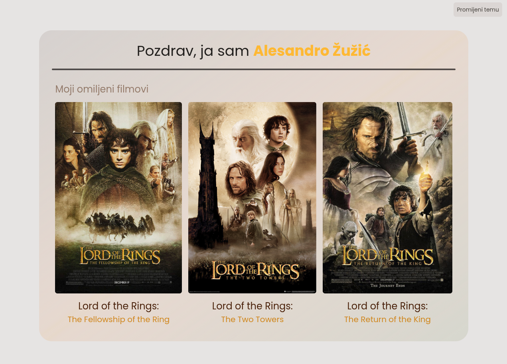
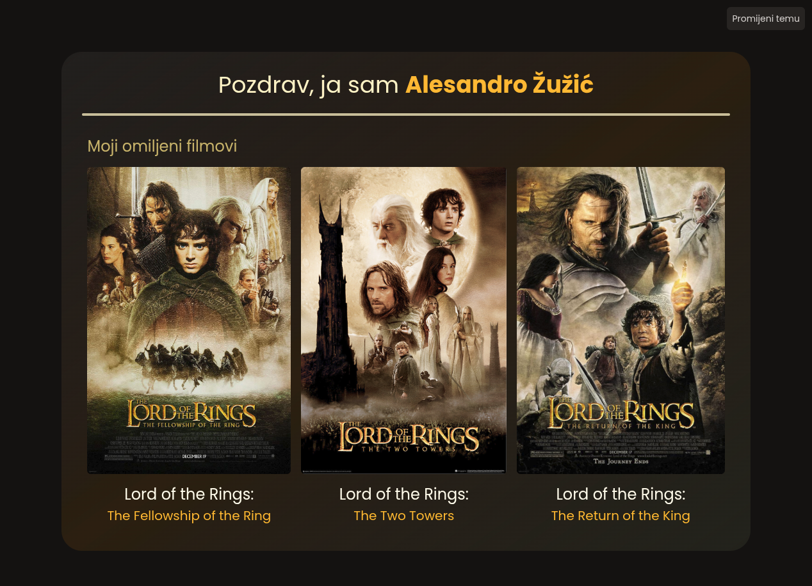
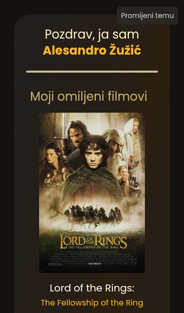

# Samostalni zadatak za vježbu 1  

1. Kreirajte novi Vue projekt prema uputama iz poglavlja [Postavljanje aplikacije/projekta](#postavljanje-aplikacijeprojekta)

2. Instalirajte Tailwind CSS 

3. U datoteci `App.vue`, unutar `<template>` bloka, pomoću osnovnih HTML elemenata i Tailwind klasa rekreirajte prikaz sa slike:  

   - Boje, veličine i razmaci mogu biti proizvoljni

4. Izradite GitHub repozitorij i spremite projekt

 

> [**Bonus**] Napravite responzivnost za mobitel i tamnu/svijetlu temu

   
   

