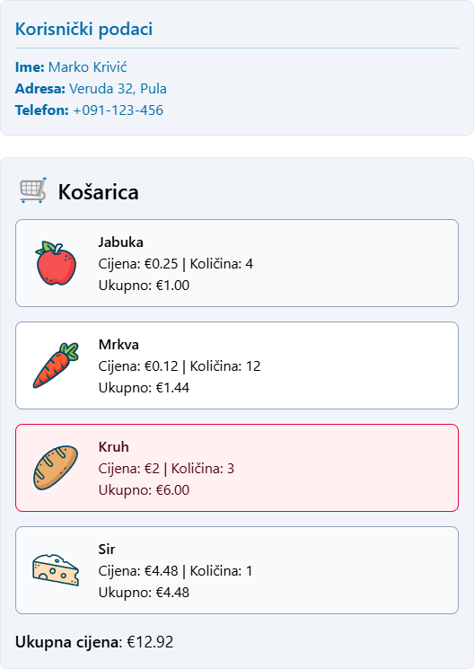

<div class="body">

## Samostalni zadatak za vježbu 2  

Korištenjem priloženih podataka u JSON formatu potrebno je implementirati prikaz korisničkih podataka i sadržaja košarice u HTML-u. (*bez korištenja direktiva v-for i v-if*)

**1. Prikaz korisničkih podataka**  
- Prikazati ime, prezime, adresu i broj telefona korisnika  
- Ako je korisnik administrator (*jeAdmin: true*), tekst korisničkih podataka treba biti obojen plavom bojom. U suprotnom, koristiti crnu boju.

**2. Prikaz sadržaja košarice**  
- Svaka stavka iz košarice treba biti prikazana u obliku liste  
- Za svaku stavku prikazati:  
  - Naziv proizvoda  
  - Slika proizvoda  
  - Jediničnu cijenu  
  - Količinu  
  - Ukupnu cijenu stavke (*jedinična cijena × količina*)  
- Implementirati funckije:
    - `dohvatiCijenu(naziv)` koja vraća cijenu proizvoda po nazivu
    - `sveukupnaCijena()` koja vraća ukupnu cijenu svih proizvoda u košarici  
    - `najskupljaStavka()` koja vraća naziv stavke s najvećom ukupnom cijenom  
- Stavku s najvećom ukupnom cijenom obojiti crvenom bojom  

*JSON podaci:*
```js
slike = {
    "Jabuka": "https://www.svgrepo.com/show/530203/apple.svg",
    "Mrkva": "https://www.svgrepo.com/show/530216/carrot.svg",
    "Sir": "https://www.svgrepo.com/show/530219/cake.svg",
    "Kruh": "https://www.svgrepo.com/show/530223/bread.svg",
}
proizvodi = [
    { naziv: "Jabuka", cijena: 0.25 }, { naziv: "Mrkva", cijena: 0.12 }, 
    { naziv: "Kruh", cijena: 2.00 }, { naziv: "Sir", cijena: 4.48 }
]
korisnik = {
    jeAdmin: true,
    osobni_podaci: {
        ime: "Marko",
        prezime: "Krivić",
        adresa: { grad: "Pula", ulica: "Veruda", broj: 32 },
        broj_telefona: "+091-123-456"
    },
    kosarica: [
        { naziv: "Jabuka", količina: 4 }, { naziv: "Mrkva", količina: 12 },
        { naziv: "Sir", količina: 1 }, { naziv: "Kruh", količina: 3 },
    ]
}
```

<div class="page"></div>

*Primjer rješenja:*



</div>