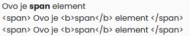
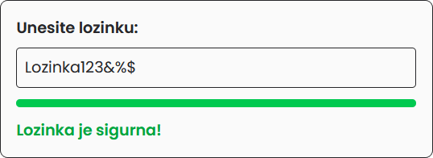
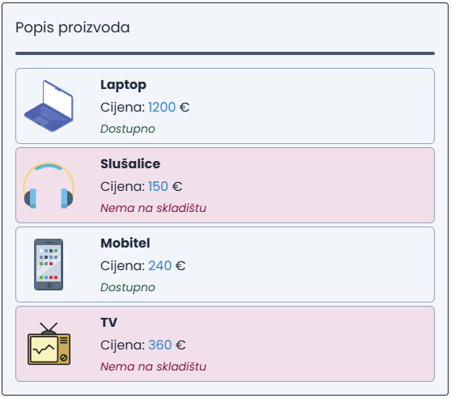
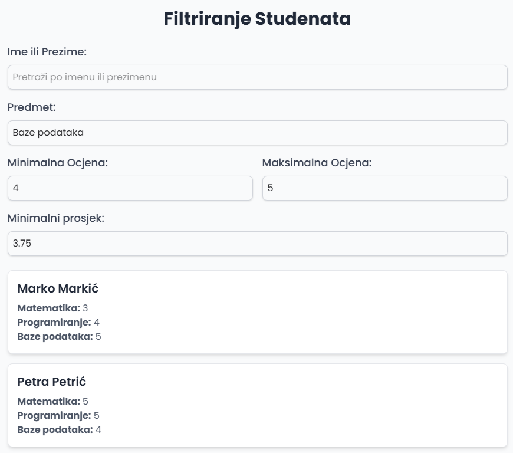
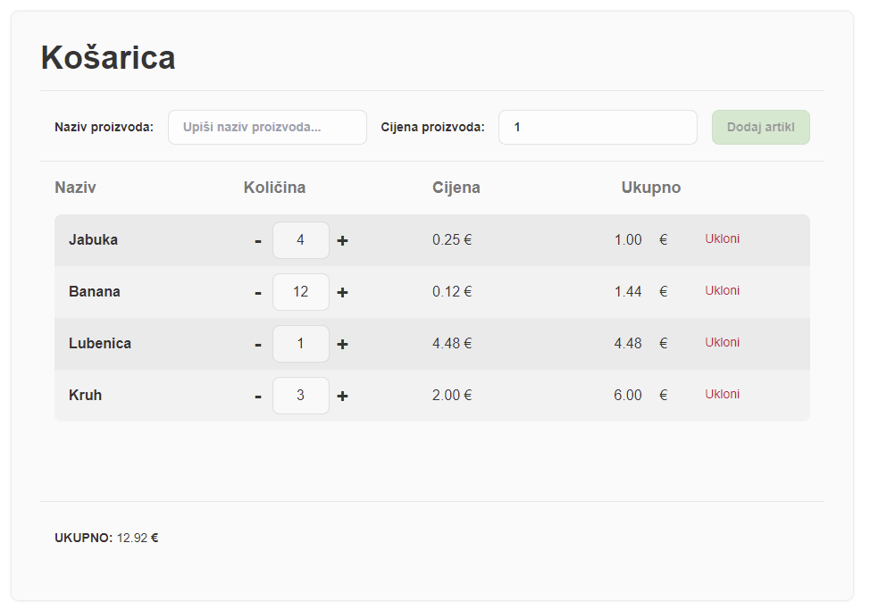

<div class="body">

# Programsko inženjerstvo

**Nositelj**: doc. dr. sc. Nikola Tanković  
**Asistent**: mag. inf. Alesandro Žužić

**Ustanova**: Sveučilište Jurja Dobrile u Puli, Fakultet informatike u Puli

<p style="float: clear; display: flex; gap: 8px; align-items: center;" class="font-brioni text-sm whitespace-nowrap">
    </img>
    Fakultet informatike u Puli
</p>

# [3] Vue Direktive & Upravljanje Događajima

<div style="display: flex; justify-content: space-between; text-align: justify; gap: 32px;">
    <p>  
        Vue omogućuje dinamičku kontrolu DOM-a pomoću <b>direktiva</b> i upravljanje korisničkim interakcijama kroz <b>događaje</b>.  
        Direktive poput <code>v-bind</code>, <code>v-if</code> i <code>v-for</code> omogućuju automatsko ažuriranje sučelja na temelju promjena podataka,  
        dok <code>v-on</code> omogućuje izvođenje radnji na korisničke akcije, poput klika ili unosa teksta.
    </p>
    </img>
</div>


**Posljednje ažurirano:** 25. ožujka 2025.
<!-- TOC -->

- [Programsko inženjerstvo](#programsko-in%C5%BEenjerstvo)
- [[3] Vue Direktive & Upravljanje Događajima](#3-vue-direktive--upravljanje-doga%C4%91ajima)
    - [Vue Direktive](#vue-direktive)
        - [v-html i v-text](#v-html-i-v-text)
        - [v-model](#v-model)
        - [v-bind](#v-bind)
        - [v-if, v-else, v-else-if](#v-if-v-else-v-else-if)
            - [Zadatak: Provjera sigurnosti lozinke](#zadatak-provjera-sigurnosti-lozinke)
        - [v-show](#v-show)
        - [v-for](#v-for)
            - [Zadatak: Galerija slika](#zadatak-galerija-slika)
            - [v-for + v-if](#v-for--v-if)
            - [Iteracija kroz polje objekata](#iteracija-kroz-polje-objekata)
                - [Zadatak: Popis proizvoda](#zadatak-popis-proizvoda)
            - [Iteracija kroz objekt](#iteracija-kroz-objekt)
            - [Iteracija kroz raspon range](#iteracija-kroz-raspon-range)
            - [Ugniježđeni v-for](#ugnije%C5%BE%C4%91eni-v-for)
            - [Modificiranje polja, filtriranje/sortiranje](#modificiranje-polja-filtriranjesortiranje)
                - [Zadatak: Dinamičko filtriranje studenata](#zadatak-dinami%C4%8Dko-filtriranje-studenata)
        - [v-pre & v-once](#v-pre--v-once)
    - [Upravljanje događajima](#upravljanje-doga%C4%91ajima)
        - [Modificiranje događaja](#modificiranje-doga%C4%91aja)
        - [Pristupanje event argumentu](#pristupanje-event-argumentu)
    - [Samostalni zadatak za vježbu 3](#samostalni-zadatak-za-vje%C5%BEbu-3)

<!-- /TOC -->
<div class="page"></div>

## Vue Direktive

Vue.js nudi širok spektar ugrađenih direktiva koje pojednostavljuju manipulaciju sadržajem na stranici. Sve direktive u Vue-u započinju s prefiksom `v-`, čime označavaju specifičnu funkcionalnost unutar aplikacije.

Popis najvažnijih Vue direktiva:

| Direktiva   | Opis                                                                      |
| ----------- | ------------------------------------------------------------------------- |
| `v-text`    | Dinamički postavlja tekst unutar elementa, zamjenjujući sadržaj           |
| `v-html`    | Dinamički postavlja HTML unutar elementa, omogućujući renderiranje HTML-a |
| `v-model`   | Povezuje varijable s input poljima za dvosmjerno vezivanje podataka       |
| `v-bind`    | Dinamički veže atribute ili svojstva DOM elemenata na varijable           |
| `v-if`      | Uvjetno prikazuje elemente u DOM-u                                        |
| `v-else`    | Uvjetno prikazuje elemente kada `v-if` uvjet nije ispunjen                |
| `v-else-if` | Alternativa za uvjet `v-else` za dodatne uvjete                           |
| `v-show`    | Kontrolira vidljivost elementa bez uklanjanja iz DOM-a                    |
| `v-for`     | Ponavlja elemente na temelju liste ili objekta                            |
| `v-pre`     | Omogućuje Vue-u da preskoči kompilaciju sadržaja unutar elementa          |
| `v-once`    | Postavlja element samo jednom, bez ponovnog Postavljanja.                 |
| `v-on`      | Priključuje event listener (npr. `click`, `input`)                        |
| `v-slot`    | Definira "slot" za dinamično dodavanje sadržaja u komponente              |

### `v-html` i `v-text`

U prethodnoj skripti spomenuli smo direktivu `v-html`, koja omogućuje prikaz HTML sadržaja unutar DOM elementa. Također, postoji i direktiva `v-text` koja omogućuje prikaz običnog teksta unutar elementa.

Direktiva `v-text` postavlja `textContent` svojstvo elementa, što znači da će zamijeniti bilo koji postojeći sadržaj unutar tog elementa.

*Primjer:*

```html
<script setup>
    const sadrzaj = "<span> Ovo je <b>span</b> element </span>";
</script>

<template>
    <div v-html="sadrzaj"> 
    </div>
    
    <div v-text="sadrzaj"> 
    </div>
    
    <div> 
        {{ sadrzaj }}
    </div>
</template>
```


*Ako treba ažurirati samo dio sadržaja, bolje je koristiti template syntax:*

```html
<script setup>
    const ime = "Marko";
    const prezime = "Markić";
    const sadrzaj = `Pozdrav, ja sam ${ime} ${prezime}`;
</script>

<template>     
    <div v-text="sadrzaj"> 
    </div>
    
    <div> 
        Pozdrav, ja sam {{ime}} {{prezime}}
    </div>
</template>
```

Sadržaj unutar `v-html` se ubacuje kao obični HTML – **Vue sintaksa neće biti obrađena**. Ako želimo koristiti `v-html` za dinamičko sastavljanje predložaka, onda se za to koriste komponente.

> Kod SFC (*Single-File Components*), stilovi koji su ograničeni (*scoped styles*) neće se primjenjivati na sadržaj unutar `v-html`, jer Vue predložak nije obradio taj HTML.

### `v-model`  

Direktiva `v-model` omogućuje dvosmjerno povezivanje podataka između varijable i HTML elementa. Najčešće se koristi s formama kako bi automatski ažurirala vrijednosti u stanju aplikacije kada korisnik unese podatke.  

*Primjer (Text Input & Checkbox):*  
```html
<script setup>
    import { ref } from "vue";

    const unos = ref("");
    const potvrda = ref(false);
</script>

<template>
    <input v-model="unos" type="text" class="border p-1 rounded" placeholder="Upiši nešto...">
    <p><b>Text:</b> {{ unos }}</p> <br>

    <label>
        <input type="checkbox" v-model="potvrda">
        Prihvaćam uvjete
    </label>
    <p><b>Potvrda:</b> {{ potvrda ? "Prihvaćeno" : "Odbijeno" }}</p>
</template>
```

- `v-model` direktivu ćemo detaljnije proći u sljedećoj skripti

### `v-bind`

Direktiva koju smo također prošli u prošloj skripti `v-bind` omogućuje dinamičko vezivanje atributa ili svojstava DOM elemenata na vrijednosti. Tako, kada se vrijednost promijeni, atribut se automatski ažurira.

Koristi se tako da se ispred atributa napiše `v-bind:` ili skraćeno samo `:`.

**Primjeri vezivanja:**

```html
<script setup>
    const slikaURL = "https://www.svgrepo.com/show/179114/painting-painting.svg";
    const link = "https://vuejs.org/guide/essentials/class-and-style.html";
    const disabledDugme = true;
    const stil = {
        color: "red",
        fontSize: "20px"
    };
    const atributi = {
        class: "rounded hover:bg-green-100",
        placeholder: "Upiši text..."
    };
</script>

<template>
    <!-- Vezivanje href atributa -->
    <a :href="link" class="underline hover:text-blue-600" target="_blank">Vue Docs Link</a>
    
    <!-- Vezivanje src atributa -->
     <!-- Kraći zapis -->

    <!-- Vezivanje boolean atributa -->
    <button :disabled="disabledDugme" 
        class="bg-gray-300 p-1 rounded disabled:opacity-25 disabled:cursor-not-allowed">
        Onemogućeno dugme
    </button>

    <!-- Vezivanje stila -->
    <p :style="stil">Ovaj tekst je crven i ima veličinu 20px</p>

    <!-- Vezivanje više atributa odjednom -->
    <input v-bind="atributi" class="border p-2">

    <!-- Dinamička klasa -->
    <div :class="[
            bold, 
            { 'text-rose-700' : hasError}, 
            isActive ? 'border-2 border-orange-400/75 rounded p-1 m-1 w-fit' : ''
        ]">
        Dinamička klasa
    </div>
</template>
```

*Primjeri korištenja:*
```html
<script setup>
import { ref } from "vue";

const size = ref("24");
const selected = ref(false);
const style = ref("");
</script>

<template>
    <input type="range" min="12" max="36" v-model="size"/>
    <div :style="`font-size: ${size}px;`">
        font-size: {{size}}px
    </div>
    
    <input type="checkbox" v-model="selected" class="mr-2"/> 
    <span :class="selected ? 'opacity-100 text-green-700': 'opacity-50 text-red-700'">
        {{selected}}
    </span>

    <br>
    <textarea class="border" type="text" :style="style" v-model="style" :rows="8"/>
</template>
```

### `v-if`, `v-else`, `v-else-if`  

Ove direktive omogućuju uvjetno prikazivanje elemenata:
- `v-if` – Prikazuje element u DOM-u samo ako je uvjet ispunjen  
- `v-else` – Prikazuje element ako prethodni `v-if` uvjet nije ispunjen
- `v-else-if` – Dodaje dodatne uvjete kao alternativa `v-else`

*Primjer:*
```html
<script setup>
    import { ref } from "vue";

    const broj = ref(6)
    const prikazi = ref(false)
</script>

<template>
    <b>Prikaži:</b> <input type="checkbox" v-model="prikazi">

    <div v-if="prikazi">
        Hello!
    </div>

    <br/><br/>

    <b>Broj:</b> <input type="number" v-model="broj" class="border p-1 rounded">

    <div v-if="broj%2==0 && broj%3==0">
        Broj {{ broj }} je djeljiv sa 2 i 3
    </div>
    <div v-else-if="broj%2==0">
        Broj {{ broj }} je djeljiv 2
    </div>
    <div v-else-if="broj%3==0">
        Broj {{ broj }} je djeljiv 3
    </div>
    <div v-else>
        Broj {{ broj }} <b>nije</b> djeljiv sa 2 i 3
    </div>
</template>
```

#### **Zadatak: Provjera sigurnosti lozinke**  

Napišite Vue.js kôd koji omogućuje korisniku unos lozinke i provjerava njezinu sigurnost prema sljedećim kriterijima:  
- Minimalno 8 znakova  
- Najmanje jedno veliko slovo  
- Najmanje jedan specijalni znak (*npr. @, #, $, %...*)  
- Najmanje jedna brojka 

Za svaki neispunjeni uvjet prikazati odgovarajuće upozorenje. Kada su svi uvjeti ispunjeni, prikazuje se poruka: *"Lozinka je sigurna!"*  

Osim tekstualne provjere, implementirati i *indikator jačine lozinke* (*progress bar*), koji vizualno prikazuje razinu sigurnosti lozinke:  

- 10% (crveno) – Nijedan uvjet nije ispunjen  
- 25% (narančasto) – Ispunjen jedan uvjet  
- 50% (žuto) – Ispunjena dva uvjeta  
- 75% (zeleno-žuto) – Ispunjena tri uvjeta  
- 100% (zeleno) – Svi uvjeti su ispunjeni  

Korisničko sučelje treba omogućiti dinamičko ažuriranje poruka i indikatora sigurnosti lozinke u realnom vremenu.




### `v-show`  

Direktiva `v-show` omogućuje uvjetno prikazivanje elemenata, ali umjesto uklanjanja iz DOM-a (kao `v-if`), ona samo mijenja `display` stil elementa. To znači da je `v-show` efikasniji za čestu promjenu vidljivosti, dok je `v-if` bolji za elemente koji se rijetko prikazuju.  

**Primjer:**  
```html
<script setup>
    import { ref } from "vue";
    
    const hide = ref(false);
    const element = ref();

    function dohvati(id) {
        element.value = document.getElementById(id);
    }
</script>

<template>
    Sakrij: <input type="checkbox" v-model="hide">

    <div id="div_if" v-if="!hide">
        Element sakriven sa v-if
    </div>

    <div id="div_show" v-show="!hide">
        Element sakriven sa v-show
    </div>
    
    <div class="flex gap-2">
        <button @click="dohvati('div_if')" 
            class="p-1 bg-sky-200 hover:bg-green-200 rounded cursor-pointer">
            Dohvati element sakriven sa v-if
        </button>

        <button @click="dohvati('div_show')"
            class="p-1 bg-sky-200 hover:bg-green-200 rounded cursor-pointer">
            Dohvati element sakriven sa v-show
        </button>
    </div>

    <div>
        <b>Element:</b> {{ element ? element.outerHTML : 'null' }}
    </div>
</template>
```  
U ovom primjeru možemo sakriti elemente i dohvatiti ih s pomoću njihovog *id-ja*. Ako sakrijemo element i pokušamo ga dohvatiti, primijetit ćemo razliku između `v-if` i `v-show`.  

Element sakriven s `v-if` neće postojati u DOM-u, pa će rezultat dohvaćanja biti `null`. S druge strane, element sakriven s `v-show` i dalje postoji u DOM-u, samo mu je postavljen stil `display: none;`.

### `v-for`  

Direktiva `v-for` koristi se za prikaz popisa elemenata na temelju niza. Sintaksa je `item in items`, gdje `items` predstavlja podatke, a `item` je trenutačna stavka u iteraciji.  

```html
<script setup>
    import { ref } from "vue";

    const items = ref([
        "banana",
        "jabuka",
        "kruška",
        "lubenica",
        "limun"
    ]);
</script>

<template>
    <li v-for="item in items">
        {{ item.message }}
    </li>
</template>
```

*Unutar `v-for` izraza moguće je koristiti i **indeks** trenutačne stavke.  koristeći sintaksu `(item, index) in items`:*

```html
<script setup>
    import { ref } from "vue";

    const items = ref([
        "banana",
        "jabuka",
        "kruška",
        "lubenica",
        "limun"
    ]);
</script>

<template>
    <li v-for="(item, index) in items">
        {{ index }} - {{ item }}
    </li>
</template>
```

> Alternativno se može koristiti `of` umjesto `in`: `item of items`

#### Zadatak: Galerija slika  

Napišite Vue kôd koji prikazuje galeriju slika koristeći `v-for`. Polje slika sadrži URL-ove slika koje se prikazuju kao popis koristeći `` element.  

*Podaci:*  
```js
const slike = [
    "https://1209k.com/bobross/images/4243768.jpg",
    "https://1209k.com/bobross/images/4243770.jpg",
    "https://1209k.com/bobross/images/4066911.jpg",
    "https://1209k.com/bobross/images/4067001.jpg",
    "https://1209k.com/bobross/images/2264861.jpg",
    "https://1209k.com/bobross/images/1775771.jpg",
    "https://1209k.com/bobross/images/1775851.jpg",
    "https://1209k.com/bobross/images/1775881.jpg",
    "https://1209k.com/bobross/images/1691651.jpg",
    "https://1209k.com/bobross/images/1691621.jpg"
];
```  


#### `v-for` + `v-if`

Direktive `v-for` i `v-if` mogu se koristiti zajedno kako bismo filtrirali ili selektivno prikazali elemente unutar petlje.

*Primjer:*  
```html
<script setup>
    import { ref } from "vue";

    const brojevi = ref([1, 2, 3, 4, 5, 6, 7, 8, 9, 10]);
</script>

<template>
    <h2>Parni brojevi:</h2>
    
    <div v-for="broj in brojevi">
        <div v-if="broj % 2 === 0">
            - {{ broj }}
        </div>
    </div>
</template>
```

*Ako napišemo:*
```html
<div v-for="broj in brojevi" v-if="broj % 2 === 0">
    - {{ broj }}
</div>
```
To neće raditi jer `v-if` ne može pročitati `broj` iz `v-for`.

> U pravilu `v-for` i `v-if` se ne pišu zajedno na istom elementu.

#### Iteracija kroz polje objekata  

Osim što možemo iterirati kroz jednostavno polje brojeva ili riječi, često radimo s poljima objekata, pri čemu svojstvima svakog objekta pristupamo na isti način kao u običnom JavaScriptu.

*Primjer:*
```html
<script setup>
    import { ref } from "vue";

    const korisnici = ref([
        { ime: "Ivan", prezime: "Horvat", godine: 25 },
        { ime: "Ana", prezime: "Kovač", godine: 30 },
        { ime: "Marko", prezime: "Babić", godine: 22 }
    ]);
</script>

<template>
    <ul>
        <li v-for="korisnik in korisnici">
            {{ korisnik.ime }} {{ korisnik.prezime }} - {{ korisnik.godine }} godina
        </li>
    </ul>
</template>
```

##### Zadatak: Popis proizvoda

U ovom zadatku, treba napisati kôd za prikaz popisa proizvoda u trgovini, iterirati kroz polje  proizvoda i prikazati svaki proizvod u popisu. Imamo polje objekata koji predstavljaju proizvode. Svaki objekt ima svojstva: `naziv` (*ime proizvoda*), `cijena` (*cijena proizvoda*), `slika` (*url slike*),  i `dostupnost` (*boolean koji označava je li proizvod dostupan*).

1. Uz svaki proizvod, treba prikazati:
   - Naziv proizvoda
   - Cijenu proizvoda
   - Sliku proizvoda
   - Status dostupnosti (ako je dostupan, napisati "Dostupno", ako nije, "Nema na skladištu")
2. Proizvode koji nisu dostupni treba označiti crvenom bojom

*Podaci:*

```js
const proizvodi = [
    { naziv: 'Laptop', cijena: 1200, dostupnost: true, slika: 'https://www.svgrepo.com/show/474385/laptop1.svg' },
    { naziv: 'Slušalice', cijena: 150, dostupnost: false, slika: 'https://www.svgrepo.com/show/268045/headphones.svg' },
    { naziv: 'Mobitel', cijena: 240, dostupnost: true, slika: 'https://www.svgrepo.com/show/260093/smartphone.svg' },
    { naziv: 'TV', cijena: 360, dostupnost: false, slika: 'https://www.svgrepo.com/show/501835/tv.svg' }
];
```



#### Iteracija kroz objekt

Osim iteracije kroz polja, `v-for` omogućuje i iteraciju kroz svojstva objekta. U tom slučaju, možemo pristupiti ključu, vrijednosti i indeksu svakog svojstva koristeći sintaksu `(value, key, index) in object`.

*Primjer:*
```html
<script setup>
    import { ref } from "vue";

    const korisnik = ref(
        { ime: "Ivan", prezime: "Ivanić", godine: 25 },
    );
</script>

<template>
    <ul>
        <li v-for="(value, key, index) in korisnik">
            {{index}} > <b>{{ key }}:</b> {{ value }}
        </li>
    </ul>
</template>
```

#### Iteracija kroz raspon (range)

`v-for` omogućuje ponavljanje elemenata određen broj puta koristeći raspon brojeva.  

```html
<template>
    <li v-for="n in 5">{{ n }}</li>
</template>
```
Ovaj primjer će generirati pet `<li>` elemenata s vrijednostima od 1 do 5.

#### Ugniježđeni `v-for`

Direktiva `v-for` može se koristiti unutar druge `v-for` petlje kako bi se iteriralo kroz ugniježđene podatke, poput polja unutar polja.  

*Primjer:*  
```html
<script setup>
    import { ref } from "vue";

    const kategorije = ref([
        { naziv: "Voće", proizvodi: ["Jabuka", "Banana", "Jagoda"] },
        { naziv: "Povrće", proizvodi: ["Mrkva", "Krumpir", "Rajčica"] },
    ]);
</script>

<template>
    <div class="flex gap-8">
        <div v-for="kategorija in kategorije">
            <b>{{ kategorija.naziv }}</b>
            <hr class="my-1">
            <p v-for="proizvod in kategorija.proizvodi" class="text-sm">
                - {{ proizvod }}
            </p>
        </div>
    </div>
</template>
```

U ovom primjeru:  
- Iteriramo kroz kategorije proizvoda  
- Svaka kategorija sadrži polje proizvoda
- Unutar svake kategorije, s pomoću ugniježđene `v-for` petlje, iteriramo kroz proizvode i prikazujemo ih

#### Modificiranje polja, filtriranje/sortiranje

U Vue.js možemo dinamički mijenjati polja s pomoću metoda poput **sort()**, **filter()** i **map()**, te ih koristiti unutar `v-for`.

*Primjer filtriranja i sortiranja učenika:* 
```html
<script setup>
    import { ref } from "vue";

    const ucenici = ref([
        { ime: "Ana", bodovi: 85 },
        { ime: "Marko", bodovi: 92 },
        { ime: "Petra", bodovi: 78 },
        { ime: "Ivan", bodovi: 60 }
    ]);

    const minBodovi = ref(70);

    function sortirajPoBodovima(ulazno) {
        ucenici.value.sort((a, b) => ulazno ? b.bodovi - a.bodovi : a.bodovi - b.bodovi);
    }
</script>

<template>
    <label>
        Minimalan broj bodova:
        <input type="number" v-model="minBodovi" class="border p-1 rounded">
    </label>

    <button @click="sortirajPoBodovima(true)" 
        class="ml-2 p-1 bg-blue-200 hover:bg-green-200 cursor-pointer rounded">
        Sortiraj Uzlazno
    </button>

    <button @click="sortirajPoBodovima(false)" 
        class="ml-2 p-1 bg-blue-200 hover:bg-green-200 cursor-pointer rounded">
        Sortiraj Silazno
    </button>

    <div v-for="ucenik in ucenici.filter(u => u.bodovi >= minBodovi)">
        <b>{{ ucenik.ime }}</b> - {{ ucenik.bodovi }} bodova
    </div>
</template>
```
- Polje učenika može se filtrirati tako da prikazuje samo one s minimalnim brojem bodova 
- Klikom na gumb učenici se sortiraju ulazno ili silazno po bodovima  
- `v-model` omogućuje unos minimalnog broja bodova u stvarnom vremenu

*Vue može detektirati reaktivne mutacije polja:*

| Metoda        | Opis                                                     | Primjer korištenja             |
| ------------- | -------------------------------------------------------- | ------------------------------ |
| **push()**    | Dodaje jedan ili više elemenata na kraj polja            | `polje.push(5);`               |
| **pop()**     | Uklanja posljednji element iz polja i vraća ga           | `let zadnji = polje.pop();`    |
| **shift()**   | Uklanja prvi element iz polja i pomiče preostale ulijevo | `let prvi = polje.shift();`    |
| **unshift()** | Dodaje jedan ili više elemenata na početak polja         | `polje.unshift(10);`           |
| **splice()**  | Dodaje, uklanja ili mijenja elemente unutar polja        | `polje.splice(1, 2, "novi");`  |
| **sort()**    | Sortira elemente polja (po defaultu leksikografski)      | `polje.sort((a, b) => a - b);` |
| **reverse()** | Obrće redoslijed elemenata u polju                       | `polje.reverse();`             |

*Primjer:*
```html
<script setup>
    import { ref } from "vue";

    const newName = ref('')

    const names = ref([
        "Ana",
        "Marko",
        "Petra",
        "Ivan"
    ]);
</script>

<template>
    <div class="flex flex-wrap gap-2">
        <input type="text" v-model="newName" class="border px-1 w-32 rounded" placeholder="Novo ime...">
        <button @click="names.push(newName)"
            class="p-1 bg-blue-200 hover:bg-green-200 cursor-pointer rounded">
            push()
        </button>
        <button @click="names.pop()"
            class="p-1 bg-blue-200 hover:bg-green-200 cursor-pointer rounded">
            pop()
        </button>
        <button @click="names.unshift(newName)"
            class="p-1 bg-blue-200 hover:bg-green-200 cursor-pointer rounded">
            unshift()
        </button>
        <button @click="names.shift()"
            class="p-1 bg-blue-200 hover:bg-green-200 cursor-pointer rounded">
            shift()
        </button>
        <button @click="names.reverse()"
            class="p-1 bg-blue-200 hover:bg-green-200 cursor-pointer rounded">
            reverse()
        </button>
        <button @click="names.sort()"
            class="p-1 bg-blue-200 hover:bg-green-200 cursor-pointer rounded">
            sort()
        </button>
    </div>

    <hr class="my-2">

    <div class="flex flex-col gap-1 text-sm">
        <div v-for="(name, index) in names" class="px-1 rounded w-fit">
            <b>{{index}}.</b> {{ name }}
        </div>
    </div>
</template>
```

##### Zadatak: Dinamičko filtriranje studenata

Treba napraviti popis studenata i omogućiti filtriranje prema imenu, prezimenu i ocjenama iz pojedinih predmeta.  

1. Prikazati popis studenata, gdje svaki student ima listu položenih predmeta s ocjenama  
2. Omogućiti filtriranje studenata prema imenu i prezimenu
3. Omogućiti filtriranje studenata prema minimalnoj ili maksimalnoj ocjeni iz odabranog predmeta
4. Omogućiti filtriranje studenata prema prosječnoj ocjeni

*Podaci:*  
```js
const studenti = ref([
    { 
        ime: "Ana", 
        prezime: "Anić", 
        predmeti: [
            { naziv: "Matematika", ocjena: 4 },
            { naziv: "Programiranje", ocjena: 5 },
            { naziv: "Baze podataka", ocjena: 3 }
        ]
    },
    { 
        ime: "Marko", 
        prezime: "Markić", 
        predmeti: [
            { naziv: "Matematika", ocjena: 3 },
            { naziv: "Programiranje", ocjena: 4 },
            { naziv: "Baze podataka", ocjena: 5 }
        ]
    },
    { 
        ime: "Petra", 
        prezime: "Petrić", 
        predmeti: [
            { naziv: "Matematika", ocjena: 5 },
            { naziv: "Programiranje", ocjena: 5 },
            { naziv: "Baze podataka", ocjena: 4 }
        ]
    },
    { 
        ime: "Ivan", 
        prezime: "Ivanić", 
        predmeti: [
            { naziv: "Matematika", ocjena: 2 },
            { naziv: "Programiranje", ocjena: 3 },
            { naziv: "Baze podataka", ocjena: 4 }
        ]
    },
]);
```



### `v-pre` & `v-once`

- Direktiva `v-pre` sprečava Vue.js da procesira sadržaj unutar označenog elementa, pa se koristi za statički tekst koji ne treba biti reaktivno obrađen.

- Direktiva `v-once` osigurava da će sadržaj unutar elementa biti renderiran samo jednom, bez ponovnog renderiranja.

*Primjer:*
```html
<script setup>
    import { ref } from 'vue';

    const text = ref("Lorem ipsum")
</script>

<template>
    <input type="text" v-model="text" class="border px-1 rounded">

    <div>
        <b>Normal:</b> {{ text }}
    </div>

    <div v-once>
        <b>v-once:</b> {{ text }}
    </div>

    <div v-pre>
        <b>v-pre:</b> {{ text }}
    </div>
</template>
```
- *normal*: će se ažurirati promjenom varijable text
- *v-once*: će se ažurirat samo pri inicijalizaciji
- *v-pre*: neće procesirati sadržaj

## **Upravljanje događajima**

U Vue.js, događaji se mogu koristiti za interakciju s korisnicima i upravljanje aplikacijom. Vue nudi jednostavan način za preslušavanje i rukovanje događajima putem direktiva `v-on`.

*Direktiva `v-on` omogućuje preslušavanje događaja na elementima tako da ga stavimo ispred događaja koji želimo slušat `v-on:<event>`:*

```html
<button v-on:click="metoda">Klikni me</button>
```
- Metoda može biti funkcija ili JavaScript kôd.

Direktiva `v-on` se može skratiti koristeći `@` symbol `@event`:

```html
<button @click="metoda">Klikni me</button>
```

*Primjeri rukovanja događajima:*

1. **Preslušavanje jednog događaja** - Kada korisnik klikne na gumb, poziva se metoda
   
```html
<script setup>
    function pozdrav() {
        alert('Pozdrav iz Vue.js!');
    }
</script>

<template>
    <button @click="pozdrav">Klikni me</button>
</template>
```

2. **Preslušavanje više događaja** - možemo preslušavati više događaja na istom elementu:

```html
<script setup>
    function pokaziPoruku() {
        console.log('Miš je preko');
    }

    function sakrijPoruku() {
        console.log('Miš je van');
    }
</script>

<template>
    <div>
        <button @mouseover="pokaziPoruku" @mouseout="sakrijPoruku">Hover me</button>
    </div>
</template>
```

### **Modificiranje događaja**

Možemo koristiti modifikatore događaja za dodavanje specifičnih ponašanja, kao što su sprječavanje osnovnih akcija `event.preventDefault()`.

| Modifikator | Opis                                                                                                | Primjer                                                   |
| ----------- | --------------------------------------------------------------------------------------------------- | --------------------------------------------------------- |
| `.stop`     | Sprječava propagaciju događaja (zaustavlja njegovo širenje na roditeljima).                         | `<button @click.stop="handleClick">Klikni me</button>`    |
| `.prevent`  | Sprječava osnovnu akciju događaja (npr. sprječava ponovno učitavanje stranice).                     | `<form @submit.prevent="submitForm">Pošaljite</form>`     |
| `.self`     | Događaj se aktivira samo ako je ciljani element sam događaj (ne na njegovim podređenim elementima). | `<div @click.self="handleSelfClick">Klikni me</div>`      |
| `.once`     | Događaj se poziva samo jednom i nakon toga se uklanja                                               | `<button @click.once="handleClick">Klikni me</button>`    |
| `.passive`  | Događaj se registrira kao pasivan, što znači da neće pozvati `preventDefault()`                     | `<button @click.passive="handleClick">Klikni me</button>` |

1. **`prevent`** - Sprječava podrazumijevanu akciju (npr. sprječava slanje forme):

```html
<form @submit.prevent="submitForm">Pošaljite</form>
```

2. **`stop`** - Sprječava propagaciju događaja (prekida se daljnje širenje događaja):

```html
<div @click="parentClick">
    <button @click.stop="childClick">Klikni me</button>
</div>
```

3. **`once`** - Događaj se poziva samo jednom:

```html
<button @click.once="pozdrav">Klikni me</button>
```

Evo nadopunjene sekcije koja objašnjava kako pristupiti argumentu događaja u inline handlerima:

---

### **Pristupanje `event` argumentu**

Ponekad je potrebno pristupiti izvornom DOM događaju. To možemo učiniti na dva načina:

1. **Korištenje posebne `$event` varijable**:
   Vue automatski prosljeđuje izvorni DOM događaj kao argument, koji možemo koristiti u metodi.

   ```html
   <button @click="warn('Form cannot be submitted yet.', $event)">
     Submit
   </button>
   ```

2. **Korištenje inline arrow funkcije**:
   Također možemo koristiti inline arrow funkciju za prosljeđivanje događaja u metodu.

   ```html
   <button @click="(event) => warn('Form cannot be submitted yet.', event)">
     Submit
   </button>
   ```

*Primjer metode*:

```js
function warn(message, event) {
  // sada imamo pristup izvornom događaju
  if (event) {
    event.preventDefault();  // sprječava osnovnu akciju
  }
  alert(message);
}
```

*Podsjetnik na neke bitne evente:*

| Metoda      | Objašnjenje                                      | Sintaksa                                       | Primjer                                   |
|-------------|--------------------------------------------------|------------------------------------------------|-------------------------------------------|
| click       | Poziva se kada se klikne mišem na element.       | `element.addEventListener('click', function() {})` | `button.addEventListener('click', function() { console.log('Kliknuto!'); })` |
dblclick    | Poziva se kada se dvaput klikne na element mišem. | `element.addEventListener('dblclick', function() {})` | `image.addEventListener('dblclick', function() { console.log('Dvaput kliknuto!'); })` |
| focus       | Poziva se kada element dobije fokus.             | `element.addEventListener('focus', function() {})` | `input.addEventListener('focus', function() { console.log('Fokusiranje!'); })` |
| focusin     | Poziva se kada element ili njegovi potomci dobiju fokus. | `element.addEventListener('focusin', function() {})` | `div.addEventListener('focusin', function() { console.log('Fokusiranje!'); })` |
| focusout    | Poziva se kada element ili njegovi potomci izgube fokus. | `element.addEventListener('focusout', function() {})` | `input.addEventListener('focusout', function() { console.log('Izgubio fokus!'); })` |
| blur        | Poziva se kada element izgubi fokus.             | `element.addEventListener('blur', function() {})`  | `input.addEventListener('blur', function() { console.log('Izgubio fokus!'); })` |
| mousedown   | Poziva se kada se pritisne miš na element.       | `element.addEventListener('mousedown', function() {})` | `div.addEventListener('mousedown', function() { console.log('Miš pritisnut!'); })` |
| mouseenter  | Poziva se kada miš uđe u element.                | `element.addEventListener('mouseenter', function() {})` | `div.addEventListener('mouseenter', function() { console.log('Miš unutar elementa!'); })` |
| mouseleave  | Poziva se kada miš napusti element.              | `element.addEventListener('mouseleave', function() {})` | `div.addEventListener('mouseleave', function() { console.log('Miš izvan elementa!'); })` |
| mousemove   | Poziva se kada se miš pomiče preko elementa.    | `element.addEventListener('mousemove', function() {})` | `div.addEventListener('mousemove', function() { console.log('Miš se pomiče!'); })` |
| mouseout    | Poziva se kada miš napusti element ili njegovog potomka. | `element.addEventListener('mouseout', function() {})` | `div.addEventListener('mouseout', function() { console.log('Miš napustio element!'); })` |
| mouseover   | Poziva se kada miš uđe u element ili njegovog potomka. | `element.addEventListener('mouseover', function() {})` | `div.addEventListener('mouseover', function() { console.log('Miš ušao u element!'); })` |
| mouseup     | Poziva se kada se miš otpusti iznad elementa.    | `element.addEventListener('mouseup', function() {})` | `div.addEventListener('mouseup', function() { console.log('Miš otpušten!'); })` |
| input       | Poziva se kada se promijeni vrijednost input elementa, a korisnik i dalje ostaje u polju. | `element.addEventListener('input', function() {})` | `input.addEventListener('input', function() { console.log('Vrijednost promijenjena!'); })` |
| change      | Poziva se kada se promijeni vrijednost elementa, a korisnik se miče od polja. | `element.addEventListener('change', function() {})` | `inputElement.addEventListener('change', function() { console.log('Vrijednost promijenjena!'); })` |

## Samostalni zadatak za vježbu 3  

Imate zadatak izraditi sučelje za **košaricu web trgovine**. Sučelje aplikacije sastoji se od polja za unos naziva i cijene proizvoda te gumba za dodavanje proizvoda u košaricu. Također, prikazuje se lista proizvoda u košarici s informacijama o nazivu, količini, cijeni po komadu te ukupnoj cijeni za taj proizvod.

Kada korisnik unese naziv i cijenu proizvoda te klikne na gumb `Dodaj artikl`, proizvod se dodaje u košaricu. 
 - Ako proizvod nema ime, dugme se ne može kliknuti, mora biti zatamnjeno/onemogućeno
 - Ako se proizvod s istim imenom već nalazi u košarici, količina se povećava za `1`
 - Ako je proizvod novi, dodaje se na listu
 - Cijena proizvoda ne može ići ispod `0`

Korisnik može mijenjati količinu proizvoda u košarici koristeći gumbe `+` i `-` pored svakog proizvoda. Također, postoji opcija za uklanjanje proizvoda iz košarice klikom na gumb `Ukloni`.

- Ako nema nijednog proizvoda u košarici, treba pisati *"Košarica je prazna!"*.
- Nakon svake promjene u košarici, ukupna cijena se automatski ažurira kako bi korisnik imao uvid u trenutačni trošak.

> Potrebno je koristiti `vezivanje atributa`, `v-model`, `v-for`, `v-if`, `upravljanje događajima`  

*Primjer:*


> *Rješenje ne mora vizualno izgledati identično kao na slici.*

</div>