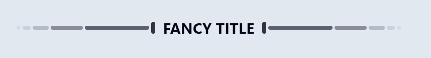

<div class="body">

# Programsko inženjerstvo

**Nositelj**: doc. dr. sc. Nikola Tanković  
**Asistent**: mag. inf. Alesandro Žužić

**Ustanova**: Sveučilište Jurja Dobrile u Puli, Fakultet informatike u Puli

<p style="float: clear; display: flex; gap: 8px; align-items: center;" class="font-brioni text-sm whitespace-nowrap">
    </img>
    Fakultet informatike u Puli
</p>

# [4] Komponente

<div style="display: flex; justify-content: space-between; text-align: justify; gap: 32px;">
    <p>  
        Vue komponente omogućuju razlaganje korisničkog sučelja na manje, modularne i ponovo iskoristive dijelove, čime se poboljšava organizacija i održavanje koda. Njihova upotreba omogućuje logičnu i skalabilnu izgradnju aplikacije, olakšavajući razvoj, testiranje i ponovnu upotrebu elemenata sučelja.
    </p>
    </img>
</div>


**Posljednje ažurirano:** 31. ožujka 2025.
<!-- TOC -->

- [Programsko inženjerstvo](#programsko-in%C5%BEenjerstvo)
- [[4] Komponente](#4-komponente)
    - [Vue komponente](#vue-komponente)
    - [Definiranje komponenti](#definiranje-komponenti)
        - [Korištenje komponenti](#kori%C5%A1tenje-komponenti)
    - [Prosljeđivanje parametara props](#proslje%C4%91ivanje-parametara-props)
        - [defineProps](#defineprops)
        - [Validacija parametara](#validacija-parametara)
        - [Statični i dinamični parametri](#stati%C4%8Dni-i-dinami%C4%8Dni-parametri)
        - [Jednosmjerna veza](#jednosmjerna-veza)

<!-- /TOC -->
<div class="page"></div>

## Vue komponente

Kao što smo rekli i prije, Vue koristi **komponente** – modularne, višekratno iskoristive dijelove korisničkog sučelja koji sadrže vlastitu logiku, stilove i podatke. Komponente olakšavaju održavanje kôda i omogućuju lakšu skalabilnost aplikacija. 


Njihova upotreba donosi brojne prednosti:  

- **Modularnost** – Sučelje se dijeli na manje cjeline koje su lakše za upravljanje i testiranje
- **Ponovna upotreba** – Jednom definirane komponente mogu se koristiti na više mjesta u aplikaciji
- **Izolacija** – Svaka komponenta ima vlastite podatke, metode i stilove, čime se izbjegava nepredvidivo ponašanje u aplikaciji  
- **Jednostavna komunikacija** – Komponente mogu razmjenjivati podatke putem **parametri** (*props*) i **događaja** (*events*)
- **Poboljšana čitljivost i održavanje** – Kod je bolje organiziran i ima definiranu strukturu

## Definiranje komponenti

Kada izrađujemo novi projekt, uvijek ćemo imati barem jednu komponentu, a to je `App.vue`. Ono što trebamo uočiti i znati jest da sve komponente u Vue-u imaju nastavak `.vue`, što također znamo i pod nazivom **Single-File Component** (*SFC*).

*Ponavljanje iz prve skripte:*

> Komponente se obično pišu u formatu koji nalikuje HTML-u, poznatom kao **Single-File Component** *(SFC)*, odnosno `*.vue` datoteke. Kao što ime sugerira, SFC enkapsulira logiku komponente (JavaScript), predložak (HTML) i stilove (CSS) u jednoj datoteci.

Komponente možemo izraditi bilo gdje u projektu, no u pravilu ih organiziramo prema njihovoj namjeni. Komponente koje se više puta koriste u različitim dijelovima aplikacije, ali nisu zasebne stranice, smještamo u mapu `components`.
- Ako ih koristimo kao stranice unutar aplikacije koja koristi `router`, tada ih stavljamo u mapu `views`.

*Smještamo komponentu unutar mape `components`:*


Kada želimo izraditi novu komponentu, dovoljno je kreirati datoteku s proizvoljnim, ali valjanim nazivom i nastavkom `.vue`.

*Svaka komponenta mora sadržavati `<template>` blok:*

```html
<script setup>
    // opcionalno
    // logika komponente
    // composition api
</script>

<template>
    <!--obavezno-->
    <!--tijelo komponente--> 
    Ahoy! 
</template>

<style scoped>
    // opcionalno
    // stil komponente
    // scoped -> označava da se stil primjenjuje samo nad komponentom
</style>
```

### Korištenje komponenti

Da bi koristili komponente u našem projektu, moramo je učitati.

*Možemo kreirati komponentu pod nazivom `Dekoracija.vue`:*
```html
<template>
    <div class="flex gap-1 items-center">
        <div class="bg-slate-950 opacity-5 h-2 w-2 rounded-full"></div>
        <div class="bg-slate-950 opacity-10 h-2 w-4 rounded-full"></div>
        <div class="bg-slate-950 opacity-20 h-2 w-8 rounded-full"></div>
        <div class="bg-slate-950 opacity-40 h-2 w-16 rounded-full"></div>
        <div class="bg-slate-950 opacity-60 h-2 w-32 rounded-full"></div>
        <div class="bg-slate-950 opacity-80 h-6 w-2 rounded-full"></div>
    </div>
</template>
```

*Te je unutar `App.vue` možemo učitati:*
```html
<script setup>
    import Dekoracija from "@/components/Dekoracija.vue";
</script>

<template>
    <div class="h-full flex justify-center items-center gap-4 p-16 bg-slate-200">     
        <Dekoracija></Dekoracija> 
        
        <p class="text-3xl font-bold text-slate-950">
            FANCY TITLE 
        </p>

        <Dekoracija class="rotate-180"></Dekoracija> 
    </div>
</template>
```



- Možemo primijetiti da smo komponentu učitali pod nazivom `Dekoracija`, iako smo je mogli nazvati proizvoljno. Ipak, uobičajena praksa je da naziv komponente odgovara nazivu datoteke.

Kod učitavanja i korištenja komponenti preporučuje se korištenje **PascalCase** naziva oznaka za komponente kako bi se razlikovale od izvornih HTML elemenata. Iako izvornim HTML oznakama nisu bitna velika i mala slova, kod Vue komponenti se mogu koristiti. 

```html
<script setup>
import MojaDekoracija from "@/components/Dekoracija.vue";
import mojaDekoracija from "@/components/DekoracijaKruzici.vue";
</script>

<template>

    <div class="flex justify-center items-center 
        gap-4 p-16 bg-slate-200">     
        <MojaDekoracija></MojaDekoracija> 
        
        <p class="text-3xl font-bold text-slate-950">
            FANCY TITLE 
        </p>
        <!--Preporuka PascalCase-->
        <MojaDekoracija class="rotate-180"/>
    </div>

    <div class="flex justify-center items-center 
        gap-4 p-16 bg-slate-200">   
        <!--Izbjegavat-->  
        <mojaDekoracija/> 
        
        <p class="text-3xl font-bold text-slate-950">
            FANCY TITLE 
        </p>

        <mojaDekoracija class="rotate-180"></mojaDekoracija>
    </div>
</template>
```


U ovom slučaju, riječ je o dvije različite komponente koje smo učitali pod istim nazivom `moja dekoracija`, pri čemu jedan naziv počinje velikim početnim slovom, a drugi malim. Time ih Vue smatra kao dvije različite komponente. Zato se preporučuje koristiti PascalCase imenovanje i odabrati deskriptivnije nazive koji se jasno razlikuju. U ovom slučaju, bolje bi bilo koristiti nazive poput *DekoracijaLinije* i *DekoracijaKruzici*.

> Možemo koristiti `/>` za zatvaranje oznake

Kako bismo nadalje izbjegli stvaranje besmislenih primjera, koristit ćemo koncept digitalne knjižnice. Možemo je zamisliti kao vlastiti ormar s policama, gdje svaka polica predstavlja određenu kolekciju knjiga, a unutar kolekcija nalaze se serijali i pojedinačne knjige.

- ormar → polica → kolekcija → knjiga

To znači da ćemo našu komponentnu hijerarhiju graditi od najmanjih jedinica prema složenijim strukturama. Počet ćemo s komponentom koja predstavlja **knjigu**, zatim ćemo je smjestiti unutar **kolekcije** knjiga, koje će se nalaziti na **policama** unutar **ormara**.  

- Tako da krećemo s izradom komponentom `Knjiga.vue` koja će imati dva parametra: *slika* i *naslov*

*`Knjiga.vue` komponenta:*
```html
<script setup>
    import { ref } from 'vue'
    const slika = ref("./src/assets/images/books/fantasy/lotr_1.png");
    const naslov = ref("Gospodar prstenova 1: Prstenova družina");
</script>

<template>
    <div class="group flex h-64 max-w-12 items-start hover:z-10 hover:rotate-x-10 hover:translate-y-4
        active:-translate-x-21 active:border-0 active:scale-125 transition-all duration-300
        active:drop-shadow-[-4px_-4px_8px_rgba(224,212,224,1)]">
        <div class="flex items-center justify-center text-orange-200 bg-gradient-to-b from-orange-900 to-amber-950 rounded-l
            h-64 min-w-12 px-4 py-1 text-sm text-center text-pretty transition-all duration-300   
            [writing-mode:sideways-rl] origin-right group-active:-rotate-y-45">
            {{ naslov }}
        </div>
              
    </div>
</template>
```

<div style="display: flex; gap: 16px;">
    
    
</div>

*I sada ako želimo koristiti tu komponentu knjige, učitamo je u App.vue:*
```html
<script setup>
    import Knjiga from "@/components/Knjiga.vue";
</script>

<template>
    <div class="h-full flex flex-col items-center p-8 bg-gradient-to-br
        from-gray-200 via-slate-50 to-stone-300 text-gray-800">
        <div class="text-3xl font-bold">
            Digitalna Knjižnica
        </div>
        <div class="flex gap-1 p-8">
            <Knjiga v-for="i in 3"/>
        </div>
    </div>
</template>
```


Međutim, sada imamo tri identične knjige, što je i očekivano jer sve imaju isti naziv i sliku definiranu u komponenti. Ako želimo prikazati tri različite knjige, umjesto da stvaramo još dvije identične komponente s različitim nazivima i slikama, možemo im proslijediti podatke kao parametre iz neke liste.

## Prosljeđivanje parametara (*props*)

U većini slučajeva, za komponente koje koristimo unutar projekta, želimo da imaju različit sadržaj. Jedan od načina kako to možemo postići je kroz prosljeđivanje podataka, a u tom kontekstu dolaze u igru **parametri** (*props*).

- **Parametri** su Vue atributi koji se mogu registrirati unutar komponente. Ako želimo proslijediti podatke komponenti, trebamo deklarirati popis parametara koje komponenta može prihvatiti, koristeći funkciju `defineProps`.

*Funkciji `defineProps` proslijeđujemo listu parametara:*
```js
const props = defineProps(['naslov'])
console.log(props.naslov);
```

*Tako da u komponenti `Knjiga.vue` možemo promijeniti `script`:*
```html
<script setup>
    defineProps(['slika', 'naslov'])
</script>
```

*Te u `App.vue` onda proslijediti podatke parametrima kjige iz liste:*
```html
<script setup>
    import { ref } from 'vue';
    import Knjiga from "@/components/Knjiga.vue";
    const knjige = ref([
        { 
            naslov: 'Gospodar prstenova - Prstenova družina', 
            slika: './src/assets/images/books/fantasy/lotr_1.png' 
        },
        { 
            naslov: 'Gospodar prstenova - Dvije kule', 
            slika: './src/assets/images/books/fantasy/lotr_2.png' 
        },
        { 
            naslov: 'Gospodar prstenova - Povratak kralja', 
            slika: './src/assets/images/books/fantasy/lotr_3.png' 
        }
    ])
</script>

<template>
    <div class="h-full flex flex-col items-center p-8 bg-gradient-to-br
        from-gray-200 via-slate-50 to-stone-300 text-gray-800">
        <div class="text-3xl font-bold">
            Digitalna Knjižnica
        </div>
        <div class="flex gap-1 p-8">
            <Knjiga v-for="knjiga in knjige" 
                :naslov="knjiga.naslov"
                :slika="knjiga.slika"/>
        </div>
    </div>
</template>
```


Sada vidimo da smo uspješno proslijedili podatke komponentama, povezujući parametre kao atribute. Time svaka knjiga ima svoj jedinstveni naziv.

### `defineProps()`

Kao što smo rekli, s pomoću funkcije `defineProps()` deklariramo parametre koje možemo proslijediti komponenti.

- Ako parametre ne spremimo u varijablu, onda im možemo pristupati samo unutar `<template>` bloka:

```html
<script setup>
defineProps(['mojParametar']);

console.log(props.mojParametar); // neće raditi
</script>
```

- Ako želimo pristupati parametrima unutar `<script>` bloka onda ih moramo spremiti u varijablu (u praksi tu varijablu nazivamo *props*):

```html
<script setup>
const props = defineProps(['mojParametar']);

console.log(props.foo); // ispisat će vrijednost proslijeđene vrijednosti parametra
</script>
```

- Kada imenujemo parametre s dugačkim nazivima, u pravilu koristimo **camelCase**

```js
defineProps({
  nazivKnjige: String,
})
```

- Te kada proslijeđujemo vrijednosti parametrima komponenti, onda u pravilu koristimo **kebab-case**

```html
<Knjiga naziv-knjige="Gospodar prstenova - Prstenova družina" />
```

### Validacija parametara

Funkcija `defineProps()` može primiti ne samo *polje* parametara, već i *objekt* parametara. U tom slučaju omogućuje nam provjeru i validaciju proslijeđenih vrijednosti, gdje je: 
- `ključ` - *naziv* parametra
- `vrijednost` - *tip podataka* ili *objekt s dodatnom validacijom*

```js
defineProps({
  // Osnovna provjera tipa
  // (`null` i `undefined` vrijednosti dopuštaju bilo koji tip)
  paramA: Number,

  // Više mogućih tipova
  paramB: [String, Number],

  // Obavezan string
  paramC: {
    type: String,
    required: true
  },

  // Obavezan ali dopušta null vrijednost
  paramD: {
    type: [String, null],
    required: true
  },

  // Broj s zadanom vrijednošću
  paramE: {
    type: Number,
    default: 100
  },

  // Objekt s zadanom vrijednošću
  paramF: {
    type: Object,
    // Objekt ili polje moraju imati zadanu vrijednost
    // koja se vraća iz funkcije. Funkcija prima sirove
    // proslijeđene parametre kao argument.
    default(rawProps) {
      return { message: 'pozdrav' }
    }
  },

  // Prilagođena funkcija za validaciju
  paramG: {
    validator(value, props) {
      // Vrijednost mora biti jedna od navedenih opcija
      return ['uspjeh', 'upozorenje', 'opasnost'].includes(value)
    }
  },
})
```

- Svi parametri (*props*) su po zadanom **opcionalni**, osim ako nije navedeno `required: true`
- Ako opcionalni parametar (osim Booleana) nije prisutan, njegova vrijednost će biti `undefined`
- Boolean parametri koji nisu prisutni automatski će se postaviti na `false`. Možete promijeniti ovo ponašanje postavljanjem zadane vrijednosti, npr. `default: undefined`, kako bi se ponašao kao ne-Boolean parametar
- Ako je zadana vrijednost definirana, koristit će se ako je vrijednost parametra `undefined`. To uključuje situacije kada parametar nije proslijeđen ili mu je eksplicitno dodijeljena vrijednost `undefined`

> Kada validacija parametra ne uspije, Vue će prikazati upozorenje u konzoli

### Statični i dinamični parametri

Kao i za atribute, vue dopošta parametre koji su proslijeđeni kao statične i dinamičke vrijednosti:  

```html
<!-- Statičko dodjeljivanje vrijednosti varijable -->
<Knjiga naslov="Gospodar prstenova - Prstenova družina" />

<!-- Dinamično dodjeljivanje vrijednosti varijable -->
<Knjiga v-bind:naslov="naslov" />

<!-- Dinamično dodjeljivanje vrijednosti izraza -->
<Knjiga :naslov="volumen + '. -' + naslov" />
```  

- Vue omogućuje prosljeđivanje parametara bilo kojeg tipa  

```html
<!-- Iako je `42` statična vrijednost, koristimo v-bind jer je to JS izraz -->
<Knjiga :broj-stranica="423" />

<!-- Ako je prop naveden bez vrijednosti, pretpostavlja se da je `true` -->
<Knjiga objavljena />

<!-- Iako je `false` statična vrijednost, koristimo v-bind -->
<Knjiga :objavljena="false" />

<!-- Prosljeđivanje polja -->
<Knjiga :zanrovi="['avantura', 'fantazija']" />

<!-- Prosljeđivanje objekta -->
<Knjiga
  :autor="{
    ime: 'John Ronald Reuel',
    prezime: 'Tolkien'
  }"
/>
```

- Ako želimo proslijediti sva svojstva objekta kao parametre, možemo koristiti `v-bind` bez argumenta

```js
const lotrPrvaKnjiga_info = {
  naziv: 'Gospodar prstenova - Prstenova družina',
  brojStranica: 423,
  zanrovi: ['avantura', 'fantazija'],
  autor: {
    ime: 'John Ronald Reuel',
    prezime: 'Tolkien'
  },
  objavljena: true
}
```

```html
<Knjiga v-bind="lotrPrvaKnjiga_info" />
```

### Jednosmjerna veza

Svi *parametri* imaju **jednosmjernu vezu** od roditelja prema djetetu: kada se vrijednost u roditelju promijeni, ažurira se i u djetetu, ali ne obrnuto.

Svako ažuriranje roditelja ponovno prosljeđuje *parametar* djetetu. Zato **nije preporučljivo** mijenjati *parametre* unutar djeteta – Vue će prikazati upozorenje:  

```js
const props = defineProps(['naziv'])

props.naziv = 'Novi naziv' // Neispravno – READONLY!
```  

- Jedno rješenje je da koristimo *parametar* kao početnu vrijednost za izradu lokalne kopije: 

```js
const props = defineProps(['naziv'])
const localniNaziv = ref(props.naziv) // Lokalna kopija
```  

Komponenta ne može izravno mijenjati *parametre*, ali može mijenjati **unutarnja svojstva objekata/nizova** jer se prenose po referenci

```js
const props = defineProps(['autor'])
props.autor.ime = 'Novo ime' // Radi – NIJE PREPORUČLJIVO!
```  

> U pravilu komponenta treba emitirati događaj, a roditelj obaviti mutaciju