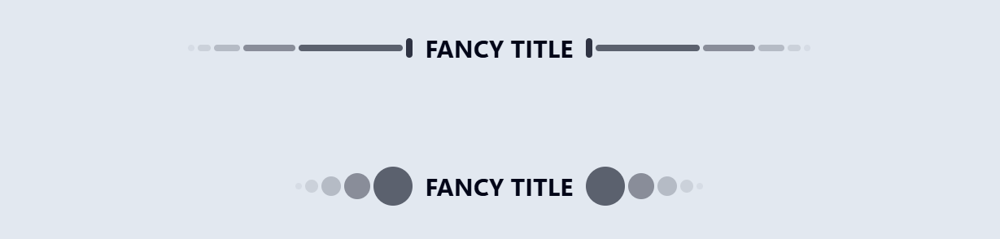
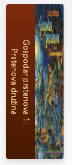
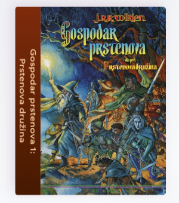

<div class="body">

# Programsko inženjerstvo

**Nositelj**: doc. dr. sc. Nikola Tanković  
**Asistent**: mag. inf. Alesandro Žužić

**Ustanova**: Sveučilište Jurja Dobrile u Puli, Fakultet informatike u Puli

<p style="float: clear; display: flex; gap: 8px; align-items: center;" class="font-brioni text-sm whitespace-nowrap">
    </img>
    Fakultet informatike u Puli
</p>

# [4] Komponente

<div style="display: flex; justify-content: space-between; text-align: justify; gap: 32px;">
    <p>  
        Vue komponente omogućuju razlaganje korisničkog sučelja na manje, modularne i ponovo iskoristive dijelove, čime se poboljšava organizacija i održavanje koda. Njihova upotreba omogućuje logičnu i skalabilnu izgradnju aplikacije, olakšavajući razvoj, testiranje i ponovnu upotrebu elemenata sučelja.
    </p>
    </img>
</div>

**Posljednje ažurirano:** 31. ožujka 2025.

<!-- TOC -->

-   [Programsko inženjerstvo](#programsko-in%C5%BEenjerstvo)
-   [[4] Komponente](#4-komponente)
    -   [Vue komponente](#vue-komponente)
    -   [Definiranje komponenti](#definiranje-komponenti)
        -   [Korištenje komponenti](#kori%C5%A1tenje-komponenti)
    -   [Prosljeđivanje parametara props](#proslje%C4%91ivanje-parametara-props)
        -   [defineProps](#defineprops)
        -   [Validacija parametara](#validacija-parametara)
        -   [Statični i dinamični parametri](#stati%C4%8Dni-i-dinami%C4%8Dni-parametri)
        -   [Jednosmjerna veza](#jednosmjerna-veza)

<!-- /TOC -->
<div class="page"></div>

## Vue komponente

Kao što smo rekli i prije, Vue koristi **komponente** – modularne, višekratno iskoristive dijelove korisničkog sučelja koji sadrže vlastitu logiku, stilove i podatke. Komponente olakšavaju održavanje kôda i omogućuju lakšu skalabilnost aplikacija.


Njihova upotreba donosi brojne prednosti:

-   **Modularnost** – Sučelje se dijeli na manje cjeline koje su lakše za upravljanje i testiranje
-   **Ponovna upotreba** – Jednom definirane komponente mogu se koristiti na više mjesta u aplikaciji
-   **Izolacija** – Svaka komponenta ima vlastite podatke, metode i stilove, čime se izbjegava nepredvidivo ponašanje u aplikaciji
-   **Jednostavna komunikacija** – Komponente mogu razmjenjivati podatke putem **parametri** (_props_) i **događaja** (_events_)
-   **Poboljšana čitljivost i održavanje** – Kod je bolje organiziran i ima definiranu strukturu

## Definiranje komponenti

Kada izrađujemo novi projekt, uvijek ćemo imati barem jednu komponentu, a to je `App.vue`. Ono što trebamo uočiti i znati jest da sve komponente u Vue-u imaju nastavak `.vue`, što također znamo i pod nazivom **Single-File Component** (_SFC_).

_Ponavljanje iz prve skripte:_

> Komponente se obično pišu u formatu koji nalikuje HTML-u, poznatom kao **Single-File Component** _(SFC)_, odnosno `*.vue` datoteke. Kao što ime sugerira, SFC enkapsulira logiku komponente (JavaScript), predložak (HTML) i stilove (CSS) u jednoj datoteci.

Komponente možemo izraditi bilo gdje u projektu, no u pravilu ih organiziramo prema njihovoj namjeni. Komponente koje se više puta koriste u različitim dijelovima aplikacije, ali nisu zasebne stranice, smještamo u mapu `components`.

-   Ako ih koristimo kao stranice unutar aplikacije koja koristi `router`, tada ih stavljamo u mapu `views`.

_Smještamo komponentu unutar mape `components`:_


Kada želimo izraditi novu komponentu, dovoljno je kreirati datoteku s proizvoljnim, ali valjanim nazivom i nastavkom `.vue`.

_Svaka komponenta mora sadržavati `<template>` blok:_

```html
<script setup>
	// opcionalno
	// logika komponente
	// composition api
</script>

<template>
	<!--obavezno-->
	<!--tijelo komponente-->
	Ahoy!
</template>

<style scoped>
	// opcionalno
	// stil komponente
	// scoped -> označava da se stil primjenjuje samo nad komponentom
</style>
```

### Korištenje komponenti

Da bi koristili komponente u našem projektu, moramo je učitati.

_Možemo kreirati komponentu pod nazivom `Dekoracija.vue`:_

```html
<template>
	<div class="flex gap-1 items-center">
		<div class="bg-slate-950 opacity-5 h-2 w-2 rounded-full"></div>
		<div class="bg-slate-950 opacity-10 h-2 w-4 rounded-full"></div>
		<div class="bg-slate-950 opacity-20 h-2 w-8 rounded-full"></div>
		<div class="bg-slate-950 opacity-40 h-2 w-16 rounded-full"></div>
		<div class="bg-slate-950 opacity-60 h-2 w-32 rounded-full"></div>
		<div class="bg-slate-950 opacity-80 h-6 w-2 rounded-full"></div>
	</div>
</template>
```

_Te je unutar `App.vue` možemo učitati:_

```html
<script setup>
	import Dekoracija from "@/components/Dekoracija.vue";
</script>

<template>
	<div
		class="h-full flex justify-center items-center gap-4 p-16 bg-slate-200">
		<Dekoracija></Dekoracija>

		<p class="text-3xl font-bold text-slate-950">FANCY TITLE</p>

		<Dekoracija class="rotate-180"></Dekoracija>
	</div>
</template>
```


-   Možemo primijetiti da smo komponentu učitali pod nazivom `Dekoracija`, iako smo je mogli nazvati proizvoljno. Ipak, uobičajena praksa je da naziv komponente odgovara nazivu datoteke.

Kod učitavanja i korištenja komponenti preporučuje se korištenje **PascalCase** naziva oznaka za komponente kako bi se razlikovale od izvornih HTML elemenata. Iako izvornim HTML oznakama nisu bitna velika i mala slova, kod Vue komponenti se mogu koristiti.

```html
<script setup>
	import MojaDekoracija from "@/components/Dekoracija.vue";
	import mojaDekoracija from "@/components/DekoracijaKruzici.vue";
</script>

<template>
	<div
		class="flex justify-center items-center 
        gap-4 p-16 bg-slate-200">
		<MojaDekoracija></MojaDekoracija>

		<p class="text-3xl font-bold text-slate-950">FANCY TITLE</p>
		<!--Preporuka PascalCase-->
		<MojaDekoracija class="rotate-180" />
	</div>

	<div
		class="flex justify-center items-center 
        gap-4 p-16 bg-slate-200">
		<!--Izbjegavat-->
		<mojaDekoracija />

		<p class="text-3xl font-bold text-slate-950">FANCY TITLE</p>

		<mojaDekoracija class="rotate-180"></mojaDekoracija>
	</div>
</template>
```



U ovom slučaju, riječ je o dvije različite komponente koje smo učitali pod istim nazivom `moja dekoracija`, pri čemu jedan naziv počinje velikim početnim slovom, a drugi malim. Time ih Vue smatra kao dvije različite komponente. Zato se preporučuje koristiti PascalCase imenovanje i odabrati deskriptivnije nazive koji se jasno razlikuju. U ovom slučaju, bolje bi bilo koristiti nazive poput _DekoracijaLinije_ i _DekoracijaKruzici_.

> Možemo koristiti `/>` za zatvaranje oznake

Kako bismo nadalje izbjegli stvaranje besmislenih primjera, koristit ćemo koncept digitalne knjižnice. Možemo je zamisliti kao vlastiti ormar s policama, gdje svaka polica predstavlja određenu kolekciju knjiga, a unutar kolekcija nalaze se serijali i pojedinačne knjige.

-   ormar → polica → kolekcija → knjiga

To znači da ćemo našu komponentnu hijerarhiju graditi od najmanjih jedinica prema složenijim strukturama. Počet ćemo s komponentom koja predstavlja **knjigu**, zatim ćemo je smjestiti unutar **kolekcije** knjiga, koje će se nalaziti na **policama** unutar **ormara**.

-   Tako da krećemo s izradom komponentom `Knjiga.vue` koja će imati dva parametra: _slika_ i _naslov_

_`Knjiga.vue` komponenta:_

```html
<script setup>
	import { ref } from "vue";
	const slika = ref("./src/assets/images/books/fantasy/lotr_1.png");
	const naslov = ref("Gospodar prstenova 1: Prstenova družina");
	const selected = ref(false);
</script>

<template>
	<div
		class="group/book flex flex-col gap-1 h-fit"
		:class="{ 'active' : selected }">
		<div
			@click="selected = true"
			@mouseleave="selected = false"
			class="relative flex h-64 max-w-12 items-start group-hover/book:rotate-x-10 transition-all duration-300"
			:class="selected ? 'drop-shadow-[-4px_-4px_8px_rgba(224,212,224,1)] -translate-x-54 scale-125' :
            'drop-shadow-lg group-hover/book:-translate-x-4 group-hover/book:scale-105'">
			<div
				class="flex items-center justify-center text-orange-200 bg-gradient-to-b from-orange-900 to-amber-950 rounded-l
                h-64 min-w-12 px-8 text-sm text-center text-pretty transition-all duration-300 [writing-mode:sideways-rl] origin-right"
				:class="{ '-rotate-y-45' : selected }">
				{{ naslov }}
			</div>

			
		</div>
	</div>
</template>
```

<div style="display: flex; gap: 16px;">
    
    
</div>

_I sada ako želimo koristiti tu komponentu knjige, učitamo je u App.vue:_

```html
<script setup>
	import Knjiga from "@/components/Knjiga.vue";
</script>

<template>
	<div
		class="h-full flex flex-col items-center p-8 bg-gradient-to-br
        from-gray-200 via-slate-50 to-stone-300 text-gray-800">
		<div class="text-3xl font-bold">Digitalna Knjižnica</div>
		<div class="flex gap-1 p-8">
			<Knjiga v-for="i in 3" />
		</div>
	</div>
</template>
```


Međutim, sada imamo tri identične knjige, što je i očekivano jer sve imaju isti naziv i sliku definiranu u komponenti. Ako želimo prikazati tri različite knjige, umjesto da stvaramo još dvije identične komponente s različitim nazivima i slikama, možemo im proslijediti podatke kao parametre iz neke liste.

## Prosljeđivanje parametara (_props_)

U većini slučajeva, za komponente koje koristimo unutar projekta, želimo da imaju različit sadržaj. Jedan od načina kako to možemo postići je kroz prosljeđivanje podataka, a u tom kontekstu dolaze u igru **parametri** (_props_).

-   **Parametri** su Vue atributi koji se mogu registrirati unutar komponente. Ako želimo proslijediti podatke komponenti, trebamo deklarirati popis parametara koje komponenta može prihvatiti, koristeći funkciju `defineProps`.

_Funkciji `defineProps` proslijeđujemo listu parametara:_

```js
const props = defineProps(["naslov"]);
console.log(props.naslov);
```

_Tako da u komponenti `Knjiga.vue` možemo promijeniti `script`:_

```html
<script setup>
	defineProps(["slika", "naslov"]);
</script>
```

_Te u `App.vue` onda proslijediti podatke parametrima kjige iz liste:_

```html
<script setup>
	import { ref } from "vue";
	import Knjiga from "@/components/Knjiga.vue";
	const knjige = ref([
		{
			naslov: "Gospodar prstenova - Prstenova družina",
			slika: "./src/assets/images/books/fantasy/lotr_1.png",
		},
		{
			naslov: "Gospodar prstenova - Dvije kule",
			slika: "./src/assets/images/books/fantasy/lotr_2.png",
		},
		{
			naslov: "Gospodar prstenova - Povratak kralja",
			slika: "./src/assets/images/books/fantasy/lotr_3.png",
		},
	]);
</script>

<template>
	<div
		class="h-full flex flex-col items-center p-8 bg-gradient-to-br
        from-gray-200 via-slate-50 to-stone-300 text-gray-800">
		<div class="text-3xl font-bold">Digitalna Knjižnica</div>
		<div class="flex gap-1 p-8">
			<Knjiga
				v-for="knjiga in knjige"
				:naslov="knjiga.naslov"
				:slika="knjiga.slika" />
		</div>
	</div>
</template>
```


Sada vidimo da smo uspješno proslijedili podatke komponentama, povezujući parametre kao atribute. Time svaka knjiga ima svoj jedinstveni naziv.

### `defineProps()`

Kao što smo rekli, s pomoću funkcije `defineProps()` deklariramo parametre koje možemo proslijediti komponenti.

-   Ako parametre ne spremimo u varijablu, onda im možemo pristupati samo unutar `<template>` bloka:

```html
<script setup>
	defineProps(["mojParametar"]);

	console.log(props.mojParametar); // neće raditi
</script>
```

-   Ako želimo pristupati parametrima unutar `<script>` bloka onda ih moramo spremiti u varijablu (u praksi tu varijablu nazivamo _props_):

```html
<script setup>
	const props = defineProps(["mojParametar"]);

	console.log(props.foo); // ispisat će vrijednost proslijeđene vrijednosti parametra
</script>
```

-   Kada imenujemo parametre s dugačkim nazivima, u pravilu koristimo **camelCase**

```js
defineProps({
	nazivKnjige: String,
});
```

-   Te kada proslijeđujemo vrijednosti parametrima komponenti, onda u pravilu koristimo **kebab-case**

```html
<Knjiga naziv-knjige="Gospodar prstenova - Prstenova družina" />
```

### Validacija parametara

Funkcija `defineProps()` može primiti ne samo _polje_ parametara, već i _objekt_ parametara. U tom slučaju omogućuje nam provjeru i validaciju proslijeđenih vrijednosti, gdje je:

-   `ključ` - _naziv_ parametra
-   `vrijednost` - _tip podataka_ ili _objekt s dodatnom validacijom_

```js
defineProps({
	// Osnovna provjera tipa
	// (`null` i `undefined` vrijednosti dopuštaju bilo koji tip)
	paramA: Number,

	// Više mogućih tipova
	paramB: [String, Number],

	// Obavezan string
	paramC: {
		type: String,
		required: true,
	},

	// Obavezan ali dopušta null vrijednost
	paramD: {
		type: [String, null],
		required: true,
	},

	// Broj s zadanom vrijednošću
	paramE: {
		type: Number,
		default: 100,
	},

	// Objekt s zadanom vrijednošću
	paramF: {
		type: Object,
		// Objekt ili polje moraju imati zadanu vrijednost
		// koja se vraća iz funkcije. Funkcija prima sirove
		// proslijeđene parametre kao argument.
		default(rawProps) {
			return { message: "pozdrav" };
		},
	},

	// Prilagođena funkcija za validaciju
	paramG: {
		validator(value, props) {
			// Vrijednost mora biti jedna od navedenih opcija
			return ["uspjeh", "upozorenje", "opasnost"].includes(value);
		},
	},
});
```

-   Svi parametri (_props_) su po zadanom **opcionalni**, osim ako nije navedeno `required: true`
-   Ako opcionalni parametar (osim Booleana) nije prisutan, njegova vrijednost će biti `undefined`
-   Boolean parametri koji nisu prisutni automatski će se postaviti na `false`. Možete promijeniti ovo ponašanje postavljanjem zadane vrijednosti, npr. `default: undefined`, kako bi se ponašao kao ne-Boolean parametar
-   Ako je zadana vrijednost definirana, koristit će se ako je vrijednost parametra `undefined`. To uključuje situacije kada parametar nije proslijeđen ili mu je eksplicitno dodijeljena vrijednost `undefined`

> Kada validacija parametra ne uspije, Vue će prikazati upozorenje u konzoli

### Statični i dinamični parametri

Kao i za atribute, vue dopošta parametre koji su proslijeđeni kao statične i dinamičke vrijednosti:

```html
<!-- Statičko dodjeljivanje vrijednosti varijable -->
<Knjiga naslov="Gospodar prstenova - Prstenova družina" />

<!-- Dinamično dodjeljivanje vrijednosti varijable -->
<Knjiga v-bind:naslov="naslov" />

<!-- Dinamično dodjeljivanje vrijednosti izraza -->
<Knjiga :naslov="volumen + '. -' + naslov" />
```

-   Vue omogućuje prosljeđivanje parametara bilo kojeg tipa

```html
<!-- Iako je `42` statična vrijednost, koristimo v-bind jer je to JS izraz -->
<Knjiga :broj-stranica="423" />

<!-- Ako je prop naveden bez vrijednosti, pretpostavlja se da je `true` -->
<Knjiga objavljena />

<!-- Iako je `false` statična vrijednost, koristimo v-bind -->
<Knjiga :objavljena="false" />

<!-- Prosljeđivanje polja -->
<Knjiga :zanrovi="['avantura', 'fantazija']" />

<!-- Prosljeđivanje objekta -->
<Knjiga
	:autor="{
    ime: 'John Ronald Reuel',
    prezime: 'Tolkien'
  }" />
```

-   Ako želimo proslijediti sva svojstva objekta kao parametre, možemo koristiti `v-bind` bez argumenta

```js
const lotrPrvaKnjiga_info = {
	naziv: "Gospodar prstenova - Prstenova družina",
	brojStranica: 423,
	zanrovi: ["avantura", "fantazija"],
	autor: {
		ime: "John Ronald Reuel",
		prezime: "Tolkien",
	},
	objavljena: true,
};
```

```html
<Knjiga v-bind="lotrPrvaKnjiga_info" />
```

### Jednosmjerna veza

Svi _parametri_ imaju **jednosmjernu vezu** od roditelja prema djetetu: kada se vrijednost u roditelju promijeni, ažurira se i u djetetu, ali ne obrnuto.

Svako ažuriranje roditelja ponovno prosljeđuje _parametar_ djetetu. Zato **nije preporučljivo** mijenjati _parametre_ unutar djeteta – Vue će prikazati upozorenje:

```js
const props = defineProps(["naziv"]);

props.naziv = "Novi naziv"; // Neispravno – READONLY!
```

-   Jedno rješenje je da koristimo _parametar_ kao početnu vrijednost za izradu lokalne kopije:

```js
const props = defineProps(["naziv"]);
const localniNaziv = ref(props.naziv); // Lokalna kopija
```

Komponenta ne može izravno mijenjati _parametre_, ali može mijenjati **unutarnja svojstva objekata/nizova** jer se prenose po referenci

```js
const props = defineProps(["autor"]);
props.autor.ime = "Novo ime"; // Radi – Nije preporučljivo
```

> U pravilu komponenta treba emitirati događaj, a roditelj obaviti mutaciju, no ponekad je poželjno i jednostavnije raditi mutaciju unutar komponente

## Događaji komponenti

U prethodnom poglavlju stvorili smo komponentu `Knjiga.vue`, kojoj prosljeđujemo parametre iz liste. Sada možemo kreirati novu komponentu `Kolekcija.vue`, koja će sadržavati više knjiga iz istog serijala, poput sedmologije _Harry Potter_ ili trilogije _Gospodar prstenova_.

-   Osim prikaza knjiga, omogućit ćemo **dodavanje** i **brisanje** knjiga iz kolekcije.
    -   Svaka knjiga će imati dugme _Ukloni_.
-   Kolekcija će sadržavati **parametar** `kolekcija`, koji ćemo proslijeđivati iz roditeljske komponente.
    -   Svaka kolekcija sadrži _naslov_ i _popis knjiga_.

_Prvi korak je implementacija funkcionalnosti za uklanjanje određene knjige iz kolekcije pritiskom na dugme **Ukloni**:_

```html
<div
	class="text-red-700 font-bold opacity-0 group-hover/book:opacity-100 cursor-pointer hover:underline transition"
	@click="$emit('ukloni')">
	<!--prosljeđivanje događaja ukloni-->
	Ukloni
</div>
```

Budući da pojedinačne knjige nemaju izravan pristup kolekciji, ne mogu ukloniti same sebe iz nje. Umjesto toga, potrebno je pozvati funkciju unutar komponente `Kolekcija.vue`, koja će se pobrinuti za uklanjanje knjige iz popisa.

-   Način na koji to radimo je korištenjem **`$emit`** događaja, koji omogućuje komponenti `Knjiga.vue` da emitira vlastiti događaj prema `Kolekcija.vue`. Kada se događaj pokrene, `Kolekcija.vue` ga može presresti i ažurirati popis knjiga uklanjanjem odgovarajuće stavke.

```html
<script setup>
	import { ref } from "vue";
	import Knjiga from "@/components/Knjiga.vue";
	const props = defineProps(["kolekcija"]);

	function ukloniKnjigu(index) {
		props.kolekcija.knjige.splice(index, 1);
	}
</script>

<template>
	<div class="relative group flex flex-col gap-2">
		<div class="text-lg font-bold">{{ kolekcija.naslov }}</div>
		<div class="flex gap-1">
			<Knjiga
				v-for="(knjiga, i) in kolekcija.knjige"
				:naslov="knjiga.naslov"
				:slika="knjiga.slika"
				@ukloni="ukloniKnjigu(i)" />
			<!--presrećivanje događaja ukloni-->
		</div>
	</div>
</template>
```

Dalje, kod komponente `Kolekcija.vue` možemo dodati mogućnost za dodavanje nove knjige. Definirat ćemo novu varijablu `novaKnjiga` i funkciju koja će omogućiti dodavanje knjige u kolekciju.

```js
const novaKnjiga = ref({
	naslov: "",
	slika: "",
});

function dodajKnjigu() {
	props.kolekcija.knjige.push(novaKnjiga.value);
}
```

```html
<div class="flex gap-2 opacity-0 group-hover:opacity-100 text-sm transition">
	<input
		type="text"
		class="ring rounded w-24 px-2 bg-amber-100/25"
		v-model="novaKnjiga.naslov"
		placeholder="Naslov..." />
	<input
		type="text"
		class="ring rounded w-24 px-2 bg-amber-100/25"
		v-model="novaKnjiga.slika"
		placeholder="Url slike..." />
	<button
		class="bg-sky-600 rounded px-2 hover:bg-sky-500 text-sky-50 cursor-pointer"
		@click="dodajKnjigu()">
		Dodaj
	</button>
</div>
```

Zatim u `App.vue` komponenti malo preuredimo i dodamo dvije kolekcije:

```js
const lotrKolekcija = ref({
    naslov: "Gospodar prstenova",
    knjige: [...]
})
const harryPotterKolekcija = ref({
    naslov: "Harry Potter",
    knjige: [...]
})
```

```html
<template>
	<div
		class="h-full flex flex-col items-center bg-gradient-to-br from-gray-200 via-slate-50 to-stone-300 text-gray-800 px-60 pt-8 gap-8">
		<div class="text-3xl font-bold">Digitalna Knjižnica</div>
		<div
			class="flex flex-col w-full pt-4 rounded-xl"
			style="background-image: url(https://i.pinimg.com/originals/b9/ea/4e/b9ea4e526fb0fc0fd8038ac713fbb881.jpg)">
			<div class="flex gap-8 px-8 pt-4">
				<Kolekcija :kolekcija="lotrKolekcija" />
				<Kolekcija :kolekcija="harryPotterKolekcija" />
			</div>
			<div
				class="flex items-center bg-orange-950 rounded-lg text-orange-100 text-xl px-8 py-1">
				Fantazija
			</div>
		</div>
	</div>
</template>
```


</div>

### Proslijeđivanje događaja `emit()`

Komponente u Vue.js mogu proslijeđivati vlastite događaje koristeći metodu `$emit()`. Ovaj mehanizam omogućava komunikaciju između komponenta roditelja i djece, na način da djete šalje signal roditelju kada se nešto dogodi.

U komponenti možemo proslijeđivati događaj izravno iz `<template>`:

```html
<!-- MyComponent.vue -->
<template>
	<button @click="$emit('myEvent')">Klikni me</button>
</template>
```

-   U ovom slučaju, kada korisnik klikne dugme, komponenta proslijedi događaj pod nazivom _myEvent_

_Roditelj može osluškivati ovaj događaj pomoću `v-on` direktive (kraće `@`)_:

```html
<template>
	<MyComponent @my-event="myFun" />
</template>

<script setup>
	function myFun() {
		console.log("Događaj myEvent je primljen!");
	}
</script>
```

-   Ako želimo da se događaj preslušava samo jednom, možemo koristiti `.once` modifikator:

```html
<MyComponent @my-event.once="myFun" />
```

Nakon prvog emitiranja, ovaj događaj se više neće preslušavati.

> Za razliku od nativnih DOM događaja, događaji koje proslijeđuje komponenta **ne propagiraju se prema gore** kroz hijerarhiju komponenti. Roditelj može čuti samo događaje proslijeđene izravno od svoje djece. Ako je potrebno komunicirati između neizravno povezanih komponenti, preporučuje se korištenje globalnog stanja (_Vuex, Pinia_).

### Prosljeđivanje argumenata događajima

Često želimo poslati dodatne podatke uz događaj. To se može postići dodavanjem argumenata u `$emit()`.

_Pretpostavimo da imamo komponentu koja omogućava povećanje broja za određenu vrijednost:_

```html
<template>
	<button @click="$emit('increaseBy', 1)">Povećaj za 1</button>
</template>
```

-   Ovdje `$emit('increaseBy', 1)` znači da će se uz događaj `'increaseBy'` poslati broj `1`

_Roditeljska komponenta može uhvatiti taj argument i koristiti ga:_

```html
<template>
	<MyButton @increase-by="(n) => count += n" />
</template>

<script setup>
	import { ref } from "vue";

	const count = ref(0);
</script>
```

-   Ako želimo koristiti metodu umjesto inline funkcije, možemo definirati posebnu funkciju:

```html
<template>
	<MyButton @increase-by="increaseCount" />
</template>

<script setup>
	import { ref } from "vue";

	const count = ref(0);

	function increaseCount(n) {
		count.value += n;
	}
</script>
```

-   Ako je potrebno poslati više podataka, `$emit()` može primiti više argumenata:

```html
<button @click="$emit('update', 'Nova vrijednost', 42)">Ažuriraj</button>
```

_Roditelj može primiti sve argumente:_

```html
<MyComponent @update="(msg, num) => console.log(msg, num)" />
```

---

### Deklaracija proslijeđenih događaja

Možemo **deklarirati događaje** koje komponenta emitira. Budući da metoda `$emit`, korištena unutar `<template>`, nije dostupna unutar `<script setup>`, `defineEmits()` vraća ekvivalentnu funkciju koju možemo koristiti umjesto nje:

```html
<script setup>
	const emit = defineEmits(["inFocus", "submit"]);

	function buttonClick() {
		emit("submit");
	}
</script>
```
