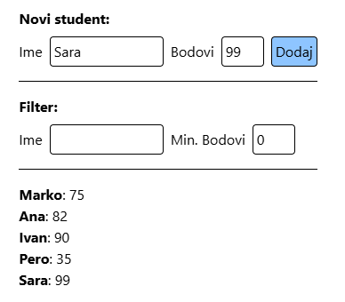

<div class="body">

# Programsko inženjerstvo

**Nositelj**: doc. dr. sc. Nikola Tanković  
**Asistent**: mag. inf. Alesandro Žužić

**Ustanova**: Sveučilište Jurja Dobrile u Puli, Fakultet informatike u Puli

<p style="float: clear; display: flex; gap: 8px; align-items: center;" class="font-brioni text-sm whitespace-nowrap">
    </img>
    Fakultet informatike u Puli
</p>

# [5] Napredne funkcije i životni ciklus komponenti

<div style="display: flex; justify-content: space-between; text-align: justify; gap: 32px;">
    <p>  
		Razumijevanje <b>životnog ciklusa</b> komponente ključno je za upravljanje njezinim ponašanjem, dok napredne funkcije poput <b>watchers</b>, <b>computed properties</b> i <b>template refs</b> poboljšavaju modularnost i fleksibilnost komponenti.
    </p>
    </img>
</div>

**Posljednje ažurirano:** 1. travnja 2025.

<!-- TOC -->

- [Programsko inženjerstvo](#programsko-in%C5%BEenjerstvo)
- [[5] Napredne funkcije i životni ciklus komponenti](#5-napredne-funkcije-i-%C5%BEivotni-ciklus-komponenti)
    - [Napredne funkcije](#napredne-funkcije)
        - [Computed](#computed)
        - [Watchers](#watchers)
        - [Template Refs](#template-refs)
            - [defineExpose - pristup komponentama](#defineexpose---pristup-komponentama)
        - [Composables & Utils](#composables--utils)
            - [Composables](#composables)
            - [Utils](#utils)
            - [Kada što koristiti?](#kada-%C5%A1to-koristiti)
    - [Životni ciklus komponenti Lifecycle Hooks](#%C5%BEivotni-ciklus-komponenti-lifecycle-hooks)
        - [created](#created)
        - [mounted](#mounted)
        - [unmounted](#unmounted)
    - [Built in components](#built-in-components)
        - [Transition](#transition)
        - [Teleport](#teleport)

<!-- /TOC -->

<div class="page"></div>

## Napredne funkcije

Dosad smo unutar komponenti koristili obične JavaScript funkcije za izračune i filtriranje podataka. No, takve funkcije imaju nedostatak kada rade s reaktivnim varijablama – izvršavaju se pri svakoj promjeni bilo koje varijable, čak i kada to nije potrebno.  

Ponekad želimo pratiti promjene određene varijable kako bismo pokrenuli specifičnu logiku ili dijeliti ponavljajuću logiku među više komponenti. Vue nudi ugrađena rješenja za ove probleme, omogućujući optimizirano upravljanje reaktivnošću, efikasno praćenje promjena i ponovno korištenje logike unutar različitih komponenti.

### Computed

Uzet ćemo primjer s *listom studenata* iz prethodne skripte, gdje svaki *student* ima *ime* i *broj bodova*. Također ćemo dodati jednostavan unos za dodavanje novih studenata u listu i unos za filtriranje studenata po imenu i minimalnom broju bodova.

*Primjer:*

```html
<script setup>
    import { ref } from 'vue'

    const novoIme = ref("");
    const noviBodovi = ref(0);

    const studenti = ref([
        { ime: "Marko", bodovi: 75 },
        { ime: "Ana", bodovi: 82 },
        { ime: "Ivan", bodovi: 90 },
    ])

    const filterIme = ref("");
    const filterMinBodovi = ref(0);

    function filtriraniStudent() {
        const tempStudenti = studenti.value.filter(student =>             
            student.ime.toLowerCase().includes(filterIme.value.toLowerCase()) &&
            student.bodovi >= filterMinBodovi.value
        )
        console.log("filtriranje")
        return tempStudenti;
    }

    function addStudent() {
        const noviStudent = {
            ime: novoIme.value,
            bodovi: noviBodovi.value
        }
        studenti.value.push(noviStudent);
    }
</script>

<template>
    <div class="h-full flex p-8 items-center justify-center">

        <div class="h-64">

            <b>Novi student:</b>

            <div class="flex gap-2 items-center mt-2">
                Ime <input type="text" v-model="novoIme" class="p-1 border rounded w-32">
                Bodovi <input type="number" v-model="noviBodovi" class="p-1 border rounded w-12">
                <button @click="addStudent()" class="p-1 border rounded hover:bg-blue-200 bg-blue-300 cursor-pointer">
                    Dodaj
                </button>
            </div>
            
            <hr class="my-4">

            <b>Filter:</b>

            <div class="flex gap-2 items-center mt-2">
                Ime <input type="text" v-model="filterIme" class="p-1 border rounded w-32">
                Min. Bodovi <input type="number" v-model="filterMinBodovi" class="p-1 border rounded w-12">
            </div>
            
            <hr class="my-4">

            <div v-for="student in filtriraniStudent()">
                <b>{{ student.ime }}</b>: {{ student.bodovi }}
            </div>

        </div>

    </div>
</template>
```



Ova mini aplikacija radi ispravno, ali prilikom unosa imena novog studenta, funkcija `filtriraniStudent()` se poziva iako to nije potrebno. Naime, svaka promjena bilo koje reaktivne varijable uzrokuje njezino ponovno izvršavanje.

- Želimo da se funkcija poziva samo kada se mijenjaju varijable koje zaista utječu na njezin rezultat. Prisjetimo se principa reaktivnosti iz prethodne skripte (*Skripta 2. - Reaktivnost i Vezani Atributi*)

Vue nudi ugrađenu funkciju **`computed()`**, koja rješava ovaj problem. Ako funkciju `filtriraniStudent()` prebacimo u `computed()`, pozivat će se samo kada se promijene varijable `filterIme` i `filterMinBodovi`.

*Primjer:*
```html
<script setup>
    import { ref, computed } from 'vue'
    ...
    const filtriraniStudent = computed(() => {
        const tempStudenti = studenti.value.filter(student =>             
            student.ime.toLowerCase().includes(filterIme.value.toLowerCase()) &&
            student.bodovi >= filterMinBodovi.value
        )
        console.log("filtriranje")
        return tempStudenti;
    })
    ...
</script>

<template>
    ...
    <div v-for="student in filtriraniStudent">
        <b>{{ student.ime }}</b>: {{ student.bodovi }}
    </div>
    ...
</template>
```

- Sada se `filtriraniStudent` poziva onda samo kada se promijene varijable `filterIme` i `filterMinBodovi`

*Da bi koristili `computed` funkciju potrebno ju je učitati iz `vue` okvira kao što učitavamo `ref` funkciju:*

```js
import { computed } from 'vue'
```

*Sintaksa za pisanje `computed` funkcije je sljedeća:*

```js

const nazivFunkcije = computed(() => {
    // izračun
    return vrijednost;
})
// ILI
const nazivFunkcije = computed(() => vrijednost)
```

*I onda se koristi u `<template>` bloku bez običnih zagradi:*
```html
<div>
    {{ nazivFunkcije }}
</div>
```

- `Computed` funkcija prati samo reaktivne varijable koje koristi. Ako, primjerice, sadrži `Date.now()`, neće se ponovno izračunati jer ta vrijednost nije reaktivna

> Vrlo bitna razlika između obične funkcije i `computed` funkcije je to što `computed` funkcija ne može primati argumente

### Watchers

U Vue.js, **watch** funckija omogućuje prilagođeno praćenje promjena reaktivnih varijabli i izvođenje dodatne logike kada se te promjene dogode. Za razliku od `computed` funkcije, koja se koristi za izračunavanje vrijednosti, `watch` je koristan kada želimo izvršiti naredbe kao što su API pozivi, ručna manipulacija DOM-om ili bilo koja asinkrona operacija kao odgovor na promjenu podataka.

*Da bismo koristili `watch`, prvo moramo učitati `watch` funkciju iz `vue` okvira:*

```js
import { ref, watch } from 'vue'
```

*Sintaksa za pisanje `watch` funkcije je sljedeća:*

```js
watch(reaktivnaVarijabla, (novaVrijednost, StaraVrijednost) => {
  // Izvrši neku akciju kada se reaktivnaVarijabla promijeni
})
```

Nastavimo s primjerom studenata i dodajmo watcher koji će ispisivati u konzolu kad god se promijeni vrijednost `filterIme`:

```html
<script setup>
    import { ref, computed, watch } from 'vue'
    ...
    watch(filterIme, (newValue, oldValue) => {
        console.log(`Filter imena promijenjen s "${oldValue}" na "${newValue}"`)
    })
    ...
</script>
```

**`watch(filterIme, callback)`** prati promjene u `filterIme` varijabli i poziva callback funkciju sa novom i starom vrijednošću, tako da će se aktivirati samo kada se `filterIme` stvarno promijeni (*npr. ako korisnik upiše nešto u input polje*).

- Ako želimo pratiti više reaktivnih vrijednosti odjednom, možemo koristiti niz:

```js
watch([filterIme, filterMinBodovi], ([newIme, newBodovi], [oldIme, oldBodovi]) => {
    console.log(`Promjena filtra: 
        Ime (${oldIme} -> ${newIme}), 
        Bodovi (${oldBodovi} -> ${newBodovi})`)
})
```

- Ako pratimo objekt ili niz i želite da `watch` reagira na promjene unutar njih (*npr. promjena svojstva objekta*), moramo koristiti opciju `deep: true`:

```js
watch(studenti, () => {
    console.log('Lista studenata promijenjena!')
}, { deep: true })
```

- Ako želimo da se `watch` pokrene čim se komponenta montira (*bez čekanja na prvu promjenu*), koristimo `immediate: true`:

```js
watch(filterIme, () => {
    console.log('Watcher pokrenut!')
}, { immediate: true })
```

### Template Refs

Već znamo i koristimo `ref` funkciju za kreiranje reaktivnih varijabli. Međutim, `ref` se može koristiti kao atribut kod DOM elemenata ili Vue komponenti.

**Template Refs** tu onda omogućuju direktan pristup DOM elementima unutar `<template>` bloka. Ovo je korisno kada trebamo ručno upravljati DOM-om: fokusirati input polje, mjeriti veličinu elementa ili integrirati Vue s vanjskim bibliotekama koje zahtijevaju direktan pristup DOM-u.

*Prvi način korištenja je s pomoću `$refs` varijable:*

```html
<template>
    <div ref="customRef">
        HELLO
    </div>

    <button @click="console.log($refs.customRef.outerHTML)">
        Klikni
    </button>
</template>
```

- Referencu postavljamo dodavanjem `ref` atributa na element, slično kao kod `id` atributa. Zatim možemo pristupiti tom elementu preko `$refs` varijable

*Drugi način korištenja je s pomoću `useTemplateRef()` funckije:*

```html
<script setup>
    import { useTemplateRef } from 'vue'

    const myRef = useTemplateRef('customRef');

    function ispis() {
        console.log(myRef.value.outerHTML);
    }
</script>

<template>
    <div ref="customRef">
        HELLO
    </div>

    <button @click="ispis()">
        Klikni
    </button>

    <div v-if="myRef">
        {{ myRef.outerHTML }}
    </div>
</template>
```

- Postavljamo `ref` atribut na element, zatim koristimo funkciju `useTemplateRef` iz Vue okvira kako bismo element mogli koristiti kao varijablu unutar drugih funkcija ili unutar `<template>` bloka.

> Ako želimo koristiti **Template Ref** unutar `<template>` bloka, potrebno je izvršiti provjeru na `null`, jer element još nije postavljen pri inicijalizaciji ili montiranju, što bi moglo izazvati grešku.

#### `defineExpose()` - pristup komponentama

Napomenuli smo da možemo povezati komponente s pomoću **Template Ref**. Na taj način dobivamo pristup varijablama i funkcijama koje komponenta izlaže putem funkcije `defineExpose()`.

*Prvo ćemo unutar komponente definirati izložene varijable:*
```html
<script setup>
    import { ref } from 'vue'

    const a = ref(4);
    const b = 2;
    const c = ref("Izračun:");

    function pozdrav() {
        console.log("Ahoy!");        
    }

    defineExpose({
        a, 
        b,
        pozdrav
    })
</script>

<template>
    <input type="number" v-model="a" class="rounded p-1 border">
    <div>
        {{ c }} {{ a }} % {{ b }} is {{ a % b == 0 }}
    </div>
</template>
```

> `defineExpose()` funkciju nije potrebno učitati iz vue okvira

- Pomoću funkcije `defineExpose()` izložili smo varijable `a` i `b` te funkciju `pozdrav`. Kada koristimo tu komponentu i postavimo referencu na nju, imat ćemo pristup tim izloženim varijablama i funkcijama.

*Primjer:*

```html
<script setup>
    import ChildComponent from './ChildComponent.vue';
    import { useTemplateRef } from 'vue'
    const myChild = useTemplateRef('childRef');
</script>

<template>
    <ChildComponent ref="childRef"/>

    <div v-if="myChild">
        myChild.a: {{ myChild.a }}
        myChild.b: {{ myChild.b }}
    </div>

    <button @click="myChild.pozdrav"
        class="border hover:bg-slate-200 cursor-pointer p-1 rounded">
        Klikni
    </button>
</template>
```

> Kod `click` događaja nije potrebno staviti `null` provjeru jer se ne poziva pri inicijalizaciji.

### Composables & Utils  

U Vue.js aplikacijama, **Composables** i **Utils** služe za organizaciju i ponovno korištenje logike izvan Vue komponenti.  

#### Composables  

**Composables** su funkcije koje koriste **Vue Composition API** za enkapsulaciju i ponovno korištenje logike sa stanjem.  

Pri izradi frontend aplikacija često nailazimo na ponavljajuće zadatke, poput formatiranja datuma na više mjesta. U takvim slučajevima logiku izdvajamo u zasebne funkcije radi bolje organizacije koda.

- **Composables** mogu koristiti Vue reaktivne funkcije (`ref`, `computed`, `watch`, ...) 
- Obično se organiziraju u zasebne **JS datoteke** unutar mape `composables`
- Nazivi tih datoteka prate format `use<Naziv>.js`

*Primjer:*
```js
// useCounter.js
import { ref } from 'vue'

const count = ref(0)

export function useCounter() {
    const increment = () => count.value++;
    return { count, increment }
}
```

- Uvijek je važno napraviti izvoz (*export*) funkcije kako bi je mogli koristiti unutar drugih djelova aplikacije

*Primjer:*
```html
// PrikazBrojaca.vue
<script setup>
    import { useCounter } from '@/composables/useCounter.js'
</script>

<template>
    <div>
        Count: <b>{{ useCounter().count }}</b>
    </div>
</template>
```
```html
// App.vue
<script setup>
    import PrikazBrojaca from './PrikazBrojaca.vue';
    import { useCounter } from '@/composables/useCounter.js'
</script>

<template>
    <div>
        <PrikazBrojaca/>
        <button @click="useCounter().increment" 
            class="border hover:bg-slate-200 cursor-pointer p-1 rounded">
            Increment
        </button>
    </div>
</template>
```

#### Utils

**Utils** su pomoćne funkcije koje nemaju stanje i ne koriste Vue reaktivnost, ali olakšavaju ponovnu upotrebu generičke logike unutar aplikacije.

Često ih koristimo za operacije poput formatiranja podataka, parsiranja stringova ili matematičkih izračuna. Primjerice, ako na više mjesta trebamo formatirati datum ili validirati e-mail adresu, takve funkcije izdvajamo u **utils** kako bismo ih mogli lako koristiti bilo gdje u aplikaciji.  

- **Utils funkcije su čiste funkcije** – ne ovise o stanju komponente i ne mijenjaju globalno stanje
- Najčešće ih organiziramo u zasebne **JS datoteke** unutar mape `utils`

*Primjer:*
```js
// stringUtils.js
export function capitalize(str) {
    return str[0].toUpperCase() + str.slice(1)
}
```

#### Kada što koristiti?
| Composables          | Utils                   |
| -------------------- | ----------------------- |
| Vue reaktivna logika | Neovisno o Vue          |
| Upravljanje stanjem  | Transformacija podataka |
| Lifecycle hooks      | Pomoćne operacije       |
| Template interakcije | Matematičke funkcije    |

*Primjer kombinacije:*
```js
// useUserFormatter.js
import { computed } from 'vue'
import { capitalize } from './stringUtils'

export function useUserFormatter(user) {
  const fullName = computed(() => {
    return `${capitalize(user.firstName)} ${capitalize(user.lastName)}`
  })

  return { fullName }
}
```

## Životni ciklus komponenti (Lifecycle Hooks)

### created
### mounted
### unmounted


## Built in components

### Transition
### Teleport

</div>