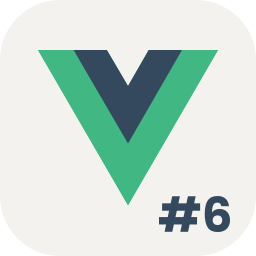
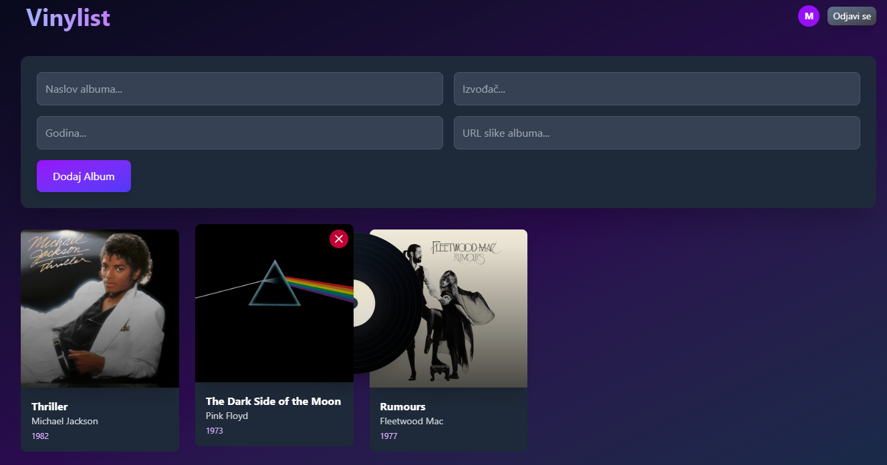

<div class="body">

# Programsko inženjerstvo

**Nositelj**: doc. dr. sc. Nikola Tanković  
**Asistent**: mag. inf. Alesandro Žužić

**Ustanova**: Sveučilište Jurja Dobrile u Puli, Fakultet informatike u Puli

<p style="float: clear; display: flex; gap: 8px; align-items: center;" class="font-brioni text-sm whitespace-nowrap">
    </img>
    Fakultet informatike u Puli
</p>

# [6] Vue Router i Pinia  

<div style="display: flex; justify-content: space-between; text-align: justify; gap: 32px;">  
    <p>  
        <b>Vue Router</b> omogućuje jednostavno upravljanje navigacijom i rutama u Vue aplikacijama, dok <b>Pinia</b> pruža moderan i intuitivan način upravljanja globalnim stanjem (<i>state management</i>).
    </p>  
    </img>  
</div>  

**Posljednje ažurirano:** 22. travnja 2025.

<!-- TOC -->

- [Programsko inženjerstvo](#programsko-in%C5%BEenjerstvo)
- [[6] Vue Router i Pinia](#6-vue-router-i-pinia)
    - [Vue Router](#vue-router)

<!-- /TOC -->

<div class="page"></div>

## Vue Router

Do sad nismo koristili *url linkove* za navigaciju po stranici unutar intrnetskog preglednika. Zato postoiji službena *Vue.js* paket **Vue Router** koja omogućuje dinamičko upravljanje navigacijom, ugniježđenim rutama, uz podršku za povijest, tranzicije i naprednu kontrolu putanje s modularnom konfiguracijom.

Ajmo sada postaviti situaciju u kojoj bi nam **Vue Router** poslužio. Imamo jednu običnu stranicu za praćenje kolekcije vinyla. Stranica ima tri komponente koje se ponašaju kao stranice: `LogIn.vue`, `SignUp.vue` i `Collection.vue`.



Unutar `App.vue` i svih tih komponenti koristimo composable funkciju `useUser` koja se ponaša kao globalni spremnik varijabli i funkcija za autentifikaciju i proslijeđivanje varijabli.

```js
//useUser.js
import { ref, computed } from 'vue';

const user = ref({ name: 'Markom', email: 'mmarkic@gmail.com' });
const registration = ref(false);

export default function useUser() {
    
    const userInitials = computed(() => {
        if (!user.value?.name) return '';
        return user.value.name.split(' ').map(n => n[0]).join('').toUpperCase();
    });

    const login = (userData) => { user.value = userData; };
    const logout = () => { user.value = null; };
    const setRegistration = (value) => { registration.value = value; };

    return { user, userInitials, registration, login, logout, setRegistration };
}
```

```html
//app.vue
<Transition>
    <Collection v-if="user"/>
    <LogIn v-else-if="!registration"/>
    <SignUp v-else/>
</Transition>
```

Kombinacijom ovih metoda vršimo prijelaze između određenih prikaza koristeći `v-if` direktivu. Međutim, možemo uočiti nekoliko problema s ovim pristupom. Uvijek se nalazimo na istoj stranici, odnosno *URL* stranice se ne mijenja. Ako želimo dodati više stranica, logika za provjeru trenutne stranice postaje složenija. Također, prilikom svakog osvježavanja stranice sve varijable se resetiraju – to se može riješiti spremanjem varijabli u lokalnu pohranu (*local storage*) i ručnim učitavanjem podataka pri pokretanju. Međutim, sve ove probleme **Vue Router** rješava umjesto nas.

Da bi uopće mogli koristiti paket **Vue Router** moramo ga instalirati.

- Ako već imamo postojeći projekt onda moramo **intalirati** paket:

```sh
    npm install vue-router@4
```

- Ako radimo novi projekt onda možemo **uključiti** paket pri instalaciji:

```sh
    npm create vue@latest
```


Prvo što treba napraviti nakon instalacije je **registrirati router** da radi unutar