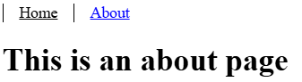
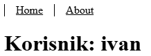

<div class="body">

# Programsko inženjerstvo

**Nositelj**: doc. dr. sc. Nikola Tanković  
**Asistent**: mag. inf. Alesandro Žužić

**Ustanova**: Sveučilište Jurja Dobrile u Puli, Fakultet informatike u Puli

<p style="float: clear; display: flex; gap: 8px; align-items: center;" class="font-brioni text-sm whitespace-nowrap">
    </img>
    Fakultet informatike u Puli
</p>

# [6] Vue Router i Pinia  

<div style="display: flex; justify-content: space-between; text-align: justify; gap: 32px;">  
    <p>  
        <b>Vue Router</b> omogućuje jednostavno upravljanje navigacijom i rutama u Vue aplikacijama, dok <b>Pinia</b> pruža moderan i intuitivan način upravljanja globalnim stanjem (<i>state management</i>).
    </p>  
    </img>  
</div>  

**Posljednje ažurirano:** 11. svibnja 2025.

<!-- TOC -->

- [Programsko inženjerstvo](#programsko-in%C5%BEenjerstvo)
- [[6] Vue Router i Pinia](#6-vue-router-i-pinia)
    - [Vue Router](#vue-router)
        - [Instalacija](#instalacija)
        - [Router struktura](#router-struktura)
        - [Rute](#rute)
            - [Dinamičke rute](#dinami%C4%8Dke-rute)
            - [Ugniježđene rute](#ugnije%C5%BE%C4%91ene-rute)
            - [Preusmjeravanje i pseudonim](#preusmjeravanje-i-pseudonim)
        - [Navigacija](#navigacija)
            - [RouterLink](#routerlink)
            - [Router funkcije](#router-funkcije)
            - [Zaštita navigacije](#za%C5%A1tita-navigacije)
        - [Tranzicije](#tranzicije)
    - [Pinia](#pinia)
        - [Instalacija](#instalacija)
        - [Pinia struktura](#pinia-struktura)
        - [Korištenje](#kori%C5%A1tenje)
        - [Local storage](#local-storage)
    - [Samostalni zadatak za vježbu 5](#samostalni-zadatak-za-vje%C5%BEbu-5)

<!-- /TOC -->

<div class="page"></div>

## Vue Router

Do sad nismo koristili *url linkove* za navigaciju po stranici unutar internetskog preglednika. Zato postoji službena *Vue.js* paket **Vue Router** koja omogućuje dinamičko upravljanje navigacijom, ugniježđenim rutama, uz podršku za povijest, tranzicije i naprednu kontrolu putanje s modularnom konfiguracijom.

Sada ćemo postaviti situaciju u kojoj bi nam **Vue Router** poslužio. Imamo jednu običnu stranicu za praćenje kolekcije vinyla. Stranica ima tri komponente koje se ponašaju kao stranice: `LogIn.vue`, `SignUp.vue` i `Collection.vue`.


<div style="width: 100%; display: grid; grid-template-columns: repeat(2, minmax(0, 1fr)); gap: 24px;">
    
    
</div>

<br/>

Unutar `App.vue` i svih tih komponenti koristimo composable funkciju `useUser` koja se ponaša kao globalni spremnik varijabli i funkcija za autentifikaciju i prosljeđivanje varijabli.

<div class="page"></div>

```js
//useUser.js
import { ref, computed } from 'vue';

const user = ref({ name: 'Markom', email: 'mmarkic@gmail.com' });
const registration = ref(false);

export default function useUser() {
    ...
}
```

```html
//app.vue
<Transition>
    <Collection v-if="user"/>
    <LogIn v-else-if="!registration"/>
    <SignUp v-else/>
</Transition>
```

Kombinacijom ovih metoda vršimo prijelaze između određenih prikaza koristeći `v-if` direktivu. Međutim, možemo uočiti nekoliko problema s ovim pristupom. Uvijek se nalazimo na istoj stranici, odnosno *URL* stranice se ne mijenja. Ako želimo dodati više stranica, logika za provjeru trenutačne stranice postaje složenija. Također, prilikom svakog osvježavanja stranice sve varijable se resetiraju – to se može riješiti spremanjem varijabli u lokalnu pohranu (*local storage*) i ručnim učitavanjem podataka pri pokretanju. Međutim, sve ove probleme **Vue Router** rješava umjesto nas.

### Instalacija

Da bi uopće mogli koristiti paket **Vue Router** moramo ga instalirati.

1. **Slučaj**: ako već imamo postojeći projekt onda moramo **instalirati** paket:

```sh
    npm install vue-router@4
```

Prvo što treba napraviti nakon instalacije je napraviti **dvije nove mape** u `src` mapi:
- `router` mapa - sadrži `index.js` datoteku u kojoj se nalazi logika **router**-a
- `views` mapa - sadrži `.vue` datoteke koje se ponašaju kao zasebne stranice, praktički identična `components` mapi

Napravit ćemo dvije obične komponente u `views` mapi:
- `AboutView.vue`
- `HomeView.vue`

<div class="page"></div>

```html
<!--AboutView.vue-->
<template>
    <h1> This is an about page  </h1>
</template>

<!--HomeView.vue-->
<template>
    <h1> Welcome </h1>
</template>
```


Zatim ćemo namjestiti logiku **router**-a u `index.js` datoteci unutar `router` mape:

```js
import { createRouter, createWebHistory } from 'vue-router' // učitavanje potrebnih funkcija
import HomeView from '../views/HomeView.vue' // učitavanje komponente

// izrada routera
const router = createRouter({
    history: createWebHistory(import.meta.env.BASE_URL), // pamćenje navigacije/promjene stranica
    routes: [
        {
            path: '/', // url link stranice
            name: 'home', // naziv stranice
            component: HomeView,  // komponenta stranice
        },
        {
            path: '/about',
            name: 'about',
            component: () => import('../views/AboutView.vue'), // 2. način učitavanje komponente
        },
    ],
})

export default router // izvoz routera
```

Nakon toga možemo **registrirati router** da radi unutar aplikacije, tako da ga učitamo u `main.js` datoteci:

<div class="page"></div>

```js
import './assets/main.css'

import { createApp } from 'vue'
import App from './App.vue'
import router from './router' // učitavanje router paketa iz router mape

const app = createApp(App)

app.use(router) // korištenje router paketa

app.mount('#app')
```

Tek onda možemo omogućiti prikaz **router** stranica u `App.vue` datoteci:

```html
<script setup>
    // Učitavanje router komponenti iz router paketa
    import { RouterLink, RouterView } from 'vue-router'
</script>

<template>
    <nav>
        <!-- RouterLink komponente se ponašaju kao <a></a> elementi-->
        <RouterLink to="/">Home</RouterLink> 
        <RouterLink to="/about">About</RouterLink>
    </nav>

    <!-- RouterView komponenta omogućuje prikaz stranica -->
    <RouterView />
</template>

<style scoped>
    a.router-link-exact-active {
      color: blue;
    }
    a {
      color: black;
      display: inline-block;
      padding: 0 1rem;
      border-left: 1px solid black;
    }
</style>
```

<div style="width: 100%; display: grid; grid-template-columns: repeat(2, minmax(0, 1fr)); gap: 64px;">
    
    
</div>

<br/>

<div class="page"></div>

2. **Slučaj**: ako radimo novi projekt onda možemo **uključiti** paket pri instalaciji:

```sh
    npm create vue@latest
```


- U tom slučaju nam je sve namješteno što smo radili u prvom slučaju.

### Router struktura

Kada namjestimo početnu router logiku, ona nam može izgledati nešto ovako:

```js
import { createRouter, createWebHistory } from 'vue-router' // učitavanje potrebnih funkcija
import HomeView from '../views/HomeView.vue' // učitavanje komponente

// izrada routera
const router = createRouter({
    history: createWebHistory(import.meta.env.BASE_URL), // pamćenje navigacije/promjene stranica
    routes: [
        {
            path: '/', // url link stranice
            name: 'home', // naziv stranice
            component: HomeView,  // komponenta stranice
        },
        {
            path: '/about',
            name: 'about',
            component: () => import('../views/AboutView.vue'), // 2. način učitavanje komponente
        },
    ],
})

export default router // izvoz routera
```

Možemo vidjeti da učitavamo dvije funkcije iz *router paketa*:
- `createRouter()` - služi za izradu routera prema danim opcijama
- `createWebHistory()` - kreira HTML5 povijest za navigaciju i prikaz URL-a 

Funkcija `createRouter()` prima objekt kao argument koji sadrži opcije za izradu routera. Nama su zasad bitne samo dvije opcije:
- **history** - definiramo vrstu povijesti koju koristimo (najčešće `createWebHistory()` iako ima i drugih)
- **routes** - definiramo **rute** aplikacije

Kada koristimo `createWebHistory()`, URL će izgledati "normalno", npr. `https://example.com/user/id`.

Međutim, ako korisnici direktno u pregledniku otvore `https://example.com/apple`, dobit će *404 grešku* – jer server ne prepoznaje tu rutu. Da bismo riješili problem, dovoljno je dodati jednostavnu *catch-all* fallback rutu, više o tome kasnije.

I na kraju imamo `export default router` čime zapravo izvozimo router objekt tako da ga možemo učitati i koristiti u `main.js` datoteci.

### Rute

U prošlom poglavlju smo spomenuli da `createRouter()` stvara router koristeći objekt s danim opcijama gdje je jedna među njima **routes**.

**Routes** ja zapravo lista **ruta** kojima korisnici mogu pristupiti u aplikaciji. Svaka **ruta** je isto zapravo objekt koji sadrži opcije rute, među kojima su nam bitne tri:
- **path** - predstavlja *url link* rute (npr. `/`, `/about`, `/users/:username`, ...)
- **name** - predstavlja naziv rute (npr. *home*, *about*, *user*, ...)
- **component** - predstavlja komponentu koja će se učitati kad se nalazimo na toj ruti

> Komponente ruta se nalaze u **views mapi**

#### Dinamičke rute

U većini slučajeva imat ćemo određene rute koje se ponavljaju više puta ili služe za prikaz određenih promjenjivih podataka. Na primjer ako imamo rutu `/users/marko` i želimo prikazati korisnika Anu onda bi trebali imati i rutu `/users/ana`. Da ne stvaramo rutu za svakog korisnika zasebno. U tom slučaju ćemo izraditi jednu **dinamičku rutu** koja može primiti korisničko ime kao **parametar**.

*Tako da umjesto da imamo:*

```js
    {
        path: '/users/marko',
        component: UserView,
    },
    {
        path: '/users/ana',
        component: UserView,
    },
```

<div class="page"></div>

*Napravit ćemo:*

```js
    {
        path: '/users/:username',
        component: UserView,
    },
```

Jedino što smo promijenili je da smo dodali `:username` umjesto pojedinačnog korisničkog imena.

```html
<!--UserView.vue-->
<template>
    <h1> Korisnik </h1>
</template>
```

Sada ako odemo na stranicu korisnika, npr. `/users/ivan` radit će kako spada.


Međutim sada kada imamo taj **parametar** možemo mu i pristupiti putem `$route.params.username` sintakse.

```html
<!--UserView.vue-->
<template>
    <h1> Korisnik: {{ $route.params.username }} </h1>
</template>
```



Drugi način na koji možemo pristupiti **parametru** username je da koristimo `defineProps()` funkciju:

```html
<script setup>
    defineProps(['username'])
</script>
<template>
    <h1> Korisnik: {{ username }} </h1>
</template>
```

<div class="page"></div>

Da bi to radilo trebamo u rutu nadodati opciju **`props: true`**:

```js
{
    path: '/users/:username',
    component: UserView,
    props: true
},
```

Kod izrade **dinamičkih ruta** može se koristiti regex za definiranje ugniježđenih parametara ili definiranje svojstva parametra. Ako se prisjetimo problema `createWebHistory()` funkcije, tu znamo da kod nepostojeći ruta dobivamo *404 grešku* (*npr. /apple*).


Da korisnici ne dobivaju tu grešku, poželjno je da ih usmjerimo na stranicu koja će ih na to uputiti. Zato ćemo kreirati sljedeću dinamičku rutu:
```js
{ 
    path: '/:pathMatch(.*)*', 
    name: 'NotFound', 
    component: NotFound
},
```
```html
<!--NotFound.vue-->
<template>
    <h1> Stranica {{ $route.path }} ne postoji! </h1>
</template>
```


<div class="page"></div>

#### Ugniježđene rute

Kada radimo rute doći ćemo do situacije gdje nekoliko ruta imaju dio URL-a isti.

```js
{
    path: '/users/:username',
    component: UserView,
},
{
    path: '/users/:username/posts',
    component: UserPostsView,
},
{
    path: '/users/:username/avatar',
    component: UserAvatarView,
},
```

Da ne ponavljamo cijelo vrijeme `/users/:username`, možemo ugnijezditi donje dvije rute kao djeca pod prvu rutu:

```js
{
    path: '/users/:username',
    component: UserView,
    children: [
        {
            path: 'posts',
            component: UserPostsView,
        },
        {
            path: 'avatar',
            component: UserAvatarView,
        },
    ]
},
```

Onda unutar rute user isto imamo `<RouterView/>`:
```html
<script setup>
    defineProps(['username'])
</script>

<template>
    <nav>
        <RouterLink :to="`/users/${username}/posts`">User posts</RouterLink>
        <RouterLink :to="`/users/${username}/avatar`">User avatar</RouterLink>
    </nav>
    <h1> Korisnik: {{ username }} </h1>
    <RouterView />
</template>
```

<div style="width: 100%; display: grid; grid-template-columns: repeat(3, minmax(0, 1fr)); gap: 64px;">
    
    
    
</div>
<br>

#### Preusmjeravanje i pseudonim

U određenim situacijama nam je poželjno da dva različita URL-a vode na istu stranicu. U tom slučaju onda stvaramo dvije rute:

```js
{
    path: '/',
    name: 'home'
    component: HomeView,
},
{
    path: '/home',
    name: 'home',
    component: HomeView,
},
```

U ovom slučaju oba URL-a prikazuju istu stranicu, no što ako želimo da samo jedan URL predstavlja stranicu dok drugi samo preusmjerava na prvi. U tom slučaju koristimo **redirect** (*preusmjeravanje*) s jedne rute na drugu:

```js
{
    path: '/',
    name: 'home',
    component: HomeView,
},
{
    path: '/home',
    redirect: '/'
},
```

- Sada ako odemo na rutu `/home` preusmjerit će nas na rutu `/` što će se i prikazati i u URL-u.

<div class="page"></div>

Ako nam nije bitan URL onda može koristiti **alias** (*pseudonim*) čime dodjeljujemo jednoj stranici više URL-ova odjednom:

```js
{
    path: '/',
    name: 'home',
    component: HomeView,
    alias: '/home'
},
```

- Sada ako odemo na rutu `/home` neće nas preusmjerit na rutu `/` ali će router znati da je to trenutačno aktivna ruta.

### Navigacija

Možemo na tri načina navigirati po stranici, koristeći `<RouterLink>` **ugrađeni element**, koristeći **router funkcije** `push()`, `replace()` i `go()`, te ručnim tipkanjem URL-a stranice.

#### RouterLink

Vue router paket dolazi s dva ugrađena elementa: `<RouterLink>` i `<RouterView/>`. Dok nam **RouterView** služi za prikaz samih ruta, **RouterLink** se ponaša kao običan `<a/>` element gdje umjesto atribut *href* koristi atribut **to**.

```html
<RouterLink to="/users/ivan">User</RouterLink>
```

s obzirom na to da koristimo Vue, znači da može atribut to vezati kao i sve druge atribute `v-on` direktivom `:` skraćeno.

```html
<RouterLink :to="`/users/${username}`">User</RouterLink>
<!--ILI-->
<RouterLink :to="{ name: 'user', params: { username: 'ivan' } }">User</RouterLink>
```

**Router** cijelo vrijeme prati na kojoj se ruti nalazimo, što mu omogućuje da zna koji je trenutačni aktivni link to jest koji `<RouterLink>` element je trenutačno aktivan. 

`RouterLink` se smatra aktivnim ako:

- Odgovara istom zapisu rute (tj. konfiguriranoj ruti) kao i trenutačna lokacija.
- Ima iste vrijednosti parametara kao i trenutačna lokacija.

`<RouterLink>` element zato ima dva argumenta za uređivanje izgleda osim *class* i *style*, a to su **linkActiveClass** i **linkExactActiveClass**.

```html
<RouterLink ...
    activeClass="border-indigo-500"
    exactActiveClass="border-indigo-700">
```

Također možemo koristiti i `<style>` s predefiniranim klasama za uređivanje aktivnih linkova:
```html
<style>
    a.router-link-active {
        color: blue;
    }
    a.router-link-exact-active {
        color: red;
    }
</style>
```

Ako imamo dva linka:
```html
<RouterLink to="/users/ivan">
    User
</RouterLink>
<RouterLink to="/users/ivan/avatar">
    Role
</RouterLink>
```

Ako je trenutačna lokacija puta `/users/ivan/avatar`, tada se obje rute smatraju aktivnim, pa im se primjenjuje klasa `router-link-active`. No, samo je druga ruta točno aktivna (*exact*), pa bo joj se primijenila klasa `router-link-exact-active`.


#### Router funkcije

Kada želimo mijenjati rute putem funkcija iz drugih dijelova aplikacije bez korištenja elementa `RouterLink` u tom slučaju koristimo **router funkcije**.

```js
import { useRouter } from 'vue-router'

const router = useRouter()

function goToUserIvan() {
    router.push({ path: '/users/ivan' })
}
```

<div class="page"></div>

*Primjeri korištenja:*

```js
// koristeći string
router.push('/users/ivan')

// koristeći objekt s putanjom
router.push({ path: '/users/ivan' })

// koristeći objekt s nazivom i parametrom
router.push({ name: 'user', params: { username: 'ivan' } })
```

Kada koristimo `push()` funkciju onda se pamti **povijest navigacije** što omogućuje korisniku da ide naprijed/nazad. U slučaju da ne želimo pamtiti navigaciju u određenim slučajevima, onda koristimo `replace()` funkciju.

```js
router.push({ path: '/home', replace: true })
// isto što i
router.replace({ path: '/home' })
```

Ako želimo implementirati vlastitu navigaciju za ići naprijed i nazad po sučelju onda koristimo funkcije `forward()`, `back()` i `go()` koja za argument prima broj:

```js
// idi naprijed za jedan zapis, isto kao router.forward()
router.go(1)

// idi natrag za jedan zapis, isto kao router.back()
router.go(-1)

// idi naprijed za tri zapisa
router.go(3)

// ne prikazuje grešku ako nema toliko zapisa
router.go(-100)
router.go(100)
```

<div class="page"></div>

#### Zaštita navigacije

Vue Router pruža funkcije koje se prvenstveno koriste za zaštitu navigacije, bilo preusmjeravanjem ili otkazivanjem. Korisno u slučaju kada želimo prikazati određene stranice samo autentificiranim korisnicima ili administratorima. 

U tom slučaju možemo definirati globalnu zaštitu koristeći `beforeEach()` funkciju:

```js
router.beforeEach(async (to, from) => {
    if (
        // provjeri je li korisnik autentificiran
        !isAuthenticated &&
        // ❗️ Izbjegni beskonačno preusmjeravanje
        to.name !== 'Login'
    ) {
        // preusmjeri korisnika na stranicu za prijavu
        return { name: 'Login' }
    }
})
```

Ako funkcija ništa ne vrati, onda ne vrši redirekciju i nastavlja prema planiranom putu, u suprotnom ako vratimo određen naziv ili rutu, vrši se redirekcija ka novoj ruti.

> Vrlo je bitno paziti da kod zaštite navigacije ne izazovemo beskonačno preusmjeravanje rute u samu sebe ili cikličko preusmjeravanje!

Naravno, evo ispravljenog i jasnije objašnjenog opisa argumenata funkcije `beforeEach`:

Funkcija `beforeEach()` prima dva argumenta:

* **to** – objekt koji predstavlja rutu na koju aplikacija pokušava navigirati (*odredišna ruta*)
* **from** – objekt koji predstavlja trenutačnu rutu iz koje korisnik dolazi (*polazna ruta*)

<div class="page"></div>

### Tranzicije

Za animaciju komponenti prilikom navigacije između ruta koristi se `<RouterView>` s `v-slot`. Unutar njega se komponenta stavlja unutar `<transition>` elementa:

```html
<template>
    <RouterView v-slot="{ Component }">
        <transition>
            <component :is="Component" />
        </transition>
    </RouterView>
</template>

<style>
    .v-leave-active {
        transition: opacity 0.5s ease;
        position: absolute;
    }
    .v-enter-active {
        transition: opacity 0.5s ease;
    }
    .v-enter-from, .v-leave-to {
        opacity: 0;
    }
</style>
```

<div class="page"></div>

## Pinia


**Pinia** je paket za *upravljanje stanjem* (**store**) u Vue aplikacijama koji omogućuje dijeljenje stanja između komponenti i stranica. Međutim ovo nam zvuči vrlo poznato, zato što smo u prošloj skripti prošli **composables** što nam isto omogućuje dijeljenje stanja.

*Pa čemu onda Pinia ako već postoji ugrađena funkcionalnost Composables koja radi istu stvar?*

Jedina velika razlika je da se Pinia ukomponira u **Vue Devtools** što omogućuje u uvid stanje aplikacije to jest možemo promatrati i mijenjati stanje aplikacije.

U slučaju da želimo spremati stanje aplikacije u **local storage** umjesto da ručno implementiramo spremanje i dohvaćanje, postoji gotov paket `pinia-plugin-persistedstate` koji nam omogućuje efikasno i jednostavno spremanje stanja.

**Pinia** i **Composables** se tretiraju kao ekvivalente alati koji se mogu koristiti naizmjenično. No ta dva alata rješavaju *različite vrste problema* i odgovaraju *različitim slučajevima korištenja*.

---

**Composables** – koristimo ih kada želimo pohraniti „jednokratne” podatke koje je razumno prosljeđivati unutar jednog prikaza (*view*) ili modula. Dobar primjer bi bila stranica s detaljima proizvoda – dohvaćamo podatke u `onMounted()` funkciji, zatim ih koristimo za prikaz informacija o proizvodu. Možemo ih razumno proslijediti komponentama unutar prikaza (npr. odjeljak s opisom, galerija slika itd.), ali trebamo izbjegavati prosljeđivanje *unucima* ili *praunucima* – to je tzv. *prop drilling* što brzo postaje neuredno i nepregledno. Također, te podatke ne trebamo izvan prikaza u kojem smo ih dohvatili.

---

**Pinia** – koristimo je kada želimo pohraniti podatke koji se koriste u više prikaza ili su skupi za dohvat. Primjer bi bila pohrana korisničkih podataka nakon prijave kako bi ti podaci bili dostupni u svim dijelovima aplikacije bez ponovnog dohvaćanja. Ako se vratimo na primjer proizvoda – koristili bismo Piniu za pohranu liste proizvoda, tako da ako korisnik prelazi između liste i detalja proizvoda, ne moramo ponovno dohvaćati podatke svaki put – što znači bolje performanse aplikacije.

Postoje i slučajevi kada je Pinia korisna i za podatke koji su razasuti po različitim razinama hijerarhije unutar jednog prikaza. To je prilično uobičajeno kod složenijih prikaza s više razina ugnježđivanja, gdje je nepraktično i neuredno prosljeđivati podatke s viših razina na niže. Ako dođemo do te točke, vjerojatno je bolje samo napraviti Pinia store i pristupati podacima direktno iz tih komponenti. Tako također izbjegavamo potrebu za prosljeđivanjem događaja prema gore kroz više razina – – to jest tzv. *bubble up events* - što je još gore od samog prosljeđivanja podataka. Jednostavno izmijenimo podatke iz duboko ugniježđene komponente direktno.

---

**Composables i Composition API** služe kao način organizacije koda prema *funkcionalnostima* (*feature-first*), a ne prema komponentama (*component-first*) – doslovno kroz kompoziciju.

To znači da su **Composables dijeljena funkcionalnost**, a ne dijeljeno stanje.

Određene funkcionalnosti mogu sadržavati unutarnje (dijeljeno; globalno) stanje, ali to **nije primarna svrha** Composables.

**Pinia**, s druge strane, služi **isključivo za dijeljenje stanja**. Može sadržavati funkcionalnosti za upravljanje tim stanjem, ali **nema smisla bez samog stanja**.

> Naravno, svi gore navedeni argumenti predstavljaju uobičajene prakse i koncepte koji se često primjenjuju u razvoju, ali to ne znači da je pogrešno koristiti samo composable funkcije za upravljanje cijelim stanjem aplikacije — ako to odgovara potrebama konkretnog projekta, takav pristup je potpuno valjan.

### Instalacija

Da bi uopće mogli koristiti paket **Pinia** moramo ga instalirati.

1. **Slučaj**: ako već imamo postojeći projekt onda moramo **instalirati** paket:

```sh
    npm install pinia
```

Zatim ćemo registrirati Piniu u Vue unutar `main.js` datoteke:

```js
import './assets/main.css'

import { createApp } from 'vue'
import { createPinia } from 'pinia' // učitavanje funkcije iz pinia paketa
import App from './App.vue'

const pinia = createPinia() // izrada pinije
const app = createApp(App)

app.use(pinia) // // korištenje pinije
app.mount('#app')
```

Sada kada je Pinia ubačena u aplikaciju, možemo napraviti novu mapu `stores` unutar `src` mape i napraviti novu datoteku `counterStore.js`:


- Naziv svakog novog **spremnika** (*store*) uobičajeno slijedi konvenciju imenovanja u obliku `<naziv>Store`

<div class="page"></div>

Onda možemo unutar te datoteke definirati **spremnik** s pomoću funkcije `defineStore()` koja zapravo i stvara novi **spremnik**:

```js
import { defineStore } from "pinia"
import { ref, computed } from "vue"

export const useCounterStore = defineStore('counterStore', () => {
    const count = ref(0)
    const doubleCount = computed(() => count.value * 2)
    function increment() {
        count.value++
    }

    return { 
        count, 
        doubleCount, 
        increment
    }
})
```

Sada taj novostvoreni spremnik *counterStore* možemo koristiti bilo gdje u aplikaciji:

```html
<!--App.vue-->
<script setup>
    import { useCounterStore } from "@/stores/counterStore.js"
    const counterStore = useCounterStore();
</script>

<template>
    <div>
        Count: {{ counterStore.count }}
        <button @click="counterStore.increment()">Increment</button>
        <br> DoubleCount: {{ counterStore.doubleCount }}
    </div>
</template>
```


2. **Slučaj**: ako radimo novi projekt onda možemo **uključiti** paket pri instalaciji:

```sh
    npm create vue@latest
```


- U tom slučaju nam je sve namješteno što smo radili u prvom slučaju.

### Pinia struktura

Kada napravimo prvi spremnik on nam može izgledati nešto ovako:

```js
import { defineStore } from "pinia" // učitavanje pinia funkcije
import { ref, computed } from "vue"

// definiranje spremnika
export const useCounterStore = defineStore('counterStore', () => {

    // STATE - reaktivne varijable (ref)
    const count = ref(0)

    // GETTERS - computed funkcije
    const doubleCount = computed(() => count.value * 2)

    // ACTION - obične funkcije
    function increment() {
        count.value++
    }

    // izvoz odabranih varijabli i funkcija
    return { 
        count, 
        doubleCount, 
        increment
    }
})
```

<div class="page"></div>

Ako budete gledali Pinia dokumentaciju uočit ćete da vrlo često u svojim primjerima koristi drukčiju sintaksu ove ove koju smo i napisali, to jest izgleda ovako:

```js
import { defineStore } from "pinia"

export const useCounterStore = defineStore('counter', {
    state: () => ({ 
        count: 0
    }),
    getters: {
        doubleCount: (state) => state.count * 2,
    },
    actions: {
        increment() {
            this.count++
        },
    },
})
```

To je zato što Pinia ima dva načina na koja se mogu definirati spremnici, putem **Option Stores** i **Setup Stores**. Gdje mi koristimo **Setup Stores** što je u stvari **Composition API** dok **Option Stores** više liči na **Option API**.

**Composition API vs. Options API**

Oba pristupa rade jednako dobro, ali svaki ima svoje prednosti ovisno o složenosti aplikacije i osobnim preferencijama.

* **Options API** koristi strukturirani pristup (data, methods, computed, itd.) — čitljiv i jednostavan za manje projekte
* **Composition API** omogućuje veću fleksibilnost i bolju organizaciju logike prema funkcionalnostima (*feature-first*), posebno koristan u većim ili kompleksnim aplikacijama

> Options API je baziran na Composition API-ju i koristio se u Vue 2 verziji dok nisu Vue 3 verziji uveli Composition API koji je postao standard


s obzirom na to da cijelo vrijeme koristimo Composition API, tako ćemo ga dalje nastaviti koristiti u Piniji. 

<div class="page"></div>

### Korištenje

Mi u pravilu možemo definirati više spremnika što se u praksi i radi. Kada želimo koristiti određen spremnik u nekoj komponenti, potrebno ju je učitati iz datoteke u kojoj se nalazi:

```html
<script setup>
    // Učitavanje useCounterStore iz datoteke counterStore.js
    import { useCounterStore } from "@/stores/counterStore.js"
    // korištenje useCounterStore() funkcije za pristupanje spremniku 
    const counterStore = useCounterStore();
</script>

<template>
  <div>
    Count: {{ counterStore.count }} <!--Pristupanje reaktivnim vraijablama--> 
    <button @click="counterStore.increment()">Increment</button> <!--Pristupanje funkcijama--> 
    <br> DoubleCount: {{ counterStore.doubleCount }} <!--Pristupanje computed funkcijama--> 
  </div>
</template>
```

> Korištenje spremnika unutar `<script setup>` bloka isto je kao i unutar `<template>` bloka

### Local storage


Kada koristimo spremnike vrlo često nam je poželjno da spremimo podatke u lokalni spremnik web preglednika. Umjesto da ručno implementiramo spremanje i dohvaćanje, postoji gotov paket `pinia-plugin-persistedstate` koji nam omogućuje efikasno i jednostavno spremanje stanja.

Potrebno ga je instalirati putem sljedeće naredbe:

```sh
    npm i pinia-plugin-persistedstate
```

Zatim ga trebamo učitati u **Piniu** unutar `main.js` datoteke:

```js
import { createPinia } from 'pinia'
import piniaPluginPersistedstate from 'pinia-plugin-persistedstate'

const pinia = createPinia()
pinia.use(piniaPluginPersistedstate)
```

<div class="page"></div>

I sada možemo unutar bilo kojeg spremnika nadodati opciju **persist: true** tako da se očuva stanje spremnika nakon bilo koje promjene.

```js
import { defineStore } from "pinia"
import { ref, computed } from "vue"

export const useCounterStore = defineStore('counterStore', () => {
    const count = ref(0)
    const doubleCount = computed(() => count.value * 2)
    function increment() {
        count.value++
    }

    return { 
        count, 
        doubleCount, 
        increment
    }
}, { persist: true })
```

Sada kada osvježimo stranicu podaci će ostati spremljeni.

<div class="page"></div>

## Samostalni zadatak za vježbu 5

Za potrebe ovog zadatka napravit ćete **novi projekt** s ukomponiranom **Piniom** i **Routerom**.

> Primjer zadatka dostupan je na sljedećoj stranici: [primjer-zadatka-5.netlify.app](https://primjer-zadatka-5.netlify.app)

Potrebno je napraviti tri stranice:
- `SignUpView.vue`
  - **sadrži formu** za **registraciju** *novog korisnika*
  - **polja za unos**: *username*, *email*, *lozinka* i *ponovi lozinku*
  - **dugme**: *Registracija*
- `LogInView.vue`
  - **sadrži formu** za **prijavu** *postojećeg korisnika*
  - **polja za unos**: *email* i *lozinka*
  - **dugme**: *Prijava*
- `UserView.vue`
  - prikaz **ulogiranog korisnika** i njegovih podataka: *username* i *email*
  - prikaz **forme** za *mijenjanje lozinke*
  - prikaz **forme** za *brisanje korisničkog računa*
  - dugme za **odjavu**

**Korisnik treba moći navigirati između registracije i prijave.**

> Ako korisnik nije prijavljen ne može pristupiti stranici `UserView.vue`, treba prebaciti korisnika na `LogInView.vue` stranicu

Treba napraviti **Pinia spremnik** `userStore.js` koji će se ponašati kao *lažna baza podataka*:
- mora spremati sve u **local storage** (`pinia-plugin-persistedstate`)
- sadrži **listu** *registriranih korisnika*
- sadrži **trenutačno** *prijavljenog korisnika*
- sadrži funkcije za:
  - **prijavu**
  - **registraciju**
  - **mijenjanje lozinke korisnika**
  - **brisanje korisnika**

**Pri registraciji** na `SignUpView.vue` stranici:
  - treba provjeriti da li **korisnik** s odabranim *username* i *email* **postoji**:
    - ako **postoji**: upozoriti korisnika na to, spriječiti izradu novog korisnika
    - ako **ne postoji**: stvoriti novog korisnika i prebaciti korisnika na `UserView.vue` stranicu
  
**Pri prijavi** na `LogInView.vue` stranici:
  - treba provjeriti da li **korisnik** s odabranim *username* i *email* **postoji**:
    - ako **ne postoji**: upozoriti korisnika na to, spriječiti prijavu korisnika
    - ako **postoji**: prijaviti korisnika i prebaciti korisnika na `UserView.vue` stranicu

**Na `UserView.vue`** stranici:
  - pri **odjavi korisnika**:
    - odjaviti korisnika i prebaciti korisnika na `LogInView.vue` stranicu
  - pri **mijenjanju lozinke**:
    - omogućiti mijenjanje lozinke samo kad korisnik ponovno upiše *trenutačnu lozinku*
    - odjaviti korisnika nakon uspješne promijene lozinke i prebaciti ga na `LogInView.vue` stranicu
  - pri **brisanju korisnika**:
    - omogućiti brisanje korisnika samo kad korisnik ponovno upiše *trenutačnu lozinku*
    - odjaviti korisnika nakon brisanja i prebaciti ga na `LogInView.vue` stranicu

*Primjer:*

<div style="width: 100%; display: grid; grid-template-columns: repeat(2, minmax(0, 1fr)); gap: 32px;">
    
    
</div>

<br/>

<div style="width: 100%; display: grid; grid-template-columns: repeat(2, minmax(0, 1fr)); gap: 32px;">
    
    
</div>

<br/>

> Primjer zadatka dostupan je na sljedećoj stranici: [primjer-zadatka-5.netlify.app](https://primjer-zadatka-5.netlify.app)

<div/>