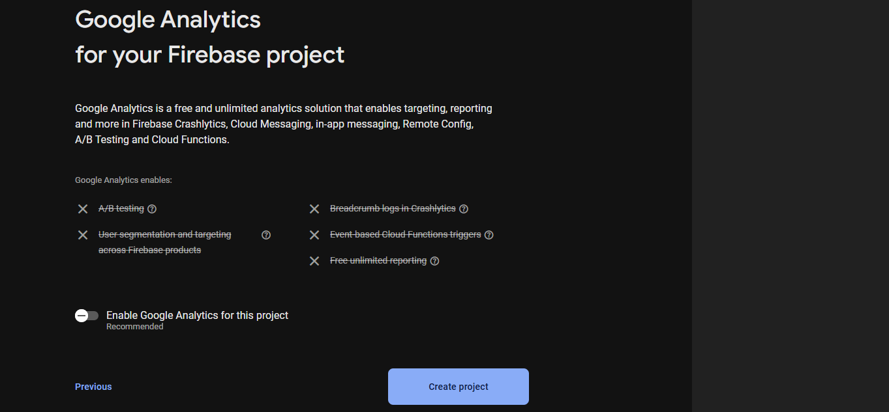
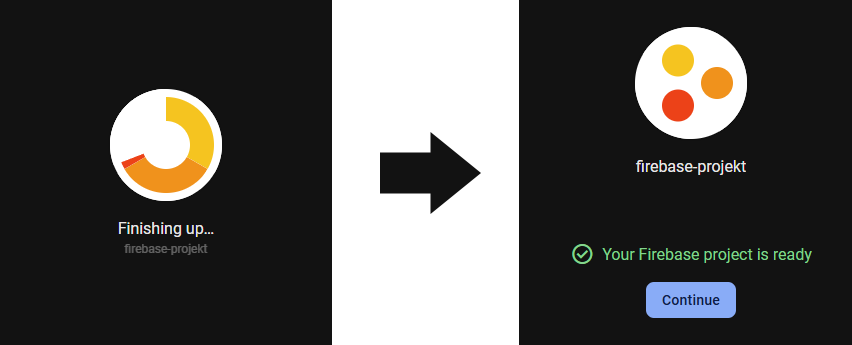

<div class="body">

# Programsko inženjerstvo

**Nositelj**: doc. dr. sc. Nikola Tanković  
**Asistent**: mag. inf. Alesandro Žužić

**Ustanova**: Sveučilište Jurja Dobrile u Puli, Fakultet informatike u Puli

<p style="float: clear; display: flex; gap: 8px; align-items: center;" class="font-brioni text-sm whitespace-nowrap">
    </img>
    Fakultet informatike u Puli
</p>

# [7] Firebase

<div style="display: flex; justify-content: space-between; text-align: justify; gap: 32px;">
    <p>  
        Firebase je platforma za razvoj aplikacija koja nudi brojne usluge poput baze podataka, autentifikacije, hostinga i analitike. U kombinaciji s Vue.js, Firebase omogućuje brz i jednostavan razvoj modernih web aplikacija s real-time funkcionalnostima.
    </p>
    </img>
</div>

<!-- TOC -->

- [Programsko inženjerstvo](#programsko-in%C5%BEenjerstvo)
- [[7] Firebase](#7-firebase)
    - [Uvod u Firebase](#uvod-u-firebase)
        - [Postavljanje Firebase projekta](#postavljanje-firebase-projekta)
        - [Konfiguriranje Vue projekta](#konfiguriranje-vue-projekta)
    - [Firebase Autentifikacija](#firebase-autentifikacija)
        - [Registracija korisnika](#registracija-korisnika)
        - [Prijava korisnika](#prijava-korisnika)
        - [Praćenje stanja autentifikacije](#pra%C4%87enje-stanja-autentifikacije)
    - [Firestore baza podataka](#firestore-baza-podataka)
        - [Osnove Firestore-a](#osnove-firestore-a)
        - [Čitanje podataka](#%C4%8Ditanje-podataka)
        - [Pisanje podataka](#pisanje-podataka)
    - [Samostalni zadatak za vježbu 6](#samostalni-zadatak-za-vje%C5%BEbu-6)

<!-- /TOC -->

<div class="page"></div>

## Uvod u Firebase


Firebase je sveobuhvatna platforma koju je razvio Google s ciljem da programerima omogući jednostavniji i brži razvoj mobilnih i web aplikacija. Umjesto da moramo brinuti o izgradnji i održavanju složene infrastrukture, Firebase nudi skup integriranih alata i servisa koji pokrivaju najvažnije potrebe tijekom cijelog ciklusa aplikacije – od autentifikacije korisnika, preko pohrane podataka, do praćenja performansi i analitike.

---

### Postavljanje Firebase projekta

Prije nego uopće ubacimo Firebase u Vue aplikaciju trebamo napraviti i postaviti **Firebase projekt**. Da bi to napravili trebamo ići **Firebase konzolu**:
> [https://console.firebase.google.com/u/1/](https://console.firebase.google.com)


- Nakon što kliknemo na *Get started with a Firebase project* trebamo napisati **ime projekta**: 


- Zatim ćemo **isključiti** *Google Analytics* s obzirom da nam to za sada ne treba, uvijek se može naknadno poslije uključiti:



- Kada smo isključili, možemo **kreirati projekt**:



- Sada ima novi svježi Firebase Projekt, gdje nam je sljedeći cilj dodati ga u Vue aplikaciju. S obzirom da je Vue **web aplikacija** odabrati ćemo **Web** app:


### Konfiguriranje Vue projekta

Sljedeći korak nam je da sada registriramo tu web aplikaciju tako da odaberemo **naziv**, *Firebase Hosting* nam nije potreban trenutno:


- I za kraj nam ostaje da instaliramo **Firebase paket** u Vue i kopiramo dani kôd u Vue projekt:

```sh
    npm install firebase
```


- Dani kôd je najbolje smjestiti u zasebnu `firebase.js` datoteku unutar `src` mape i učitati ju unutar `main.js` datoteke:


```js
import './assets/main.css'
import './firebase.js'

import { createApp } from 'vue'
import App from './App.vue'

createApp(App).mount('#app')
```

S obzirom da ćemo koristiti samo Firebase **autentifikaciju** i **firestore**, onda ćemo ureditit `firebase.js` datoteku tako da učitamo i namjestimo ta dva servisa:

```js
// Učitavanje potrebnih funkcija
import { initializeApp } from "firebase/app";
import { getAuth } from "firebase/auth";
import { getFirestore } from "firebase/firestore";

// Firebase konfiguracija
const firebaseConfig = {
  apiKey: "API_KEY",
  authDomain: "PROJECT_ID.firebaseapp.com",
  projectId: "PROJECT_ID",
  storageBucket: "PROJECT_ID.appspot.com",
  messagingSenderId: "SENDER_ID",
  appId: "APP_ID"
};

// Firebase inicijalizacija
const app = initializeApp(firebaseConfig);

// Inicijalizacija servisa
const auth = getAuth(app);
const db = getFirestore(app);

// Izvoz servisa
export { auth, db };
```

<div class="page"></div>

## Firebase Autentifikacija


Jedna od ključnih komponenti Firebasea je **autentifikacija**, koja omogućuje jednostavnu integraciju različitih metoda prijave korisnika, uključujući prijavu putem emaila i lozinke, kao i prijavu putem trećih strana kao što su Google, Facebook ili Apple. Ova usluga značajno smanjuje vrijeme potrebno za implementaciju sigurnog sustava za upravljanje korisničkim računima.

<br/>

---

Da bi uopće koristili **autentifikaciju**, trebamo je uključiti u **Firebase konzoli**.


- Kada smo je uključili, možemo odabrati **vrstu autentifikacij**e, gjde ćemo za početak odabrati `Email/Password`:


- I uključiti autentifikaciju putem `Email/Password`, registracija bez email-a nam ne treba, pa neka ostane isključeno:


- Sada možemo vidjeti da smo uspiješno uključili `Email/Password` autentifikaciju, uvijek možemo dodati druge vrste autentifikacije.


### Registracija korisnika

```html
<script setup>
import { ref } from 'vue';
import { createUserWithEmailAndPassword } from 'firebase/auth';
import { auth } from '@/firebase';

const email = ref('');
const password = ref('');

const register = async () => {
    try {
        const userCredential = await createUserWithEmailAndPassword(
            auth,
            email.value,
            password.value
        );
        console.log('Registrirani korisnik:', userCredential.user);
    } catch (error) {
        console.error('Greška pri registraciji:', error.message);
    }
};
</script>

<template>
    <form @submit.prevent="register">
        <input v-model="email" type="email" placeholder="Email">
        <input v-model="password" type="password" placeholder="Lozinka">
        <button type="submit">Registriraj se</button>
    </form>
</template>
```

### Prijava korisnika

```html
<script setup>
import { ref } from 'vue';
import { signInWithEmailAndPassword } from 'firebase/auth';
import { auth } from '@/firebase';

const email = ref('');
const password = ref('');

const login = async () => {
    try {
        const userCredential = await signInWithEmailAndPassword(
            auth,
            email.value,
            password.value
        );
        console.log('Prijavljeni korisnik:', userCredential.user);
    } catch (error) {
        console.error('Greška pri prijavi:', error.message);
    }
};
</script>

<template>
    <form @submit.prevent="login">
        <input v-model="email" type="email" placeholder="Email">
        <input v-model="password" type="password" placeholder="Lozinka">
        <button type="submit">Prijavi se</button>
    </form>
</template>
```

<div class="page"></div>

### Praćenje stanja autentifikacije

```html
<script setup>
import { ref, onMounted } from 'vue';
import { onAuthStateChanged } from 'firebase/auth';
import { auth } from '@/firebase';

const user = ref(null);

onMounted(() => {
    onAuthStateChanged(auth, (currentUser) => {
        user.value = currentUser;
        if (currentUser) {
            console.log('Prijavljen korisnik:', currentUser.email);
        } else {
            console.log('Nema prijavljenog korisnika');
        }
    });
});
</script>

<template>
    <div v-if="user">
        <p>Prijavljeni ste kao: {{ user.email }}</p>
        <button @click="auth.signOut()">Odjavi se</button>
    </div>
    <div v-else>
        <p>Niste prijavljeni</p>
    </div>
</template>
```

---

### Postavljanje email adrese

```html
<script setup>
import { verifyBeforeUpdateEmail } from 'firebase/auth';
import { auth } from '@/firebase';

const newEmail = 'nova.email@primjer.com';

const changeEmail = async () => {
    try {
        await verifyBeforeUpdateEmail(auth.currentUser, newEmail);
        alert('Verifikacijski email poslan na novu adresu. Promjena će biti aktivna nakon potvrde.');
    } catch (error) {
        console.error('Greška pri ažuriranju emaila:', error.message);
    }
};
</script>

<template>
    <button @click="changeEmail">Promijeni email adresu</button>
</template>
```

---

### Slanje verifikacijskog emaila

```html
<script setup>
import { sendEmailVerification } from 'firebase/auth';
import { auth } from '@/firebase';

const sendVerification = async () => {
    try {
        await sendEmailVerification(auth.currentUser);
        console.log('Verifikacijski email poslan');
    } catch (error) {
        console.error('Greška pri slanju verifikacijskog emaila:', error.message);
    }
};
</script>

<template>
    <button @click="sendVerification">Pošalji verifikacijski email</button>
</template>
```

---

### Promjena lozinke

```html
<script setup>
import { updatePassword } from 'firebase/auth';
import { auth } from '@/firebase';

const novaLozinka = 'novaTajna123';

const changePassword = async () => {
    try {
        await updatePassword(auth.currentUser, novaLozinka);
        console.log('Lozinka uspješno promijenjena');
    } catch (error) {
        console.error('Greška pri promjeni lozinke:', error.message);
    }
};
</script>

<template>
    <button @click="changePassword">Promijeni lozinku</button>
</template>
```

---

### Slanje emaila za resetiranje lozinke

```html
<script setup>
import { ref } from 'vue';
import { sendPasswordResetEmail } from 'firebase/auth';
import { auth } from '@/firebase';

const resetEmail = ref('');

const resetPassword = async () => {
    try {
        await sendPasswordResetEmail(auth, resetEmail.value);
        console.log('Email za resetiranje lozinke poslan');
    } catch (error) {
        console.error('Greška pri slanju emaila za reset lozinke:', error.message);
    }
};
</script>

<template>
    <input v-model="resetEmail" type="email" placeholder="Unesite email za reset">
    <button @click="resetPassword">Pošalji reset lozinke</button>
</template>
```

---

### Brisanje korisnika

```html
<script setup>
import { deleteUser } from 'firebase/auth';
import { auth } from '@/firebase';

const removeUser = async () => {
    try {
        await deleteUser(auth.currentUser);
        console.log('Korisnički račun obrisan');
    } catch (error) {
        console.error('Greška pri brisanju korisnika:', error.message);
    }
};
</script>

<template>
    <button @click="removeUser">Obriši korisnički račun</button>
</template>
```

---

### Ponovna autentifikacija korisnika (Re-authenticate a user)

```html
<script setup>
import { EmailAuthProvider, reauthenticateWithCredential } from 'firebase/auth';
import { ref } from 'vue';
import { auth } from '@/firebase';

const email = ref('');
const password = ref('');

const reauthenticate = async () => {
    try {
        const credential = EmailAuthProvider.credential(email.value, password.value);
        await reauthenticateWithCredential(auth.currentUser, credential);
        console.log('Ponovna autentifikacija uspješna');
    } catch (error) {
        console.error('Greška pri ponovnoj autentifikaciji:', error.message);
    }
};
</script>

<template>
    <input v-model="email" type="email" placeholder="Email">
    <input v-model="password" type="password" placeholder="Lozinka">
    <button @click="reauthenticate">Ponovno se autentificiraj</button>
</template>
```

### Prijava putem Google računa (GoogleAuth)

```html
<script setup>
import { ref } from 'vue';
import { GoogleAuthProvider, signInWithPopup } from 'firebase/auth';
import { auth } from '@/firebase';

const user = ref(auth.currentUser);

const loginWithGoogle = async () => {
    try {
        const provider = new GoogleAuthProvider();
        const result = await signInWithPopup(auth, provider);
        user.value = result.user;
        console.log('Prijavljen s Google računom:', result.user.email);
    } catch (error) {
        console.error('Greška pri Google prijavi:', error.message);
    }
};
</script>

<template>
    <button @click="loginWithGoogle">Prijavi se putem Google računa</button>
</template>
```

</div>